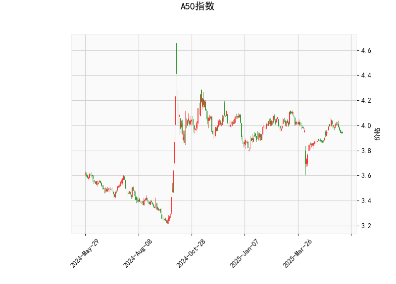

# A50指数技术分析及策略建议

## 一、技术分析结果解读

### 1. 价格与布林轨道
- 当前价**3.942**位于布林中轨（**3.951**）附近，略低于中轨水平，显示短期处于震荡平衡状态
- 距离上轨（**4.134**）空间**4.8%**，距离下轨（**3.769**）空间**4.5%**，价格通道呈现对称性波动区间
- 需关注能否有效突破中轨形成方向选择

### 2. 动量指标
- **RSI（47.08）**处于中性区域，无超买超卖信号
- **MACD柱状图（-0.0063）**显示短期动能偏弱，但负值绝对值较小，DIFF线（0.0107）与DEA线（0.0171）接近粘合，可能酝酿变盘

### 3. K线形态
- **CDLMATCHINGLOW**形态出现，表明市场在连续下跌后出现多头抵抗
- 该形态需配合成交量验证，若后续出现放量阳线则看涨信号增强

---

## 二、投资机会与策略建议

### 1. 趋势跟踪策略
**突破交易机会**
- **做多条件**：价格放量突破中轨**3.951**并企稳，目标上看上轨**4.134**
- **做空条件**：价格有效跌破下轨**3.769**后，可能打开下行空间

**仓位管理**
- 突破中轨时建立首仓（30%），回踩确认加仓（20%）
- 止损设置：多单设于下轨下方**3.75**，空单设于中轨上方**3.96**

### 2. 均值回归策略
**区间套利机会**
- 当前价格处于布林通道中轴区域，可采取高抛低吸操作
- **买入区间**：3.80-3.85（接近下轨）
- **卖出区间**：4.05-4.10（靠近上轨）

**风险控制**
- 单次交易仓位不超过15%
- 破位区间边界立即止损

### 3. 事件驱动策略
**形态博弈机会**
- 关注CDLMATCHINGLOW形态的验证信号：
  - 若次日出现阳线且成交量放大10%以上，可轻仓试多
  - 若形态失败（跌破形态低点3.90），则反手做空

**盈亏比设置**
- 止盈目标：前高4.05（3%空间）
- 止损位置：形态低点下方0.5%（3.89）

---

## 三、风险提示
1. 当前MACD与RSI均显示市场缺乏明确方向，需警惕假突破风险
2. 美联储议息会议等宏观事件可能加剧波动率
3. 建议结合A股市场整体情绪（可通过沪深300联动性）进行交叉验证
4. 期权策略推荐：可考虑卖出宽跨式组合（Sell Strangle），利用波动率收敛获利