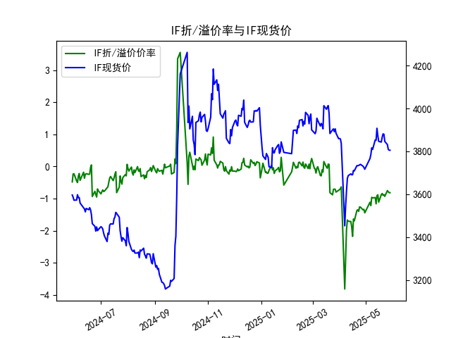
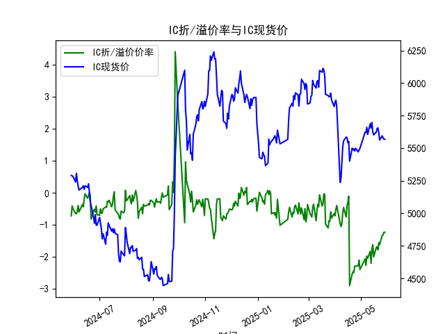
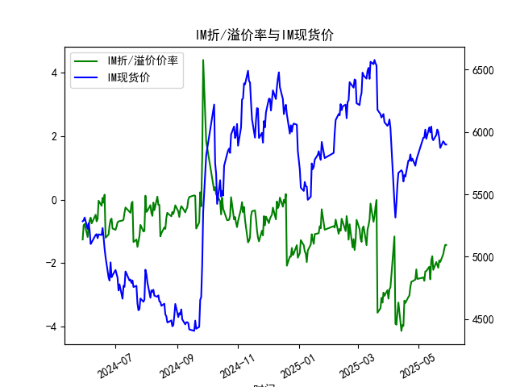

|            |   IF折/溢价率 |   IF现货价 |   IH折/溢价率 |   IH现货价 |   IC折/溢价率 |   IC现货价 |   IH折/溢价率 |   IH现货价 |
|:-----------|--------------:|-----------:|--------------:|-----------:|--------------:|-----------:|--------------:|-----------:|
| 2025-04-29 |     -1.33181  |     3724.8 |      -2.10005 |     5487.2 |      -2.10005 |     5487.2 |      -2.19842 |     5773.6 |
| 2025-04-30 |     -1.44197  |     3716.2 |      -2.39398 |     5497   |      -2.39398 |     5497   |      -2.49939 |     5801.4 |
| 2025-05-06 |     -1.11177  |     3766.2 |      -2.06144 |     5622   |      -2.06144 |     5622   |      -2.45329 |     5953.2 |
| 2025-05-07 |     -1.2169   |     3785   |      -2.26234 |     5620.2 |      -2.26234 |     5620.2 |      -2.55739 |     5955.2 |
| 2025-05-08 |     -0.957625 |     3816   |      -1.97107 |     5660   |      -1.97107 |     5660   |      -2.2617  |     6018.8 |
| 2025-05-09 |     -0.976471 |     3808.6 |      -2.04348 |     5604.8 |      -2.04348 |     5604.8 |      -2.25057 |     5945.2 |
| 2025-05-12 |     -0.966676 |     3853   |      -1.82396 |     5688   |      -1.82396 |     5688   |      -2.1153  |     6037   |
| 2025-05-13 |     -1.16158  |     3851   |      -2.19778 |     5654.6 |      -2.19778 |     5654.6 |      -2.51032 |     5996.6 |
| 2025-05-14 |     -0.908163 |     3907.4 |      -1.74715 |     5697.8 |      -1.74715 |     5697.8 |      -1.90524 |     6043   |
| 2025-05-15 |     -0.880406 |     3872.8 |      -1.6149  |     5623   |      -1.6149  |     5623   |      -1.78364 |     5949   |
| 2025-05-16 |     -1.10785  |     3846   |      -1.99531 |     5601.8 |      -1.99531 |     5601.8 |      -2.21348 |     5933.8 |
| 2025-05-19 |     -0.875523 |     3843.2 |      -1.70946 |     5623   |      -1.70946 |     5623   |      -1.96768 |     5975.4 |
| 2025-05-20 |     -0.840664 |     3865.4 |      -1.6802  |     5650.8 |      -1.6802  |     5650.8 |      -2.06014 |     6019.4 |
| 2025-05-21 |     -0.898296 |     3881.2 |      -1.77707 |     5655.6 |      -1.77707 |     5655.6 |      -2.14574 |     6000.6 |
| 2025-05-22 |     -0.87548  |     3879.6 |      -1.55138 |     5614.8 |      -1.55138 |     5614.8 |      -1.91397 |     5950   |
| 2025-05-23 |     -0.9292   |     3846.2 |      -1.61406 |     5561.8 |      -1.61406 |     5561.8 |      -1.96463 |     5872   |
| 2025-05-26 |     -0.748858 |     3831.2 |      -1.32042 |     5594.6 |      -1.32042 |     5594.6 |      -1.72151 |     5925   |
| 2025-05-27 |     -0.786501 |     3809.2 |      -1.31181 |     5578   |      -1.31181 |     5578   |      -1.55547 |     5915   |
| 2025-05-28 |     -0.814251 |     3805   |      -1.22822 |     5568   |      -1.22822 |     5568   |      -1.42796 |     5899   |
| 2025-05-29 |     -0.814251 |     3805   |      -1.22822 |     5568   |      -1.22822 |     5568   |      -1.42796 |     5899   |

### 1. 股指期货折/溢价率与现货价的相关性及影响逻辑

**相关性解释：**  
股指期货的折价率（期货价格低于现货）或溢价率（期货价格高于现货）与现货价的关系通常反映市场对未来价格预期的博弈：
- **折价率扩大**：当期货价格持续低于现货，可能暗示市场对短期现货价格的悲观预期（如流动性紧张、政策风险、资金流出），或存在套利机会（套利者买入期货、卖出现货压低现货价）。
- **溢价率扩大**：期货价格高于现货时，可能反映市场对现货未来上涨的乐观预期（如政策利好、资金流入），或存在正向套利空间（买入现货、卖出期货）。

**影响逻辑：**  
1. **套利机制驱动**：折/溢价率超过合理区间（如覆盖资金成本和交易费用后）会触发套利行为，推动期货与现货价格收敛。  
2. **市场情绪传导**：折价率持续扩大可能引发避险情绪，导致现货抛售压力；溢价率扩大可能吸引资金流入期货市场，间接推高现货。  
3. **资金成本与分红影响**：股指期货定价需考虑资金成本（如利率）和成分股分红预期。例如，分红季前期货通常折价（分红导致现货指数自然下跌）。  
4. **政策与流动性干扰**：监管政策（如保证金调整）或市场流动性变化会直接影响期货定价，进而通过折溢价率传递到现货市场。

---

### 2. 近期投资机会分析（基于最近一周数据）

#### **关键数据变化（以今日2025年5月29日对比昨日）：**
- **IF（沪深300指数期货）：**  
  - 折价率：-0.814%（与昨日持平），现货价稳定于3805.0。  
  - **机会**：近期折价率持续高位（近一周-0.93%至-0.81%），若市场情绪改善（如政策预期升温），期货价格可能修复折价，可关注做多期货的短期反弹机会。

- **IH（上证50指数期货）：**  
  - 折价率：-1.228%（与昨日持平），现货价稳定于5568.0。  
  - **机会**：折价率较前一周略有收窄（从-1.614%到-1.228%），若现货指数企稳，可布局跨期套利（买入近月、卖出远月）。

- **IC（中证500指数期货）：**  
  - **数据异常**：提供的IC数据与IH重复，需核实数据源。假设数据正确，其折价率与IH一致，需结合中证500成分股特性（成长风格）分析，若近期市场风格切换至中小盘，折价率收窄可能加速。

- **IM（中证1000指数期货）：**  
  - 折价率：-1.428%（与昨日持平），现货价稳定于5899.0。  
  - **机会**：折价率近一周从-1.965%收窄至-1.428%，反映小盘股情绪回暖。若资金持续流入中小盘，可考虑多IM期货、空IH的跨品种套利。

#### **综合策略建议：**
1. **短期修复机会**：IF、IM折价率处于近一周较低水平，若市场风险偏好回升，可轻仓做多期货。  
2. **套利组合**：  
   - 跨期套利：IH近月折价率修复速度快于远月，可买入近月合约、卖出远月。  
   - 跨品种套利：IM折价率修复弹性更大，可多IM空IH，押注小盘股相对强势。  
3. **风险提示**：需关注今日（2025年5月29日）数据持平是否因市场观望情绪，若后续折价率再度扩大，需警惕现货回调风险。

