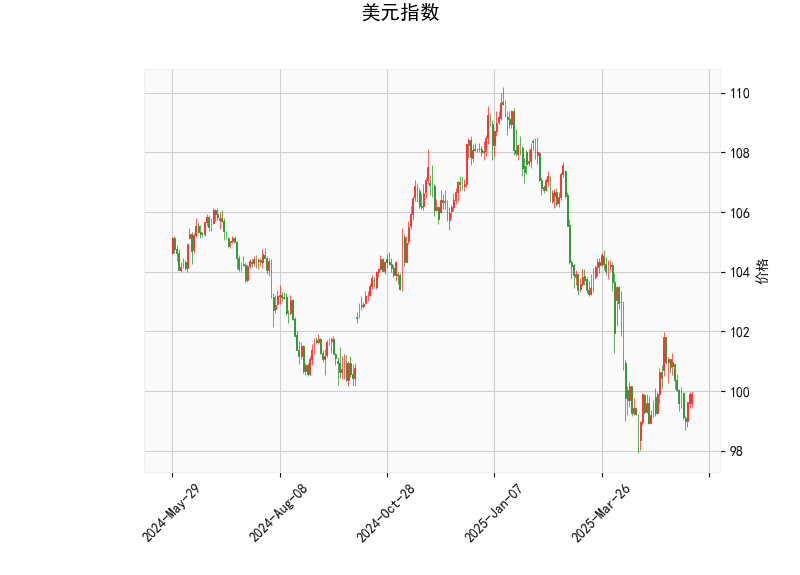

# 美元指数技术分析解读

## 一、美元指数技术指标解析

### 1. 价格与布林轨道
- **当前价99.89**位于布林下轨（97.41）与中轨（101.40）之间，且低于中轨，显示**短期偏弱**。
- **向下偏离中轨1.5%**，但未触及下轨，暗示**未进入超卖区域**，需警惕反弹可能。

### 2. RSI指标
- **46.6的中性区间值**反映多空力量均衡，但结合价格位置看，**存在空头蓄势风险**。若RSI跌破40则可能加速下行。

### 3. MACD指标
- **负值区金叉初现**（MACD柱转正0.036），但信号线（-0.415）仍压制MACD线（-0.378），需确认能否形成有效反弹。
- **量能不足**：MACD柱绝对值小于0.05，显示动能偏弱。

### 4. 关键支撑/阻力
- **下方支撑**：布林下轨97.4（强支撑）、2023年低点95.6
- **上方压力**：中轨101.4（短期分水岭）、上轨105.4（趋势反转确认位）

---
# 对A股/港股的影响及策略建议

## 二、跨市场联动逻辑
### 1. 美元-人民币-股市传导链
- **美元走弱**→人民币被动升值→北向资金流入加速→利好A股流动性
- **港股美元计价属性**：美元弱势时，外资配置港股的汇率成本降低

### 2. 大宗商品传导
- **美元弱势周期**→黄金/原油等商品价格上涨→利好资源股（石油、煤炭、有色金属）

---
## 三、具体投资机会挖掘

### A股策略
| 板块         | 逻辑                                                                 | 标的举例                 |
|--------------|----------------------------------------------------------------------|--------------------------|
| **进口依赖型** | 人民币升值降低采购成本（芯片、航空）                                | 中国国航、中芯国际       |
| **大宗商品**  | 美元计价商品上涨+国内稳增长政策                                      | 紫金矿业、中国海油       |
| **消费电子**  | 海外库存周期见底+汇率利好出口利润率                                  | 立讯精密、传音控股       |

### 港股策略
| 方向         | 逻辑                                                                 | 重点关注                 |
|--------------|----------------------------------------------------------------------|--------------------------|
| **科技龙头**  | 外资回流+AI算力需求爆发                                              | 腾讯、美团、商汤科技     |
| **高股息**    | 全球避险情绪升温+港交所放宽REITs政策                                 | 中移动、港交所、领展房产 |
| **生物医药**  | 美联储降息预期强化创新药估值                                         | 药明生物、百济神州       |

### 套利机会
1. **AH溢价收敛**  
   - 当前AH溢价指数约140，处于历史高位  
   - **做多H股/做空A股**配对：中国平安（H/A溢价-15%）、中信证券（H/A溢价-25%）

2. **跨境ETF折溢价套利**  
   - 监测恒生科技指数ETF（513180.SH vs 03033.HK）溢价差，当溢价>3%时反向操作

3. **港股通股息税套利**  
   - 利用境内投资者港股通股息20%税率 vs QFII的10%税率差异，布局高分红标的

---
## 四、风险提示
1. **美元反弹风险**：若美国非农数据超预期或通胀反弹，可能逆转美元弱势
2. **政策变量**：关注国内7月政治局会议对资本市场定位的表述
3. **地缘政治**：台海/南海局势对港股风险溢价的影响

（注：以上分析基于当前技术面数据，实际决策需结合实时基本面变化。）