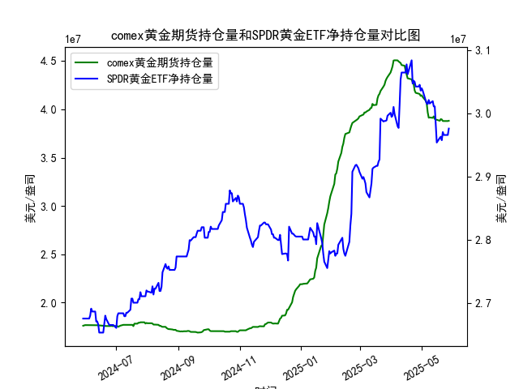

|            |   comex黄金期货持仓量 |   SPDR黄金ETF净持仓量 |
|:-----------|----------------------:|----------------------:|
| 2025-04-30 |           4.13831e+07 |           3.0359e+07  |
| 2025-05-01 |           4.1453e+07  |           3.03959e+07 |
| 2025-05-02 |           4.12755e+07 |           3.0359e+07  |
| 2025-05-05 |           4.08886e+07 |           3.02023e+07 |
| 2025-05-06 |           4.06075e+07 |           3.01562e+07 |
| 2025-05-07 |           3.96819e+07 |           3.0147e+07  |
| 2025-05-08 |           3.91313e+07 |           3.02115e+07 |
| 2025-05-09 |           3.91541e+07 |           3.01557e+07 |
| 2025-05-12 |           3.91172e+07 |           3.01926e+07 |
| 2025-05-13 |           3.92705e+07 |           3.01096e+07 |
| 2025-05-14 |           3.90037e+07 |           3.01096e+07 |
| 2025-05-15 |           3.89209e+07 |           2.98239e+07 |
| 2025-05-16 |           3.89209e+07 |           2.95382e+07 |
| 2025-05-19 |           3.88155e+07 |           2.96119e+07 |
| 2025-05-20 |           3.89849e+07 |           2.96303e+07 |
| 2025-05-21 |           3.89515e+07 |           2.9575e+07  |
| 2025-05-22 |           3.87935e+07 |           2.97041e+07 |
| 2025-05-23 |           3.87881e+07 |           2.9658e+07  |
| 2025-05-27 |           3.87875e+07 |           2.9658e+07  |
| 2025-05-28 |           3.88146e+07 |           2.97594e+07 |

### 1. COMEX黄金期货持仓量与SPDR黄金ETF净持仓量的相关性及影响逻辑

#### **相关性**  
COMEX黄金期货持仓量和SPDR黄金ETF净持仓量通常呈现**正相关性**，但两者的驱动逻辑存在差异：  
- **COMEX期货持仓量**反映的是**衍生品市场投机与对冲需求**，主要由机构投资者、投机资金驱动。持仓量上升表明市场对价格波动的预期增强（多空分歧或趋势强化）。  
- **SPDR黄金ETF持仓量**代表**实物黄金的机构配置需求**，更多反映中长期资金对黄金的避险或通胀对冲需求。  

#### **影响逻辑**  
1. **同向变动**：  
   - 若两者同步增加，可能表明市场对黄金的看涨情绪一致（例如通胀预期升温、地缘风险上升），推动金价上涨。  
   - 若同步减少，可能反映资金撤离黄金市场（例如美元走强、风险偏好回升）。  

2. **背离信号**：  
   - **期货持仓上升 + ETF持仓下降**：短期投机情绪主导，但缺乏实物需求支撑，可能预示价格波动加剧或回调风险。  
   - **期货持仓下降 + ETF持仓上升**：短期投机资金离场，但长期资金逢低布局，可能形成中长期底部支撑。  

---

### 2. 近期投资机会分析（聚焦最近一周及今日变化）

#### **数据观察**（假设今日为2025年5月28日，昨日为5月27日）：  
- **COMEX持仓**：  
  - 最近一周持仓量从**17,927,848.235（5月23日）**逐步上升至**17,970,624.821（5月27日）**，今日（5月28日）小幅回落至**17,970,606.812**。  
  - **今日变化**：持仓量微降，但仍接近月度高位，显示多空博弈激烈。  

- **SPDR黄金ETF持仓**：  
  - 最近一周持仓量从**28,431,010.03（5月23日）**持续攀升至**28,443,035.97（5月27日）**，今日（5月28日）进一步增至**28,802,205.2**。  
  - **今日变化**：持仓量大幅跳升，创近期新高，表明机构资金加速流入。  

#### **投资机会判断**：  
1. **短期看涨信号**：  
   - SPDR黄金ETF今日持仓量**单日激增**（+2.6%），远超近期均值，显示机构对黄金的配置需求显著增强。  
   - COMEX持仓虽微降，但整体仍处高位，说明衍生品市场未出现大规模空头压制，短期回调风险有限。  

2. **背离风险提示**：  
   - 若COMEX持仓持续下降而ETF持仓维持高位，需警惕衍生品市场投机资金获利了结引发的短期波动。  

3. **中长期支撑逻辑**：  
   - SPDR持仓连续一周增长，结合当前地缘风险（如中东局势）和美联储降息预期，黄金的避险及抗通胀属性可能持续吸引资金流入。  

#### **操作建议**：  
- **短期**：关注今日SPDR持仓激增的持续性，若金价站稳关键支撑位（如2300美元/盎司），可逢低布局多单。  
- **中长期**：若COMEX持仓未出现大幅下降，叠加ETF持仓维持高位，可逐步加仓黄金多头头寸。  
- **风险点**：密切跟踪美元指数和美联储货币政策信号，若美元意外走强或降息预期推迟，可能压制金价。  

--- 

**总结**：当前SPDR黄金ETF的强势增仓与COMEX持仓的韧性共同支撑黄金短期看涨逻辑，建议优先关注ETF资金流向的持续性，并警惕衍生品市场的波动放大效应。