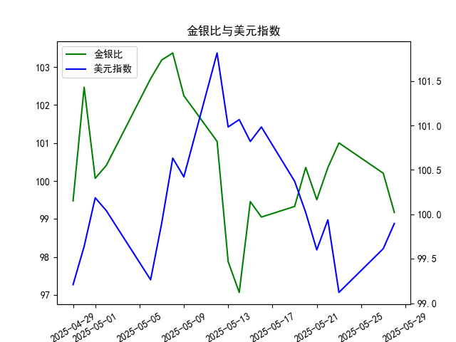

|            |    金价 |   银价 |   美元指数 |   金银比 |
|:-----------|--------:|-------:|-----------:|---------:|
| 2025-04-29 | 3305.05 | 33.225 |    99.21   |  99.4748 |
| 2025-04-30 | 3302.05 | 32.225 |    99.6403 | 102.469  |
| 2025-05-01 | 3214.75 | 32.125 |   100.187  | 100.07   |
| 2025-05-02 | 3249.7  | 32.365 |   100.042  | 100.408  |
| 2025-05-06 | 3391.45 | 33.025 |    99.2654 | 102.693  |
| 2025-05-07 | 3392.25 | 32.875 |    99.9006 | 103.186  |
| 2025-05-08 | 3352.3  | 32.43  |   100.633  | 103.37   |
| 2025-05-09 | 3324.55 | 32.515 |   100.422  | 102.247  |
| 2025-05-12 | 3235.4  | 32.02  |   101.814  | 101.043  |
| 2025-05-13 | 3227.95 | 32.98  |   100.983  |  97.876  |
| 2025-05-14 | 3191.95 | 32.885 |   101.066  |  97.064  |
| 2025-05-15 | 3191.05 | 32.085 |   100.82   |  99.4561 |
| 2025-05-16 | 3182.95 | 32.135 |   100.983  |  99.0493 |
| 2025-05-19 | 3230.15 | 32.52  |   100.373  |  99.3281 |
| 2025-05-20 | 3261.55 | 32.5   |   100.022  | 100.355  |
| 2025-05-21 | 3299.65 | 33.16  |    99.6014 |  99.5069 |
| 2025-05-22 | 3284    | 32.725 |    99.9388 | 100.351  |
| 2025-05-23 | 3342.65 | 33.095 |    99.1231 | 101.002  |
| 2025-05-27 | 3296.7  | 32.9   |    99.6147 | 100.204  |
| 2025-05-28 | 3300.85 | 33.285 |    99.8978 |  99.1693 |

### 一、金银比与美元指数的相关性及影响逻辑

#### 1. **金银比与美元指数的负相关性**
金银比（黄金价格/白银价格）与美元指数在多数情况下呈现**负相关性**，逻辑如下：
- **美元走强**：美元作为全球避险货币和计价货币，其升值会压制以美元计价的黄金和白银价格。但由于黄金的避险属性强于白银，其抗跌性更明显，导致金银比**被动上升**（如美元指数在5月6日升至99.90，金银比同步升至102.69）。
- **美元走弱**：美元贬值通常推动贵金属价格上涨，而白银因工业属性对经济复苏更敏感，涨幅可能超过黄金，导致金银比**下降**（如5月28日美元指数回落至99.90，金银比大幅下跌至99.17）。

#### 2. **市场情绪的分化影响**
- **避险驱动**：若市场风险偏好下降（如地缘冲突），黄金作为避险资产的需求激增，白银受工业需求拖累，金银比上升（如5月1日美元指数上涨至100.19，金银比同步升至100.07）。
- **经济复苏驱动**：若经济数据向好，白银的工业需求预期增强，可能推动其价格涨幅超过黄金，导致金银比下降（如5月28日金银比单日下跌1.03，反映白银短期强势）。

---

### 二、近期投资机会分析（聚焦最近一周）

#### 1. **金银比短期交易机会**
- **今日（5月28日）数据**：金银比从昨日100.20骤降至99.17（跌幅1.03），创近期新低，表明白银相对黄金显著走强。
- **驱动因素**：美元指数连续两日反弹（5月27日99.61 → 5月28日99.90），但白银受工业需求预期支撑，抗跌性强于黄金。
- **策略**：短期可**做空金银比**（多白银、空黄金），关注下方支撑位98.5。

#### 2. **美元指数反弹的持续性**
- **近期走势**：美元指数从5月23日低点99.12反弹至99.90，显示短期筑底迹象。
- **对贵金属影响**：若美元延续反弹，黄金可能承压，但白银因工业属性或表现分化。建议**轻仓试多白银**，止损参考5月28日低点。

#### 3. **关键时间窗口**
- **5月27-28日异动**：金银比单日跌幅（-1.03）为近一个月最大，结合美元指数反弹，可能反映市场对美联储政策的重新定价（如降息预期推迟压制黄金，但未影响白银工业预期）。
- **风险提示**：若美元指数突破100.0关口，需警惕贵金属回调压力。

---

### 总结
- **核心逻辑**：近期金银比与美元指数的负相关性增强，白银因工业属性表现出独立韧性。
- **推荐策略**：  
  1. **短线做空金银比**，目标98.5-99.0。  
  2. **分批布局白银多头**，止损参考5月28日低点。  
  3. **关注美元指数100.0关口压力**，若突破则需调整仓位。