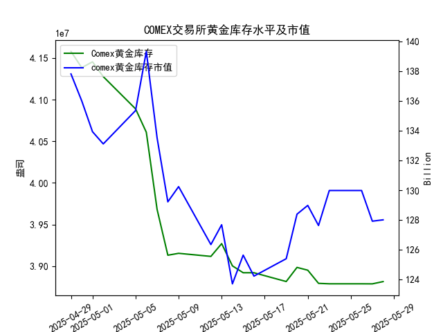

|            |   comex黄金库存量 |   comex黄金库存市值(billion) |   伦敦金现货价 |   上海金交所黄金现货价 |   美元兑人民币汇率 |
|:-----------|------------------:|-----------------------------:|---------------:|-----------------------:|-------------------:|
| 2025-05-01 |       4.1453e+07  |                       3231   |        3214.75 |                 780.19 |             7.2014 |
| 2025-05-02 |       4.12755e+07 |                       3225   |        3249.7  |                 780.19 |             7.2014 |
| 2025-05-05 |       4.08886e+07 |                       3310.1 |        3249.7  |                 780.19 |             7.2014 |
| 2025-05-06 |       4.06075e+07 |                       3430.9 |        3391.45 |                 792.2  |             7.2008 |
| 2025-05-07 |       3.96819e+07 |                       3364.7 |        3392.25 |                 798.51 |             7.2005 |
| 2025-05-08 |       3.91313e+07 |                       3302.1 |        3352.3  |                 786.5  |             7.2073 |
| 2025-05-09 |       3.91541e+07 |                       3326.3 |        3324.55 |                 785.5  |             7.2095 |
| 2025-05-12 |       3.91172e+07 |                       3230   |        3235.4  |                 759    |             7.2066 |
| 2025-05-13 |       3.92705e+07 |                       3251.4 |        3227.95 |                 763.9  |             7.1991 |
| 2025-05-14 |       3.90037e+07 |                       3171.7 |        3191.95 |                 758.38 |             7.1956 |
| 2025-05-15 |       3.89209e+07 |                       3228.1 |        3191.05 |                 735.86 |             7.1963 |
| 2025-05-16 |       3.89209e+07 |                       3191.8 |        3182.95 |                 746.4  |             7.1938 |
| 2025-05-19 |       3.88155e+07 |                       3230.6 |        3230.15 |                 754.5  |             7.1916 |
| 2025-05-20 |       3.89849e+07 |                       3293.2 |        3261.55 |                 753.49 |             7.1931 |
| 2025-05-21 |       3.89515e+07 |                       3311.4 |        3299.65 |                 773.82 |             7.1937 |
| 2025-05-22 |       3.87935e+07 |                       3290   |        3284    |                 778.36 |             7.1903 |
| 2025-05-23 |       3.87881e+07 |                       3351   |        3342.65 |                 776.4  |             7.1919 |
| 2025-05-26 |       3.87881e+07 |                       3351   |        3342.65 |                 773.94 |             7.1833 |
| 2025-05-27 |       3.87875e+07 |                       3298   |        3296.7  |                 768.75 |             7.1876 |
| 2025-05-28 |       3.88146e+07 |                       3298   |        3300.85 |                 769.67 |             7.1894 |

### 分析结论与投资机会

#### 1. **COMEX黄金库存与价格的关联性验证**
   - **趋势矛盾**：近一个月COMEX黄金库存整体呈下降趋势（从4.157亿降至3.881亿），但伦敦金价从3305美元/盎司微幅波动至3300美元/盎司，未呈现显著正相关性。部分时段（如5月6-7日库存下降、金价上涨）显示负相关，与研究员的观点不完全吻合。
   - **市值与价格关系**：库存市值（单位：十亿美元）与价格波动部分同步（如5月23日库存市值回升至129.98亿，金价同步上涨至3342美元），但长期趋势仍分化。

#### 2. **近期（5月22-28日）数据动态**
   - **库存变化**：5月28日库存首次回升（3.881亿 vs 前日3.878亿），可能标志短期拐点。
   - **价格表现**：
     - **伦敦金价**：5月23日大涨至3342美元后回落，28日微涨0.12%（3300.85美元）。
     - **上海金价**：连续下跌后企稳，5月28日微涨0.12%（769.67元/克）。
   - **汇率影响**：美元兑人民币汇率在7.18-7.19窄幅波动，对跨市场价差影响有限。

#### 3. **潜在投资机会**
   - **短期多头机会（伦敦金）**：
     - 5月28日库存回升伴随金价止跌，若库存持续增加且突破3350美元阻力位，可试探性做多。
     - 风险：库存回升持续性存疑，需警惕宏观数据（如美联储政策）扰动。
   - **上海金价技术性反弹**：
     - 上海金价在760元/克附近形成支撑，5月28日小幅反弹，可关注短线做多机会，目标位780元。
   - **跨市场套利窗口**：
     - 按5月28日汇率折算，伦敦金价约763元/克，低于上海金价（769元/克），存在6元/克溢价。可考虑“买伦敦、卖上海”套利，需扣除交易成本后操作。

#### 4. **风险提示**
   - **库存单日波动干扰**：5月28日库存回升可能为短期现象，需后续数据验证趋势。
   - **政策与事件风险**：全球央行货币政策、地缘冲突等或引发金价剧烈波动。
   - **套利成本限制**：跨市场交易涉及汇率风险、手续费及流动性成本，需精确测算盈亏平衡点。

---

### 结论
近期黄金市场呈现局部波动机会，但COMEX库存与价格的长期正相关性未获数据充分支持。投资者可关注伦敦金价超跌反弹、上海金价技术修复及跨市场价差收敛的短线机会，同时密切跟踪库存趋势及宏观政策信号。