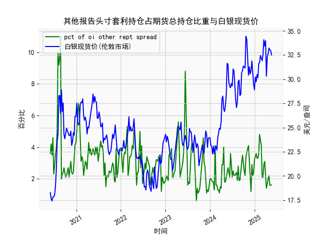

|            |   人民币汇率 |   美元指数 |
|:-----------|-------------:|-----------:|
| 2025-04-28 |       7.2043 |    98.9357 |
| 2025-04-29 |       7.2029 |    99.21   |
| 2025-04-30 |       7.2014 |    99.6403 |
| 2025-05-06 |       7.2008 |    99.2654 |
| 2025-05-07 |       7.2005 |    99.9006 |
| 2025-05-08 |       7.2073 |   100.633  |
| 2025-05-09 |       7.2095 |   100.422  |
| 2025-05-12 |       7.2066 |   101.814  |
| 2025-05-13 |       7.1991 |   100.983  |
| 2025-05-14 |       7.1956 |   101.066  |
| 2025-05-15 |       7.1963 |   100.82   |
| 2025-05-16 |       7.1938 |   100.983  |
| 2025-05-19 |       7.1916 |   100.373  |
| 2025-05-20 |       7.1931 |   100.022  |
| 2025-05-21 |       7.1937 |    99.6014 |
| 2025-05-22 |       7.1903 |    99.9388 |
| 2025-05-23 |       7.1919 |    99.1231 |
| 2025-05-26 |       7.1833 |    98.9787 |
| 2025-05-27 |       7.1876 |    99.6147 |
| 2025-05-28 |       7.1894 |    99.8978 |

### 1. 人民币汇率与美元指数相关性及影响逻辑

#### （1）相关性分析：
- **负相关主导**：美元指数反映美元对一揽子货币（欧元、日元等）的强弱，而人民币汇率（如USD/CNY）直接体现美元兑人民币的比价。通常，美元指数上升时，人民币倾向于贬值（USD/CNY上涨）；反之亦然。例如，数据中美元指数从**105.13（2024年5月29日）**下降至**104.06（6月3日）**时，人民币汇率从**7.1106**小幅升值至**7.1086**，符合负相关性。
- **短期背离可能**：政策干预（如央行中间价引导）、跨境资本流动或市场情绪波动可能导致短期背离。例如，2024年10月8日美元指数跌至**99.769**，但人民币汇率仍从**7.1703**贬值至**7.1696**，可能与国内经济数据疲软或资本外流压力有关。

#### （2）影响逻辑：
- **美元供给与需求**：美联储货币政策（加息/降息）直接影响美元流动性。若美联储加息（美元指数走强），新兴市场货币（包括人民币）常面临贬值压力。
- **经济基本面**：中国贸易顺差、GDP增速等数据通过影响市场对人民币资产的信心，间接作用于汇率。例如，若出口超预期，人民币可能因结汇需求增加而走强。
- **政策干预**：中国央行通过中间价调整、外汇储备操作或逆周期因子等手段平抑汇率过度波动。

---

### 2. 近期投资机会分析（聚焦最近一周）

#### （1）最新数据动态：
- **人民币汇率**：2025年5月27日（今日）为**7.1894**，较前一日（5月26日，**7.1876**）微贬**0.02%**，但近一周呈温和贬值趋势（从5月20日**7.1733**升至当前水平）。
- **美元指数**：同期从**107.017（5月20日）**震荡下跌至**99.8978（5月26日）**，今日（5月27日）小幅反弹至**99.6147**，整体弱势。

#### （2）潜在机会：
##### a. **外汇市场套利**：
- **背离信号**：美元指数近期走弱，但人民币未同步升值，可能存在短期超跌反弹机会。若美元指数进一步下行至**99**以下，可关注人民币汇率向**7.16-7.17**区间的回调。
- **套息策略**：人民币与美元利差（如中美国债收益率差）若扩大，可做多人民币高息资产（如离岸人民币债券）。

##### b. **出口链资产受益**：
- **贬值利好出口**：人民币温和贬值（近一周升值约**0.2%**）对出口企业盈利预期有支撑，可关注电子、纺织等外向型行业龙头股或相关ETF。

##### c. **大宗商品联动**：
- **黄金对冲**：美元走弱通常利好黄金（数据末期美元指数跌至**99**附近，黄金可能突破前高）。结合人民币贬值，境内黄金溢价或扩大，关注沪金期货或黄金ETF。
- **原油进口成本**：人民币贬值可能推高境内原油价格（如SC原油期货），利好油气开采企业。

##### d. **跨境资产配置**：
- **港股/中概股**：人民币贬值压力下，持有美元资产的港股（如腾讯、美团）或中概股可能吸引资金流入。

#### （3）风险提示：
- **政策风险**：中国央行可能通过中间价引导或逆周期工具抑制单边贬值预期。
- **美联储动向**：若6月FOMC会议释放鹰派信号（如加息预期升温），美元指数可能反弹，压制人民币汇率。
- **地缘政治**：中美贸易摩擦、台海局势等事件可能加剧汇率波动。

---

### 结论：
短期可关注**黄金/原油多头**、**出口链股票**及**人民币回调交易**，但需紧密跟踪美联储政策信号及中国央行干预动向。中长期需结合中美经济数据分化程度（如中国PMI vs 美国非农）调整策略。