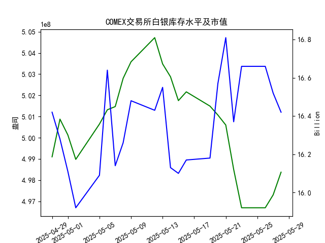

|            |   comex白银库存量 |   comex白银库存市值(billion) |   伦敦银现货价 |   上海金交所白银现货价 |   美元兑人民币汇率 |
|:-----------|------------------:|-----------------------------:|---------------:|-----------------------:|-------------------:|
| 2025-05-01 |       5.00128e+08 |                       32.205 |         32.125 |                   8163 |             7.2014 |
| 2025-05-02 |       4.98978e+08 |                       31.91  |         32.365 |                   8163 |             7.2014 |
| 2025-05-05 |       5.00644e+08 |                       32.14  |         32.365 |                   8163 |             7.2014 |
| 2025-05-06 |       5.01317e+08 |                       33.19  |         33.025 |                   8221 |             7.2008 |
| 2025-05-07 |       5.01469e+08 |                       32.195 |         32.875 |                   8229 |             7.2005 |
| 2025-05-08 |       5.028e+08   |                       32.335 |         32.43  |                   8100 |             7.2073 |
| 2025-05-09 |       5.03581e+08 |                       32.73  |         32.515 |                   8150 |             7.2095 |
| 2025-05-12 |       5.04719e+08 |                       32.56  |         32.02  |                   8124 |             7.2066 |
| 2025-05-13 |       5.03481e+08 |                       32.88  |         32.98  |                   8214 |             7.1991 |
| 2025-05-14 |       5.02874e+08 |                       32.085 |         32.885 |                   8172 |             7.1956 |
| 2025-05-15 |       5.0175e+08  |                       32.085 |         32.085 |                   7967 |             7.1963 |
| 2025-05-16 |       5.02164e+08 |                       32.195 |         32.135 |                   8062 |             7.1938 |
| 2025-05-19 |       5.0149e+08  |                       32.265 |         32.52  |                   8113 |             7.1916 |
| 2025-05-20 |       5.01069e+08 |                       33.065 |         32.5   |                   8057 |             7.1931 |
| 2025-05-21 |       5.00598e+08 |                       33.575 |         33.16  |                   8237 |             7.1937 |
| 2025-05-22 |       4.98504e+08 |                       32.84  |         32.725 |                   8268 |             7.1903 |
| 2025-05-23 |       4.96695e+08 |                       33.535 |         33.095 |                   8244 |             7.1919 |
| 2025-05-26 |       4.96695e+08 |                       33.535 |         33.095 |                   8239 |             7.1833 |
| 2025-05-27 |       4.97303e+08 |                       33.215 |         32.9   |                   8189 |             7.1876 |
| 2025-05-28 |       4.98373e+08 |                       32.955 |         33.285 |                   8211 |             7.1894 |

### 近期白银市场投资机会分析（2025年5月28日）

#### **一、关键数据变化（今日 vs 昨日）**
1. **COMEX白银库存**  
   - **今日（5/28）**：4.9837亿盎司  
   - **昨日（5/27）**：4.9730亿盎司  
   - **变化**：库存小幅回升（+0.2%），结束连续3日下降趋势，但仍处于近一周低位。

2. **伦敦白银现货价格**  
   - **今日（5/28）**：33.285美元/盎司  
   - **昨日（5/27）**：32.900美元/盎司  
   - **变化**：显著上涨**+1.17%**，创近一周新高，突破33美元关键阻力位。

3. **上海白银现货价格**  
   - **今日（5/28）**：8211元/千克  
   - **昨日（5/27）**：8189元/千克  
   - **变化**：微涨**+0.27%**，但近一周整体波动平缓（8150-8268元）。

4. **美元兑人民币汇率**  
   - **今日（5/28）**：7.1894  
   - **昨日（5/27）**：7.1876  
   - **变化**：人民币小幅贬值，美元走强（+0.025%）。

---

#### **二、核心投资逻辑**
1. **伦敦白银短期多头机会**  
   - **价格突破**：今日伦敦银价单日涨幅超1%，突破33美元阻力位，技术面形成短期看涨信号。  
   - **库存与价格背离**：尽管COMEX库存小幅回升，但银价仍强势上涨，表明市场情绪偏向乐观（或受避险需求驱动）。  
   - **策略**：轻仓追多，止损参考32.8美元（昨日收盘价），目标34美元前高。

2. **沪伦价差套利机会**  
   - **价差计算**（以5/28数据为例）：  
     - 伦敦银价（美元）→ 人民币计价：33.285 × 7.1894 ≈ **239.3元/盎司**（1盎司≈31.1克）。  
     - 上海银价（元/千克）→ **8211元/千克 = 8.211元/克** ≈ **255.5元/盎司**。  
   - **结论**：上海溢价约**16.2元/盎司**，存在正向套利空间（买入伦敦银，卖出上海银）。  
   - **风险**：需关注汇率波动及交割成本。

3. **库存回升的潜在利空**  
   - COMEX库存结束下降趋势，若后续持续回升（如突破5亿盎司），可能对银价形成压制。  
   - **监测点**：关注5月29日库存数据是否延续反弹。

---

#### **三、风险提示**
1. **美元波动风险**：美元近期走强（汇率升至7.18以上），可能压制以美元计价的白银。  
2. **中国市场疲软**：上海银价近一周波动有限，反映国内需求或偏弱，可能拖累国际银价。  
3. **库存超预期回升**：若COMEX库存加速增长，需警惕价格回调风险。

---

#### **四、结论**
- **优先策略**：短期做多伦敦白银（目标34美元），止损严格。  
- **次要策略**：沪伦价差套利（需结合实时汇率和交易成本优化）。  
- **观察窗口**：未来2个交易日COMEX库存变化及美元指数走势。