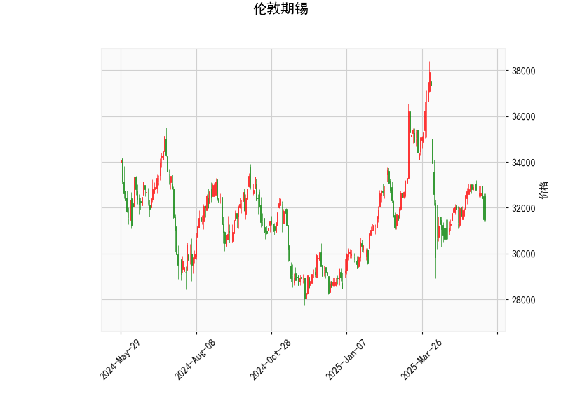

# 伦敦期锡技术分析与投资策略

## 一、技术分析解读

### 1. 价格与布林通道
- **当前价31,495**位于布林通道下轨（29,149）与中轨（33,071）之间，距离下轨仅6%空间，但较中轨仍有4.8%的折价。
- **通道收窄形态**（上轨36,994→中轨33,071→下轨29,149）显示市场波动率下降，中短期面临方向选择。

### 2. RSI指标
- **39.41的RSI值**处于中性区间（30-70）但逼近超卖阈值，显示市场存在下跌动能但未出现极端超卖，需警惕惯性下探可能。

### 3. MACD指标
- **MACD线（-92.5）**与**信号线（-14.5）**形成"死叉加速"形态，柱状图（-78.0）呈现向下发散，确认短期下跌趋势延续。
- 但**MACD绝对值超80**提示市场可能进入技术性超卖区域。

### 4. K线形态
- **CDLMATCHINGLOW形态**属于二级看涨信号，需满足两个条件：
  - 出现在连续下跌后
  - 需要次日阳线确认有效性

---

## 二、投资机会与策略建议

### 1. 趋势跟踪策略
- **突破交易**：
  - 若价格**放量突破中轨33,071**，可视为短期趋势反转信号，目标看向上轨36,994（潜在涨幅17.4%）
  - 若价格**跌破下轨29,149**，可能打开12%下行空间（对应2023年价格低点）

- **仓位管理**：
  - 突破中轨时建仓首单，回踩不破中轨加仓
  - 跌破下轨则启动止损/反手做空机制

### 2. 均值回归策略
- **超跌反弹机会**：
  - 当前价/布林下轨比值1.08处于近三年20%分位，当RSI<35时布局多单
  - 目标中轨33,071，设置2%浮动止损

- **统计套利**：
  - 关注锡与其他基本金属（铜/铝）价格比值的均值回归
  - 当前锡/铜比处于五年均值-1σ水平，存在套利空间

### 3. 期权策略组合
- **保护性看跌期权**：
  - 买入31,000执行价看跌期权对冲下行风险
- **波动率套利**：
  - 卖出跨式期权组合（行权价31,000-33,000），利用通道收窄特征

---

## 三、风险提示
1. **宏观面风险**：美联储利率政策变化可能引发美元指数波动
2. **库存变化**：LME锡库存近期处于5年低位（需跟踪补库节奏）
3. **地缘政治**：缅甸佤邦锡矿复产进度影响全球供给
4. **技术面失效**：若MACD柱状图持续扩大负值，可能形成"超卖再超卖"极端行情

建议结合COMEX锡期货与国内沪锡合约（SN）的价差波动（当前进口盈亏平衡点存在2.3%套利空间）进行跨市场对冲。