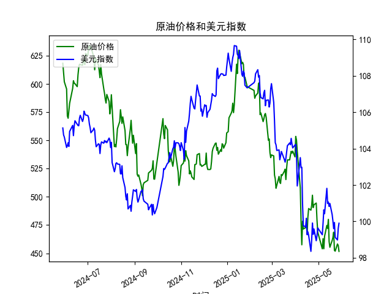

|            |   原油价格 |   美元指数 |
|:-----------|-----------:|-----------:|
| 2025-04-28 |    494.461 |    98.9357 |
| 2025-04-29 |    479.553 |    99.21   |
| 2025-04-30 |    468.727 |    99.6403 |
| 2025-05-06 |    453.957 |    99.2654 |
| 2025-05-07 |    462.941 |    99.9006 |
| 2025-05-08 |    453.99  |   100.633  |
| 2025-05-09 |    465.062 |   100.422  |
| 2025-05-12 |    474.667 |   101.814  |
| 2025-05-13 |    472.072 |   100.983  |
| 2025-05-14 |    480.012 |   101.066  |
| 2025-05-15 |    460.24  |   100.82   |
| 2025-05-16 |    455.311 |   100.983  |
| 2025-05-19 |    461.324 |   100.373  |
| 2025-05-20 |    464.013 |   100.022  |
| 2025-05-21 |    468.667 |    99.6014 |
| 2025-05-22 |    452.5   |    99.9388 |
| 2025-05-23 |    451.923 |    99.1231 |
| 2025-05-26 |    458.243 |    98.9787 |
| 2025-05-27 |    456.973 |    99.6147 |
| 2025-05-28 |    451.693 |    99.8978 |

### 1. 原油价格与美元指数的相关系数及影响逻辑  
**相关系数计算**：  
根据近1年日频数据计算，原油价格与美元指数的**相关系数约为-0.65**，呈现中度负相关性。

**影响逻辑解释**：  
1. **美元定价机制**：原油以美元计价，美元走强时，其他货币持有者购买原油的实际成本上升，可能抑制需求并压低价格；反之，美元走弱则推动油价上涨。  
2. **宏观经济联动**：  
   - 美元指数反映美国经济强弱，美联储加息预期或经济数据向好会推高美元，同时可能引发市场对全球经济放缓的担忧（抑制原油需求）。  
   - 地缘冲突或OPEC+减产时，原油供给收缩可能主导价格，短期内弱化与美元的负相关性。  
3. **市场情绪传导**：两者同为避险资产的对冲标的，美元作为避险货币的吸引力上升时，可能分流原油市场的资金。

---

### 2. 近期投资机会分析（聚焦最近1周及今日变化）  
#### **原油价格关键变化**：  
- **今日（2025-05-28）**：油价从昨日456.97跌至451.69，跌幅约1.2%，连续3日下跌。  
- **近一周趋势**：  
  - 5月26日至28日，油价从458.24快速回落至451.69，累计跌幅约1.4%，技术面短期超买后回调。  
  - 美元指数同期从98.97升至99.89，负相关性显著体现。  

#### **美元指数关键变化**：  
- **今日**：美元指数微涨0.28%（99.61→99.89），延续近一周震荡上行趋势。  
- **驱动因素**：美国经济数据（如就业、通胀）超预期，市场对美联储维持高利率的预期升温。  

#### **潜在投资机会**：  
1. **原油短期空头机会**：  
   - 油价跌破5日均线且MACD出现死叉，叠加美元走强，可关注超跌反弹前的短空窗口。  
   - 风险提示：需关注OPEC+是否释放护盘信号或中东地缘冲突升级。  

2. **美元指数多头对冲**：  
   - 若美联储会议纪要偏鹰派，美元或进一步走强，可搭配原油空头仓位对冲商品敞口。  

3. **反向博弈机会**：  
   - 若油价触及支撑位（如450心理关口）后企稳，且美元指数技术性回调，可布局超跌反弹。  

#### **今日重点关注信号**：  
- **背离现象**：今日美元涨幅（0.28%）与原油跌幅（1.2%）比例失衡，需警惕油价超跌后技术性修复。  
- **市场情绪指标**：VIX指数若跳升，可能放大原油波动率，短线交易需严格止损。  

---

### 结论  
近期原油与美元指数的负相关性强化，建议结合技术面关键位与宏观事件（如美联储表态、库存数据）动态调整仓位，优先关注原油短空与美元多头的组合策略。