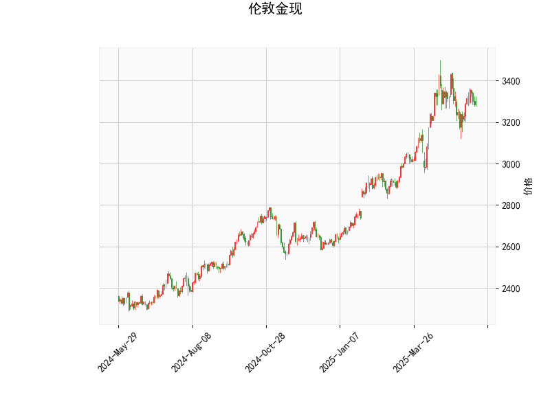

### 伦敦金现技术分析解读

#### 1. 技术指标分析
- **当前价与布林轨道**：  
  当前价（3286.34）位于布林中轨（3188.5）和上轨（3482.16）之间，距离中轨更近，表明价格处于中上区间，但尚未接近上轨压力位，短期可能仍有震荡或上行试探空间。布林带开口较宽（上下轨间距约587点），显示近期波动性较高。

- **RSI（51.61）**：  
  接近中性值50，说明市场多空力量均衡，未出现明显超买或超卖信号。若后续RSI突破55或跌破45，可能预示短期趋势方向。

- **MACD指标**：  
  MACD线（21.27）低于信号线（26.6），柱状图（-5.33）为负值，形成“死叉”信号，表明短期动能偏空。但MACD整体仍位于零轴上方，中长期趋势尚未完全转弱，需关注是否持续下行。

- **K线形态（CDLMATCHINGLOW）**：  
  该形态通常出现在下跌趋势中，表示价格低点与前一日的收盘价接近，暗示卖压减弱，可能为短期反弹信号，但需结合其他指标确认。

---

#### 2. 投资机会与策略建议

##### **短期机会**：
1. **区间震荡策略**：  
   - **做多条件**：若价格站稳中轨（3188.5）并伴随RSI回升至55以上，可尝试轻仓买入，目标看向上轨（3482），止损设于中轨下方。
   - **做空条件**：若价格跌破中轨且MACD柱状图持续扩大负值，可短空至下轨（2894.8），止损设于中轨上方。

2. **趋势突破策略**：  
   - 若价格突破上轨且MACD柱状图转正，可能开启新一轮上涨趋势，可顺势追多。
   - 若价格有效跌破中轨且RSI下穿45，可能加速向下轨运行，可布局空单。

##### **套利与风控**：
- **波动率套利**：布林带开口较宽，若价格触及上轨后回落，可结合RSI超买信号（如RSI>70）反向操作，反之亦然。
- **风险提示**：当前MACD死叉与K线形态的反弹信号矛盾，需警惕假突破。建议仓位控制在5%以内，严格设置止损。

---

**总结**：短期伦敦金现处于震荡偏弱格局，需关注中轨支撑有效性及MACD动能变化。若价格站稳中轨且MACD柱状图缩窄，可能为多头入场机会；反之，跌破中轨则需防范加速回调风险。