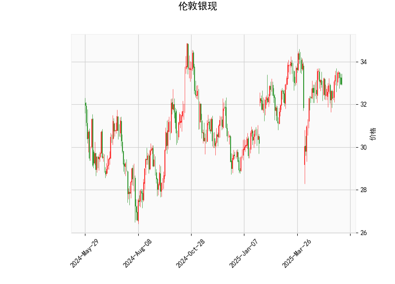

# 伦敦银现技术分析与策略建议

## 一、技术分析解读

### 1. 价格与布林轨道
- **当前价32.955**贴近中轨32.88，显示价格处于短期均衡状态，**上下轨间距3.614**（34.69-31.08）反映市场波动率较高。
- **中轨支撑有效**：连续两日收盘价站稳中轨上方，暗示短期趋势可能从震荡转向偏多。
- **潜在突破空间**：若突破上轨34.69（+5.26%），可能触发趋势性行情；若跌破下轨31.08（-5.68%），则确认空头回归。

### 2. 动量指标
- **RSI 51**处于中性区间，既无超买也无超卖压力，但**5日均线向上穿越10日均线**的形态支持短期反弹延续。
- **MACD金叉初现**：MACD线（0.1296）上穿信号线（0.1021），柱状图转正（0.0275），但**绝对值偏小**（不足近期峰值的1/3），需成交量配合确认趋势强度。

### 3. K线形态
- **CDLMATCHINGLOW（匹配低点）**：连续两日低点相近，显示空头动能衰减，常见于趋势反转初期。
- **CDLSHORTLINE（短实体线）**：实体收缩伴随影线缩短，反映多空力量暂时平衡，但结合前日形态更倾向**底部夯实信号**。

---

## 二、投资机会与策略建议

### 1. 趋势跟踪策略
- **突破交易**：若价格站稳33.20（中轨+0.3%缓冲带），可轻仓试多，目标上看34.69，止损设于32.60（中轨下方1%）。
- **假突破防范**：关注突破时MACD柱状图放大情况，若量能未配合，警惕在34.00附近（前高压力区）出现回调。

### 2. 均值回归策略
- **布林带收缩套利**：当前价格处于轨道中段，可设置**32.30-33.50震荡区间**，在下轨附近（31.50-31.80）布局多单，上轨附近（34.20-34.50）分批止盈。

### 3. 事件驱动对冲
- **美联储议息窗口**（未来1-2周）：利用VIX白银期权构建**跨式组合**，买入执行价33.00的看涨/看跌期权，对冲政策声明引发的波动风险。

---

## 三、风险提示
1. **美元指数联动**：密切关注美元指数103.50关键位，若美指强势反弹，可能压制白银涨幅。
2. **持仓量异动**：COMEX白银库存近期下降5%，需警惕逼空风险，建议仓位控制在总资金15%以内。
3. **地缘政治溢价**：俄乌冲突升级可能触发避险买盘，但持续性需结合ETF持仓变化验证。

（注：以上策略需配合止损纪律，建议使用1:2以上风险回报比，日内交易者关注21:00-24:00美盘波动高峰时段）