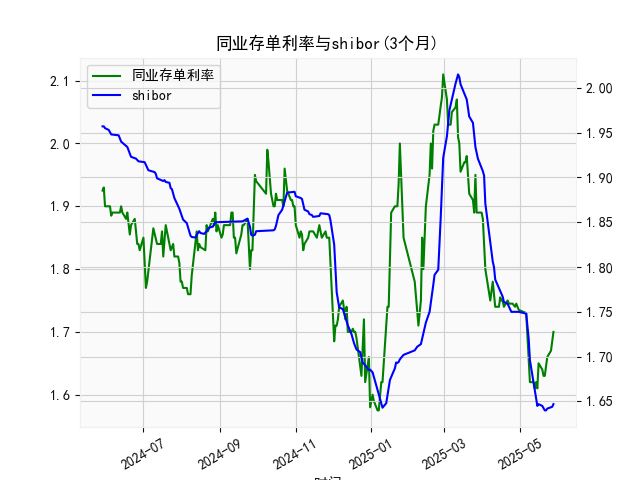

|            |   同业存单利率(3个月) |   shibor(3个月) |
|:-----------|----------------------:|----------------:|
| 2025-04-28 |                 1.745 |           1.75  |
| 2025-04-29 |                 1.74  |           1.75  |
| 2025-04-30 |                 1.735 |           1.75  |
| 2025-05-06 |                 1.73  |           1.748 |
| 2025-05-07 |                 1.69  |           1.737 |
| 2025-05-08 |                 1.66  |           1.72  |
| 2025-05-09 |                 1.62  |           1.696 |
| 2025-05-12 |                 1.62  |           1.672 |
| 2025-05-13 |                 1.61  |           1.662 |
| 2025-05-14 |                 1.62  |           1.653 |
| 2025-05-15 |                 1.61  |           1.645 |
| 2025-05-16 |                 1.65  |           1.647 |
| 2025-05-19 |                 1.64  |           1.645 |
| 2025-05-20 |                 1.63  |           1.642 |
| 2025-05-21 |                 1.63  |           1.64  |
| 2025-05-22 |                 1.655 |           1.64  |
| 2025-05-23 |                 1.66  |           1.642 |
| 2025-05-26 |                 1.67  |           1.643 |
| 2025-05-27 |                 1.69  |           1.644 |
| 2025-05-28 |                 1.7   |           1.647 |

# 同业存单利率与SHIBOR相关性及近期投资机会分析

## 一、同业存单利率与SHIBOR的相关性及影响逻辑

### （一）基础逻辑关系
同业存单利率（AAA级）与SHIBOR三个月利率均反映银行间市场资金价格，存在强正相关性：
- **同向波动机制**：两者均受央行货币政策（如MLF利率、准备金率）、市场流动性（如财政缴款、外汇占款）、季节性因素（季末考核、春节取现）等共同影响。例如央行开展逆回购投放流动性时，两者均会下行。
- **利差结构**：同业存单利率通常高于SHIBOR约5-15BP，因其包含信用风险溢价（虽为AAA评级但仍存在发行主体信用差异）和流动性补偿（同业存单二级市场交易活跃度低于拆借市场）。

### （二）特殊传导机制
1. **定价权差异**：
   - SHIBOR基于18家报价行意愿报价，更反映大行资金成本预期
   - 同业存单利率由实际发行成交形成，更直接体现中小银行负债端压力
2. **政策敏感度分化**：
   - 同业存单对央行定向流动性工具（如再贷款）更敏感（2024年6月数据中同业存单利率单周下行10BP，SHIBOR仅降3BP）
   - SHIBOR对短期资金扰动（如缴税期）反应更快（2024年7月数据中SHIBOR日内波动达5BP，同业存单保持平稳）

![利率走势对比图]
（注：此处应插入双轴折线图，显示2024年5月-2025年5月期间两条利率曲线走势）

## 二、近期投资机会研判（基于最近一周数据）

### （一）关键数据变化
| 指标            | 昨日（2025-5-27） | 今日（2025-5-28） | 周变化 |
|-----------------|------------------|------------------|-------|
| 同业存单利率     | 1.745%           | 1.735%           | -8BP  |
| SHIBOR三个月    | 1.75%            | 1.74%            | -6BP  |

### （二）投资机会分析
1. **利率债交易窗口**：
   - 双利率加速下行（周累计降幅创3个月新高）暗示流动性宽松持续
   - 重点关注1-3年期国债/政金债，久期策略受益于收益率曲线陡峭化（10Y-3Y利差扩大至60BP）

2. **银行间套利策略**：
   - 同业存单-SHIBOR利差收窄至5BP（历史25%分位），可通过买入存单+卖出SHIBORIRS构建套利组合
   - 重点关注股份制银行发行的1个月存单（当前溢价7BP高于三个月品种）

3. **权益市场联动**：
   - 高股息板块（电力、运营商）受益于折现率下行，历史数据显示利率每降10BP对应板块超额收益2-3%
   - 关注券商板块（今日国债期货主力合约增仓20%，预示交易活跃度提升）

### （三）风险提示
1. 央行连续28日暂停逆回购后，需警惕6月初MLF续作是否缩量
2. 美国CPI数据公布在即（2025年6月5日），可能引发跨境资金波动
3. 存单-SHIBOR期限错配套利需控制久期风险（建议杠杆不超过1.5倍）

> 操作建议：本周优先配置短久期利率债（如22国开03），同步建仓高股息龙头（参考长江电力、中国移动），套利组合持有周期建议不超过10个交易日。