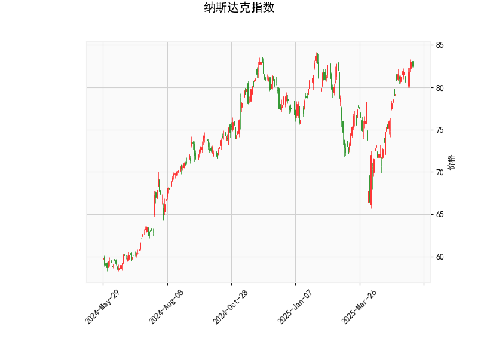

### 纳斯达克指数技术分析解读

#### 1. 技术指标综合分析
以下是关键指标及含义总结：

| 指标                | 数值/形态                  | 技术含义                                                                 |
|---------------------|---------------------------|--------------------------------------------------------------------------|
| **当前价**          | 82.55                     | 位于布林带上轨（84.38）与中轨（76.24）之间，接近上轨压力位。            |
| **RSI**             | 65.88                     | 接近超买阈值（70），但未突破，显示短期上涨动能存在但未极端化。          |
| **MACD**            | 1.84（信号线1.81）        | MACD线略高于信号线，柱状图微弱正值（0.03），显示上涨动能减弱但未反转。 |
| **布林轨道**        | 上轨84.38 / 中轨76.24     | 价格靠近上轨，若无法突破可能回踩中轨；中轨作为动态支撑。                |
| **K线形态**         | CDLMATCHINGLOW + CDLSHORTLINE | 短期看涨信号（低位反弹）+ 单日短实体K线，反映多空博弈。                |

**核心矛盾点**：  
- **看涨信号**：K线组合（CDLMATCHINGLOW）暗示短期反弹可能性，且MACD仍维持正差值。  
- **回调风险**：RSI接近超买区、价格逼近布林带上轨，叠加MACD动能萎缩，显示上涨持续性存疑。

---

#### 2. 投资机会与策略建议

##### **短期趋势策略**：
- **突破交易**：  
  - **做多条件**：若价格强势突破布林带上轨（84.38）且RSI未超70，可轻仓追涨，目标看向前高或更高阻力位。  
  - **做空条件**：若价格在上轨附近受阻回落（如收长上影线），结合RSI拐头向下，可尝试短空，目标中轨76.24。  

- **回调买入**：  
  若价格回踩中轨（76.24）并企稳（如缩量+小实体K线），可视为中线多头入场机会，止损设于下轨（68.10）下方。

##### **套利与风控**：
- **波动率套利**：  
  布林带收窄（中轨与上下轨间距较小）时，若隐含波动率偏高，可卖出跨式期权组合（Sell Straddle），赚取时间价值衰减收益。  

- **背离预警**：  
  密切关注MACD柱状图持续收缩或转负，若与价格新高形成顶背离，需警惕趋势反转风险。

##### **关键风险提示**：
- **假突破风险**：若价格短暂突破上轨后迅速回落，可能形成“多头陷阱”，需配合成交量验证。  
- **事件驱动**：美联储政策、科技股财报等事件可能放大短期波动，需灵活调整仓位。

---

### 结论
当前纳斯达克指数处于**震荡偏强但动能减弱**阶段，建议以**区间交易（高抛低吸）**为主，重点关注布林带上轨阻力与中轨支撑的转换。若突破关键位，可顺势跟进，但需严格止损以规避短期反转风险。