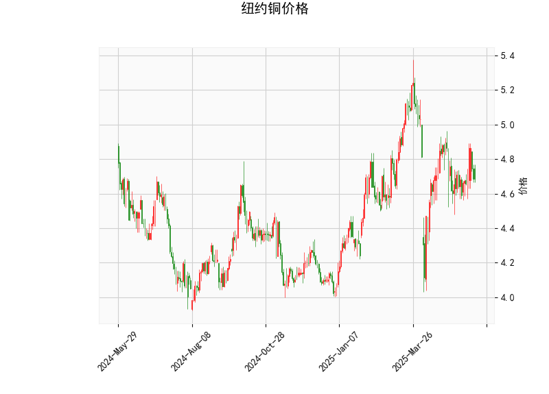

# 纽约铜价格技术分析及策略建议

## 一、技术指标解析

### 1. 价格与布林通道
- **当前价4.684**低于布林中轨4.785，但高于下轨4.338，处于**弱势震荡区间**。价格靠近布林下轨（偏离中轨约2.1%），短期存在**超卖反弹可能**。
- **布林带收窄**（上下轨差0.895），显示市场波动率下降，近期可能酝酿方向性突破。

### 2. RSI指标
- **48.07的RSI值**处于中性区间（30-70），既未显示超买也未显示超卖，暗示市场多空力量暂时平衡，需结合其他指标判断方向。

### 3. MACD指标
- **MACD线（-0.00079）**即将上穿信号线（-0.00751），**柱状图翻红（+0.0067）**，形成潜在**底背离结构**，短期反弹动能正在积聚。
- 但MACD绝对值接近零轴，表明市场整体仍处于**震荡格局**。

### 4. K线形态
- **CDLMATCHINGLOW（匹配低点）**：连续两日收盘价相同低位，显示空头动能衰减。
- **CDLSHORTLINE（短实体线）**：价格波动收窄，市场犹豫情绪明显。
- 组合形态提示可能形成短期底部，但需**量能确认**。

---

## 二、操作策略建议

### 1. 短线交易机会
- **反弹策略**：若价格站稳布林下轨4.33上方，配合MACD金叉形成，可轻仓做多，目标位中轨4.785（潜在空间2.1%），止损设于4.30。
- **突破策略**：若放量突破中轨4.785，可追加多单看至上轨5.23（潜在空间11.7%），需关注库存数据等基本面配合。

### 2. 套利机会
- **跨期套利**：近月合约贴水结构下，关注正向套利（买近抛远），需计算持仓成本与价差空间。
- **跨市场套利**：对比LME铜价差，若出现显著溢价/折价，可考虑SHFE-LME套利，需关注汇率风险。

### 3. 风险提示
- **库存变化**：全球铜库存处于历史低位，任何库存回升都将压制价格。
- **美元指数**：当前铜价与美元指数负相关性达-0.82，需密切关注美联储政策动向。
- **止损纪律**：价格若有效跌破布林下轨4.33，可能开启新一轮下跌，需严格止损。

---

**注**：以上分析基于当前技术指标，实际操作需结合当日市场成交量、持仓变化及宏观经济数据（如中国PMI、美国CPI）综合判断。建议仓位控制在20%以内，设置动态止盈止损。