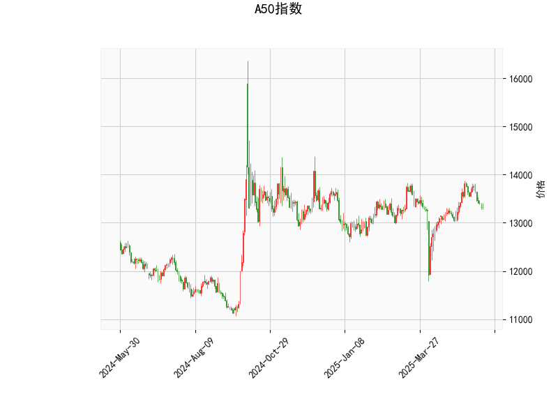

### A50指数技术分析结果详解

#### 1. 对技术指标的分析
以下是对A50指数当前技术分析结果的逐项解读，基于提供的指标数据（当前价为13320.0）。这些指标综合反映了市场的动量、趋势和波动性。

- **RSI（相对强弱指数）: 45.93**  
  RSI值处于中性区间（30-70），当前值为45.93，表明A50指数的市场动量相对平衡，但略偏弱势（低于50）。这暗示短期内买卖力量较为均衡，没有明显的超买或超卖信号。如果RSI进一步下降至30以下，可能预示市场进入超卖状态，潜在反弹机会；反之，如果上升至70以上，则需警惕超买风险。目前，这一水平显示投资者情绪较为谨慎，市场可能在盘整期。

- **MACD（移动平均收敛散度）: MACD线45.84，信号线93.03，直方图-47.19**  
  MACD线（45.84）低于信号线（93.03），这形成了一个典型的卖出信号，表明短期动量正在减弱或转向负面。直方图值为-47.19（负值），进一步确认了下行压力。整体MACD指标显示，A50指数可能处于短期回调阶段，投资者应警惕可能的下跌风险。如果MACD线向上穿越信号线，将是潜在的买入信号；否则，持续的负直方图可能加剧弱势。

- **Bollinger Bands（布林带）: 上轨13986.27，中轨13309.85，下轨12633.44**  
  当前价（13320.0）非常接近中轨（13309.85），这表明价格处于一个相对稳定的区间，没有明显偏离均值。Bollinger Bands的宽度显示市场波动性适中：价格未触及上轨（13986.27），意味着未出现超买；也未跌破下轨（12633.44），避免了超卖状况。这种位置暗示市场可能在窄幅震荡。如果价格向上突破上轨，可能预示强势反弹；反之，向下突破下轨则可能触发进一步下跌。目前的紧凑位置适合观望，等待突破确认。

- **K线形态: CDLDOJI, CDLHIGHWAVE, CDLLONGLEGGEDDOJI, CDLMATCHINGLOW, CDLSPINNINGTOP**  
  这些K线模式整体反映了市场的犹豫和不确定性：  
  - CDLDOJI和CDLLONGLEGGEDDOJI表示价格收盘接近开盘，显示买卖力量均衡，常见于趋势转折点，可能预示反转或盘整。  
  - CDLHIGHWAVE和CDLSPINNINGTOP强调了较高的波动性，但缺乏明确方向，表明市场情绪不稳。  
  - CDLMATCHINGLOW是一个潜在积极信号，可能暗示底部支撑形成，预示短期反弹。  
  综合来看，这些形态显示A50指数近期处于高不确定性阶段，投资者应关注后续K线是否出现更明确的趋势信号（如连续阳线）。

总体而言，A50指数的技术面显示中性偏弱的格局：RSI和Bollinger Bands表明市场平衡，MACD发出卖出警报，而K线形态强调波动和潜在反转。短期内，指数可能维持震荡，缺乏强烈趋势。

#### 2. 近期可能存在的投资或套利机会和策略判断
基于上述分析，A50指数的近期走势可能以盘整为主，但存在一定的交易机会。以下是对潜在投资或套利机会的评估，以及相应的策略建议。需要强调的是，市场环境复杂，建议结合基本面（如经济数据）和风险管理（如止损设置）来执行。

- **潜在投资机会**  
  - **短期观望与回调买入机会**: 当前指标显示弱势（MACD负值）和不确定性（K线形态），但RSI未进入超卖区，且CDLMATCHINGLOW暗示潜在底部。假如价格稳定在中轨附近或轻微回调至下轨（12633.44）附近，这可能是一个低风险买入点，尤其如果伴随经济数据利好（如中国经济复苏信号）。预计反弹目标可设在中轨上方或上轨（13986.27）。  
  - **反转买入机会**: K线中的Doji和Matching Low模式可能预示反转。如果后续K线出现阳线突破（如价格站上中轨），这将是买入信号。结合RSI回升至50以上，指数可能向13500-14000区间上行。  
  - **风险警示**: 如果MACD直方图持续恶化或价格跌破下轨，短期下跌风险加大，需避免追高。

- **潜在套利机会**  
  - **跨期套利**: A50指数通常涉及期货合约（如中国A50期货）。当前价格接近中轨，波动性适中，可能存在期货与现货（或ETF）之间的价差套利机会。例如，如果A50期货合约相对于现货出现折价（常见于市场不确定期），投资者可通过买入现货（或ETF）和卖出期货来锁定价差收益。预计价差在波动性增加时放大（如K线High Wave模式下）。  
  - **波动率套利**: 鉴于K线形态显示高波动性（如CDLHIGHWAVE），可考虑期权策略。例如，买入A50看涨期权（Call）和看跌期权（Put）组合（straddle或strangle），以捕捉潜在大波动。当前RSI中性环境适合此策略，如果市场突破Bollinger Bands，将放大收益。  
  - **指数相关套利**: A50指数与A股或全球新兴市场相关性高。如果A50相对其他指数（如沪深300）出现估值偏差，可进行指数间套利（如多头A50、空头沪深300）。近期不确定性可能放大这种机会。

- **推荐策略**  
  - **保守策略**: 采用观望为主，等待MACD金叉（MACD线向上穿越信号线）或K线确认反转。建议轻仓操作，设置止损在下轨附近（12600以下）。  
  - **中性策略**: 若RSI回升至50以上，可考虑买入A50相关ETF或期货，目标上轨附近，持仓时间1-2周。结合套利，监控期货现货价差，一旦扩大至0.5%以上立即执行。  
  - **积极策略**: 对于经验丰富的投资者，在波动性高的日子（如K线Spinning Top后），使用期权套利捕捉20-50点的短期波动。风险控制关键：仓位不超过总资金的20%，并结合技术止盈（e.g., 价格触及上轨时卖出）。  
  - **整体风险提示**: 近期全球经济不确定性（如地缘政治或美联储政策）可能影响A50，建议结合宏观因素评估。任何策略均需实时监控指标变化，避免单一信号决策。

通过以上分析，A50指数短期内可能以震荡为主，投资机会需依赖技术突破，而套利则更适合波动性环境。建议投资者理性决策，结合个人风险偏好。