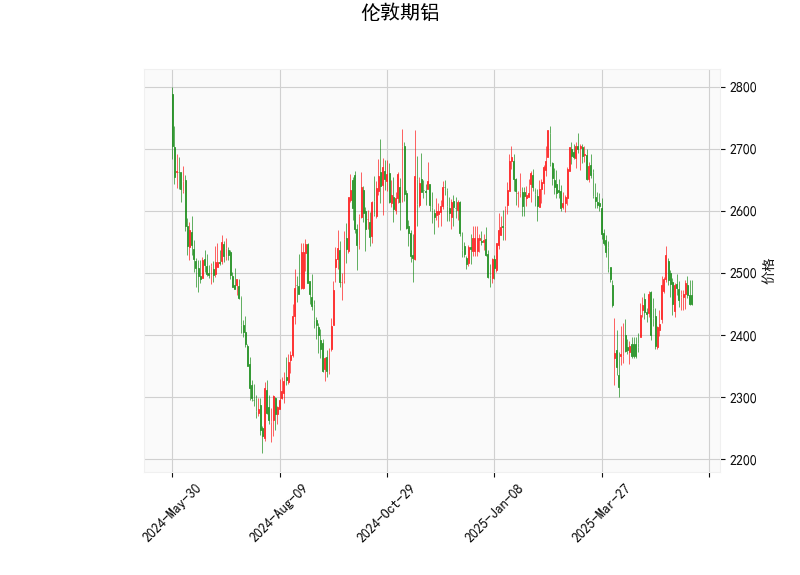

# 伦敦期铝技术分析结果分析

## 1. 技术指标详细分析
基于提供的伦敦期铝技术分析数据，我们对各指标进行逐一解读，以评估当前市场的技术面状况。当前价格为2450.5，整体指标显示市场处于相对中性偏弱的态势，但存在短期波动可能性。

- **RSI（Relative Strength Index，相对强弱指数）**：  
  当前RSI值为47.91，这表明市场处于中性区域（RSI通常以50作为分界线，低于50可能表示弱势或超卖）。RSI低于50但未跌至30以下，暗示近期卖方力量略占上风，但尚未出现明显的超卖信号。这可能反映出市场参与者对铝价的观望情绪，短期内价格可能继续小幅调整。

- **MACD（Moving Average Convergence Divergence，移动平均收敛散度）**：  
  MACD线值为1.242，信号线值为1.111，MACD直方图（Hist）值为0.131（正值）。MACD线高于信号线且Hist为正，显示短期内存在看涨信号，这可能表示多头力量正在积聚。然而，Hist值较小（仅0.131），表明这一看涨势头还不算强劲，容易受到市场波动影响。如果Hist值持续扩大，可能会确认向上趋势；反之，如果Hist转为负值，则可能逆转为看跌。

- **布林带（Bollinger Bands）**：  
  上轨（Upper Band）为2699.12，中轨（Middle Band）为2487.16，下轨（Lower Band）为2275.21。当前价格2450.5位于中轨附近（略低于中轨），这表明价格处于布林带的中间区域，市场波动相对温和。没有明显突破上轨或下轨，暗示铝价可能在短期内维持区间震荡。如果价格向上突破中轨并接近上轨（2699.12），可能预示上行趋势；反之，向下测试下轨（2275.21）则可能加剧下行压力。

- **K线形态**：  
  检测到的K线形态为“CDLMATCHINGLOW”（匹配低点形态），这是一种典型的看跌形态，通常出现在价格见底或潜在反转时。它表示近期蜡烛图显示出价格可能企稳，但也警告潜在的下行风险。如果后续K线未能向上突破，可能强化卖方主导的局面。

总体而言，这些指标呈现出混合信号：MACD显示短期看涨潜力，而RSI和K线形态则偏向弱势，布林带则反映出市场可能处于盘整期。投资者需关注后续价格行为，以确认趋势方向。

## 2. 近期投资或套利机会和策略判断
根据上述技术分析，伦敦期铝市场短期内可能存在波动性机会，但整体风险较高。以下是对潜在投资或套利机会的分析和策略建议，基于当前数据和常见市场行为。需强调，实际决策应结合基本面（如全球铝需求、供应动态和宏观经济因素）及风险管理。

### 潜在机会分析
- **短期看涨机会**：  
  MACD的正Hist值暗示可能有短期反弹空间，尤其如果铝价向上突破布林带中轨（2487.16）。如果全球经济复苏或新能源需求（如电动汽车）推动铝需求上涨，这可能转化为实际机会。预计价格可能测试上轨（2699.12）附近，形成10-15%的上行潜力。

- **看跌或盘整机会**：  
  RSI偏弱和CDLMATCHINGLOW形态提示潜在下行风险。如果价格跌破布林带中轨，可能进一步向下轨（2275.21）靠拢，带来10%左右的下行空间。这适合空头策略，尤其在市场不确定性（如地缘政治事件影响铝供应）加剧时。

- **套利机会**：  
  铝价当前处于布林带中部，波动率中等（基于布林带宽度），这为跨市场或跨品种套利提供基础。例如：  
  - **期现套利**：如果现货铝价与期货价（当前2450.5）出现价差，可通过买入现货并卖出期货锁定利润。  
  - **跨期套利**：比较伦敦金属交易所（LME）不同交割月份的铝合约价差（如近期合约 vs 远期合约），如果价差异常扩大（e.g., 由于季节性需求变化），可进行反向套利。  
  - **相关品种套利**：铝与铜或其他工业金属相关性高，如果铜价上涨而铝价滞后，可通过多头铝/空头铜的组合捕捉相对价值机会。

### 投资策略建议
- **多头策略（买入机会）**：  
  如果MACD Hist持续扩大并价格突破中轨，建议在2450-2487区间买入多头头寸，目标上探至2699附近。设置止损在下轨（2275）以下，以控制风险。适用于短期交易者，结合RSI回升至50以上作为确认信号。

- **空头策略（卖出机会）**：  
  若RSI进一步下降或K线形态强化看跌信号，考虑在当前价位卖出空头，目标下探至2275附近。止损设在中轨以上（2487）。这适合风险偏好较高的投资者，但需警惕基本面反弹（如中国刺激政策提振需求）。

- **中性策略（套利或波动率交易）**：  
  鉴于市场盘整特征，推荐波动率策略，如买入 straddles 或 strangles 期权（同时买入看涨和看跌期权），以捕捉潜在大波动。或者，进行价差交易：例如，在LME上构建铝-铜价差头寸，如果历史相关性被打破，可获利。目标价差收敛，风险控制在5-10%。

- **风险与注意事项**：  
  - **总体风险**：技术指标不一致，可能导致假突破。外部因素如能源价格波动或贸易政策变化会放大不确定性。  
  - **资金管理**：建议仓位控制在总资金的20%以内，结合技术止损（如布林带边界）。  
  - **时机建议**：短期内（1-2周）观察价格行为，如果MACD与RSI同步向上，则机会更大；否则，等待更明确信号。  
  - **长期视角**：若基本面支撑（如绿色能源需求增长），铝价可能进入上行周期，适合持有中长期多头。

总之，近期伦敦期铝的投资机会主要围绕短期波动和套利展开，但需谨慎操作，避免单一依赖技术分析。建议结合实时市场数据和专业咨询进行决策。