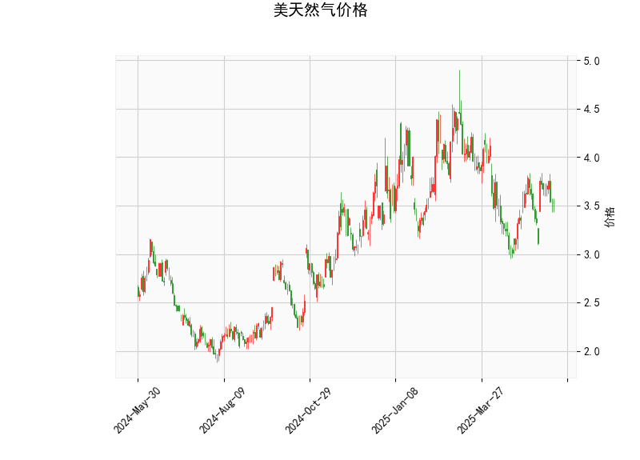

### 美天然气价格的技术分析结果分析

#### 1. 对技术分析结果的详细分析
美天然气价格当前位于3.535美元/百万英热单位（MMBtu），基于提供的指标，我们可以从多个维度评估市场趋势、技术信号和潜在风险。以下是对关键指标的逐一分析：

- **RSI（相对强弱指数）: 49.11**  
  RSI值处于中性水平（50以下表示弱势，但未低于30的超卖区域）。这表明美天然气市场近期缺乏强烈动量，价格可能处于盘整阶段。如果RSI继续下降，可能暗示短期卖压增加；反之，如果RSI反弹至50以上，将显示潜在买入信号。目前的RSI值反映了市场的犹豫不决，可能与季节性需求波动或地缘政治因素相关。

- **MACD（移动平均收敛散度）: MACD线为0.021, 信号线为0.013, 直方图为0.008**  
  MACD线高于信号线，且直方图值为正，这是一个轻微的看涨信号，表明短期内买方力量可能略占上风。然而，MACD值的幅度较小（未出现强烈交叉），显示趋势不明显。如果MACD直方图继续扩大，可能确认上行趋势；反之，如果直方图转为负值，将预示潜在反转。这反映了市场可能正从近期低点缓慢恢复，但缺乏强势推动。

- **布林带（Bollinger Bands）: 上轨为4.315, 中轨为3.643, 下轨为2.971**  
  当前价格3.535位于中轨附近（3.643），表明市场处于中性区间，没有明显的突破信号。这通常代表价格在波动范围内盘整，缺乏强烈趋势。如果价格向上突破上轨（4.315），可能触发买盘；反之，向下触及下轨（2.971）可能引发卖压。目前的布林带宽度适中，暗示波动率中等，适合观望或短期交易策略。

- **K线形态: CDLDOJI, CDLGAPSIDESIDEWHITE, CDLHIGHWAVE, CDLLONGLEGGEDDOJI, CDLSPINNINGTOP**  
  这些K线模式主要反映了市场的犹豫和不确定性：  
  - CDLDOJI和CDLLONGLEGGEDDOJI表示价格收盘接近开盘，常见于市场 indecisiveness，可能预示反转或盘整。  
  - CDLGAPSIDESIDEWHITE和CDLHIGHWAVE显示了跳空和较高波动，暗示短期波动性增强，但缺乏明确方向。  
  - CDLSPINNINGTOP代表小实体蜡烛，常见于趋势末期，表明买方和卖方力量均衡。  
  整体上，这些形态显示近期市场可能处于十字路口，投资者应警惕潜在反转，而非追逐趋势。

综合分析：美天然气价格目前呈现中性偏看涨的格局。RSI和MACD提供轻微支撑，但K线形态和布林带位置强调不确定性。外部因素如天气变化、全球能源需求或政策事件（如OPEC+动态）可能放大这些信号。短期内，价格可能在3.0-4.5美元区间波动，需关注突破点。

#### 2. 近期可能存在的投资或套利机会和策略
基于上述分析，近期美天然气市场的投资机会主要集中在短期波动和潜在反转上。以下是针对当前情况的判断和策略建议，强调风险控制和机会捕捉：

- **可能的投资机会：**  
  - **轻微看涨机会：** MACD的正直方图和RSI接近50表明，价格可能向上测试布林带上轨（4.315）。如果全球需求回升（如冬季取暖季临近）或油价上涨带动天然气，短期买入机会或出现。预计潜在上涨空间为3.535-4.315美元区间。  
  - **盘整中的反转机会：** K线形态显示高不确定性，如果价格跌破中轨（3.643）并接近下轨（2.971），可能形成超卖反弹点，尤其在RSI跌至40以下时。这适合逢低布局，但需警惕季节性供应过剩风险。  
  - **风险警示：** 当前中性信号弱于强势趋势，任何机会都可能因地缘政治（如中东冲突）或经济数据（如美国EIA库存报告）而逆转。总体机会中等，适合短线交易者。

- **可能的套利机会：**  
  - **跨期套利：** 天然气期货市场（如NYMEX）存在不同到期合约的价格差异。如果当前价格（3.535）与远期合约（如2024年Q4）出现异常分歧（如远期折价过大），可考虑多头当前合约、空头远期合约的策略。近期，若库存数据超预期，短期合约可能被低估，提供套利空间。  
  - **跨资产套利：** 天然气与相关商品（如原油或电力期货）高度相关。如果原油价格上涨（如布伦特原油突破80美元/桶）而天然气未跟进，可进行多头天然气-空头原油的相对价值套利。预计相关性系数在0.7以上，适合在价格背离时操作。  
  - **波动率套利：** K线的高波动形态（如CDLHIGHWAVE）暗示隐含波动率可能被高估。通过期权市场（如买入看涨期权、卖出看跌期权 straddles），可捕捉波动率回归均值的机会。但需注意，当前布林带宽度中等，波动率套利需在关键事件（如EIA报告发布）前后执行。

- **推荐策略：**  
  - **保守策略：** 采用观望为主，等待确认信号（如RSI>50或MACD金叉）。建议设置止损位（如价格跌破3.300），并控制仓位在总资金的10-20%。适合新手或风险厌恶者。  
  - **积极策略：** 如果MACD直方图扩大，可小额买入现货或期货，目标价位4.000-4.315；若K线显示反转迹象，考虑卖出空头。结合布林带，采用均值回归策略（价格偏离中轨时反向操作）。  
  - **风险管理建议：** 所有策略需结合宏观因素（如美联储利率决策或全球能源供应），并使用技术止损（如Trailing Stop）。总体而言，近期机会适中，但不确定性高，建议优先短线操作而非长期持有。

通过以上分析，美天然气市场短期内可能以盘整为主，投资者应注重信号确认以避免盲目操作。持续监控实时数据，以调整策略。