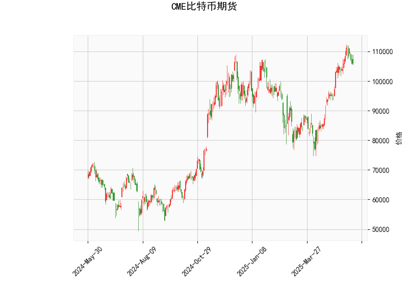

### 1. 对CME比特币期货的技术分析结果进行分析

以下是对提供的CME比特币期货技术指标的详细分析，这些指标反映了当前市场的技术面状况。比特币作为一种高度波动的资产，其技术指标往往能提供短期趋势和潜在风险的线索。

- **当前价格（Current Price）**: 比特币期货价格为106,090.0美元。这表明价格处于相对较高的水平，但未触及历史高点，显示市场仍在波动中。相比于Bollinger Bands的中轨（92,669.27美元），当前价格位于中线上方，暗示短期内价格可能维持强势，但也接近上轨，潜在风险增加。

- **RSI（Relative Strength Index，相对强弱指数）**: RSI值为60.76。这是一个中性偏强势的读数，通常RSI在70以上表示超买（可能引发回调），而在30以下表示超卖（可能迎来反弹）。当前水平表明比特币市场整体强势，但未进入超买区，短期内可能继续上涨或保持稳定。然而，如果RSI继续上升，需警惕回调风险。

- **MACD（Moving Average Convergence Divergence，移动平均收敛散度）**: MACD线为4,067.04，信号线为4,625.49，柱状图（MACD Hist）为-558.45。这是一个典型的看跌信号，因为MACD线低于信号线，且柱状图为负值。这表明短期动量可能在减弱，潜在的卖出压力增加。投资者应关注MACD线的交叉情况，如果MACD线继续下行，可能预示价格回调。

- **Bollinger Bands（布林带）**: 
  - 上轨（Upper Band）：112,862.01美元
  - 中轨（Middle Band）：92,669.27美元
  - 下轨（Lower Band）：72,476.54美元
  当前价格（106,090.0美元）位于中轨和上轨之间，这显示价格处于正常波动范围内，但接近上轨，暗示市场可能面临波动性增加。如果价格突破上轨，可能引发进一步上涨；反之，如果回落至中轨以下，则可能进入修正阶段。Bollinger Bands的宽度反映了市场的波动率，目前宽度较大，表明比特币的波动性较高。

- **K线形态（K线模式）**: 检测到"CDLMATCHINGLOW"形态。这是一个看跌的K线模式，通常出现在价格底部或回调阶段，表示市场可能出现短期逆转或进一步下跌。"Matching Low"模式暗示前两天的低点相似，这可能预示着卖家力量增强。如果后续K线确认这一模式，价格可能面临下行压力。

总体而言，这些指标呈现混合信号：RSI显示市场强势，暗示潜在上涨空间；但MACD和K线形态的看跌信号，以及价格接近Bollinger Bands上轨，增加了短期回调的风险。比特币市场受宏观经济、监管和情绪影响较大，因此这些技术指标应结合基本面分析使用。

### 2. 分析判断近期可能存在的投资或套利机会和策略

基于上述技术分析，近期CME比特币期货市场可能存在短期投资机会和套利策略，但需注意比特币的高波动性和外部不确定性（如政策变动或全球经济事件）。以下是针对当前指标的判断和建议策略：

#### 潜在投资机会
- **短期回调风险主导，但反弹可能性存在**:
  - MACD的看跌信号和"CDLMATCHINGLOW"形态表明，价格可能在短期内回落（例如向Bollinger Bands中轨92,669.27美元靠拢），这为做空或观望型投资者提供机会。
  - 另一方面，RSI的强势读数（60.76）显示市场未过度超买，如果外部因素（如机构买入）介入，价格可能反弹至上轨112,862.01美元以上。
  - **机会类型**:
    - **做空机会**: 如果MACD柱状图继续为负，价格可能跌向100,000美元附近，适合经验丰富的交易者通过期货合约做空。
    - **买入机会**: 若价格回落至中轨附近（约92,000-95,000美元），RSI可能从强势区提供低风险买入点，期待反弹。

- **风险因素**: 比特币市场易受新闻驱动（如ETF流入或地缘政治事件），当前指标的矛盾性增加了不确定性。投资者应监控RSI是否突破70（超买信号）或MACD是否金叉（看涨）。

#### 潜在套利机会
- **期货与现货价差套利**: CME比特币期货的价格（106,090.0美元）可能与现货市场（如Coinbase或Binance）存在差异，尤其在波动期。当前期货价格高于Bollinger Bands中轨，暗示基差（期货与现货的价差）可能扩大。
  - **机会类型**:
    - **正向套利**: 如果CME期货价格高于现货（例如，现货价格在105,000美元左右），可以买入现货并卖出期货合约，待价差收窄后获利。
    - **负向套利**: 若现货价格高于期货（较少见），则反向操作。
    - 预计机会窗口: 在MACD看跌信号期间，价差可能放大，提供短期套利空间。

#### 推荐策略
- **短期交易策略**:
  - **做空策略**: 基于MACD和K线形态，建议在价格接近上轨（112,000美元）时做空CME期货合约，设置止损在115,000美元以上。目标位可设在中轨（92,000美元）。这适合风险承受力强的交易者。
  - **观望并买入策略**: 如果RSI维持在60以上，等待价格回落至中轨附近后买入期货，目标上探上轨。结合技术止损（如低于下轨72,000美元），控制风险。
  
- **套利策略**:
  - **跨市场套利**: 监控CME期货与现货市场的价差。如果价差超过1-2%，执行买入现货/卖出期货的组合策略。使用杠杆期货合约放大收益，但需注意保证金要求。
  - **风险对冲策略**: 结合期权（如买入看跌期权）对冲MACD看跌风险，确保在回调中保护投资。

- **总体风险管理建议**:
  - **资金分配**: 不要将超过5-10%的资金用于比特币期货交易，以应对高波动。
  - **监控指标**: 定期检查RSI和MACD的变化；如果RSI跌破50或MACD转正，及时调整策略。
  - **市场环境**: 当前全球加密市场正处于牛市后期（基于RSI强势），但监管不确定性（如美国政策变化）可能放大回调。建议结合新闻和基本面分析，避免单纯依赖技术指标。

总之，近期投资机会主要围绕短期回调和潜在反弹，而套利机会依赖于市场价差。投资者应根据个人风险偏好和经验谨慎操作，始终优先考虑风险管理。