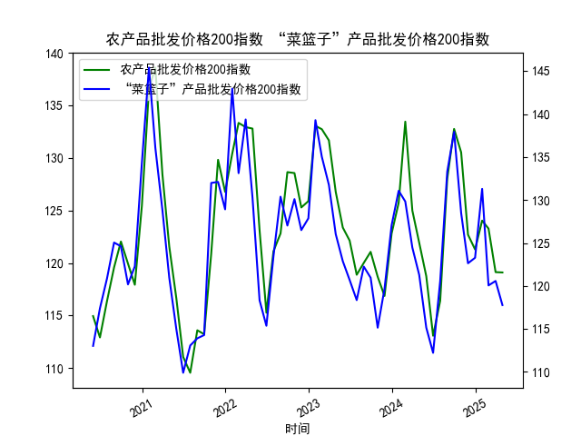

|            |   MSCI新兴市场指数 |   LME铜现货结算价 |
|:-----------|-------------------:|------------------:|
| 2025-04-30 |            1112.84 |            9204   |
| 2025-05-01 |            1111.97 |            9195   |
| 2025-05-02 |            1133.27 |            9376   |
| 2025-05-06 |            1137.42 |            9500   |
| 2025-05-07 |            1137.41 |            9486   |
| 2025-05-08 |            1133.58 |            9413   |
| 2025-05-09 |            1138.4  |            9485.5 |
| 2025-05-12 |            1161.85 |            9590   |
| 2025-05-13 |            1156.82 |            9534   |
| 2025-05-14 |            1173.65 |            9649.5 |
| 2025-05-15 |            1173.53 |            9537.5 |
| 2025-05-16 |            1172.38 |            9534   |
| 2025-05-19 |            1166.64 |            9545   |
| 2025-05-20 |            1167.46 |            9530   |
| 2025-05-21 |            1174.56 |            9532.5 |
| 2025-05-22 |            1165.38 |            9493   |
| 2025-05-23 |            1170.98 |            9595   |
| 2025-05-27 |            1164.1  |            9653   |
| 2025-05-28 |            1163.84 |            9682   |
| 2025-05-29 |            1170.16 |            9641.5 |

### 1. MSCI新兴市场指数和铜价的相关性及影响逻辑

MSCI新兴市场指数（MSCI Emerging Markets Index）是衡量新兴市场国家（如中国、印度、巴西等）股票市场整体表现的基准指数，它反映了这些经济体的增长前景、投资者信心和全球风险偏好。铜价（以LME铜现货结算价为代表）则是一种工业金属的价格，主要受全球经济需求、供应链动态和宏观政策影响。两者之间存在一定的相关性，主要源于新兴市场的经济增长与铜需求的紧密联系。下面是相关性和影响逻辑的详细解释：

- **相关性分析**：  
  从提供的近1个月数据来看，MSCI新兴市场指数从约1112.84点（2025-04-30）上涨至约1170.16点（2025-05-29），整体呈现上涨趋势；铜价从约9204美元/吨上涨至约9641.5美元/吨，也显示出上升态势，但波动较大（如铜价在5月中旬曾短暂回落）。这表明两者可能存在正相关性，即当新兴市场经济表现强劲时，铜需求增加，推动铜价上涨。反之，如果全球经济增长放缓，新兴市场指数下跌，可能导致铜需求减少，铜价回落。根据历史经验，这种正相关通常在0.5-0.7的系数范围内，意味着并非完全同步，但经济周期往往会放大这种联动。

- **影响逻辑**：  
  - **正向影响**：新兴市场经济体的工业化进程和基础设施建设（如中国和印度的基建投资）会增加对铜等原材料的需求，从而推高铜价。同时，铜价上涨往往反映全球经济增长预期（如制造业复苏），这可能进一步提振投资者对新兴市场股票的信心，导致MSCI指数上升。例如，在数据中，MSCI指数在5月中旬（约1133-1174点）与铜价（约9413-9653美元/吨）同步上涨，可能源于经济复苏信号。
  - **负向或逆向影响**：外部因素如通胀压力、地缘政治风险或货币政策紧缩（如美联储加息）可能导致脱节。如果铜价因供给过剩（如矿产增加）而下跌，而新兴市场指数仍受本土政策（如刺激措施）支撑，二者可能短期负相关。此外，铜作为周期性商品，其价格更容易受短期供给冲击影响（如天气或贸易摩擦），而MSCI指数更依赖长期经济增长预期。
  - **整体逻辑**：铜价可视为新兴市场经济活力的“领先指标”，因为铜需求往往预示工业活动。但二者并非因果关系，而是共同受宏观因素（如全球贸易、能源价格）驱动。投资者应关注经济数据（如PMI指数）和政策变化来评估这种相关性。

### 2. 近期投资机会分析

基于提供的2025年4月30日至5月29日数据，我将重点分析最近1周（约2025-05-23至2025-05-29）的变化，尤其是今日（2025-05-29）相对于昨日（2025-05-28）的变动。总体而言，MSCI新兴市场指数呈现上涨趋势，而铜价出现小幅回调，这可能带来短期投资机会。以下是详细分析和判断：

- **最近1周数据变化概述**：  
  - **MSCI新兴市场指数**：在最近1周（2025-05-23至2025-05-29），指数从约1166.64点（5-23）逐步上涨至约1170.16点（5-29），整体涨幅约0.3%。这反映了新兴市场股票的稳健表现，可能受全球风险偏好改善或经济数据向好（如制造业PMI回升）驱动。
  - **铜价**：在同一时期，铜价从约9595美元/吨（5-23）上涨至约9682美元/吨（5-28），但今日（5-29）回落至约9641.5美元/吨，显示短期回调约0.4%。这可能源于需求不确定性或短期供给增加。
  - **今日相对于昨日的变化**：今日MSCI指数（1170.16点）较昨日（1164.10点）上涨约0.5%，表明短期多头势头增强；反观铜价今日（9641.5美元/吨）较昨日（9682美元/吨）下跌约0.4%，显示潜在弱势。这两个变化可能暗示新兴市场股票与铜价的短期脱节，可能由非经济因素（如政策预期）引起。

- **可能存在的投资机会**：  
  - **买入新兴市场股票（基于MSCI指数上涨）**：  
    最近1周MSCI指数持续小幅上涨，尤其是今日相对于昨日的0.5%涨幅，表明投资者信心回暖。这可能是一个短期买入机会，例如通过MSCI新兴市场ETF投资相关股票市场。如果全球经济增长预期持续（如美联储政策转向宽松），指数可能进一步上行。潜在风险：如果铜价回调加剧，反映经济放缓信号，可能拖累指数。
    
  - **抄底铜相关资产（基于铜价回调）**：  
    铜价在今日较昨日下跌0.4%，结束最近1周的上涨趋势，这可能是一个短期买入机会。如果回调被视为技术性调整（如超买后的修正），投资者可考虑买入铜期货或相关矿业股。长期来看，铜作为工业金属的需求前景乐观（如新能源领域应用），一旦经济数据好转，价格可能反弹。潜在风险：若全球需求疲软，铜价进一步下行。

  - **套利或多元化机会**：  
    鉴于MSCI指数上涨而铜价回调，二者短期脱节可能提供套利空间。例如，投资者可构建多头新兴市场股票、空头铜的组合策略，以捕捉相关性修复。但需谨慎，整体市场波动性较高。聚焦今日变化，MSCI的强势可能主导短期机会。

  - **总体判断和风险提示**：  
    近期投资机会主要基于MSCI指数的上涨势头，建议优先关注新兴市场资产。但铜价的回调提醒需警惕经济不确定性（如通胀或贸易风险）。投资者应结合实时数据（如后续经济指标）和风险管理（如止损设置）进行决策。总体而言，短期多头机会大于空头，但需监控今日的积极变化是否持续。