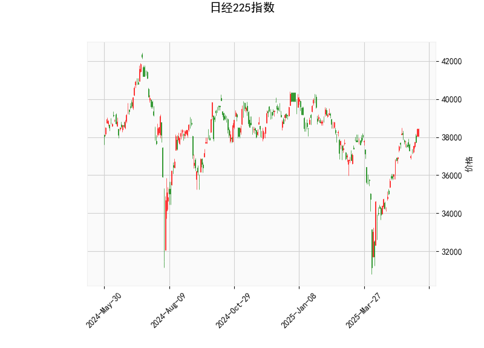

### 日经225指数技术分析

以下是对日经225指数当前技术分析结果的详细解读，基于提供的指标数据。日经225指数当前价位为38432.98，显示出混合信号，包括强势上涨趋势和潜在超买风险。我们将逐一分析各指标及其含义。

#### 1. 关键指标分析
- **当前价格（Current Price）: 38432.98**  
  当前价格位于布林带的中轨（36307.61）和上轨（39746.11）之间，表明指数处于相对强势区域。最近的价格走势可能受市场乐观情绪驱动，但距离上轨较近，暗示短期内可能面临阻力位测试或回调压力。

- **RSI（Relative Strength Index）: 66.28**  
  RSI值高于70的阈值，显示指数处于超买状态。这通常意味着市场可能过度乐观，短期内存在回调风险，尤其是在缺乏新催化剂的情况下。投资者需警惕潜在的卖出压力，如果RSI继续上升，可能进一步确认超买信号。

- **MACD（Moving Average Convergence Divergence）: 551.59 (MACD线), 501.39 (信号线), 50.20 (直方图)**  
  MACD线高于信号线，且直方图为正值（50.20），这表明短期内存在看涨动能，价格可能继续上行。然而，直方图的正值虽然支持多头趋势，但幅度相对温和，暗示动量可能正在减弱。如果MACD线与信号线差距缩小，可能会转为中性或看跌信号。

- **布林带（Bollinger Bands）: Upper Band 39746.11, Middle Band 36307.61, Lower Band 32869.11**  
  当前价格接近上轨（39746.11），显示指数处于波动率较高的上行通道内。这可能表示短期强势，但也预示着潜在的逆转风险，因为价格一旦触及上轨，往往会引发获利了结或回调。中间带作为支撑位，如果价格回落至此，可能提供买入机会。下轨（32869.11）作为更远期的支撑，当前距离较远。

- **K线形态（Candlestick Patterns）: CDLBELTHOLD, CDLCLOSINGMARUBOZU, CDLLONGLINE, CDLMARUBOZU**  
  这些形态整体显示强势上涨信号：  
  - **CDLBELTHOLD和CDLMARUBOZU**：表示强烈的买方控制，蜡烛实体较长，影线较短，暗示市场趋势可能持续向上。  
  - **CDLCLOSINGMARUBOZU**：类似于完整的Marubozu形态，显示收盘价接近当日高点，强化了多头主导地位。  
  - **CDLLONGLINE**：反映了较大的价格波动，可能是强势上涨后的调整信号。  
  总体上，这些形态支持短期多头趋势，但如果后续K线出现反转（如Doji或熊形态），可能预示回调。

#### 2. 总体市场解读
从以上指标来看，日经225指数显示出强势上涨特征（MACD和K线形态支持多头），但RSI和布林带的上轨位置警告潜在超买风险。这可能反映了市场对全球经济复苏或日本本土政策的乐观预期（如日元贬值或通胀控制）。然而，短期内，指数面临回调可能性，因为超买状态往往导致获利回吐。如果外部因素（如地缘政治事件或经济数据）出现负面影响，价格可能回落至中轨附近（36307.61）。

### 近期投资或套利机会和策略分析

基于上述技术分析，我们判断日经225指数的近期走势可能呈现短期上涨潜力，但伴随回调风险。以下是针对可能的投资或套利机会的分析和策略建议，旨在帮助投资者制定风险控制措施。注意，所有建议均为基于技术指标的推测，实际决策应结合基本面分析和风险承受能力。

#### 1. 潜在投资机会
- **看涨机会**：  
  如果MACD直方图保持正值且K线形态持续强势，指数可能进一步向39746.11（布林上轨）测试，甚至突破。这为多头投资者提供机会，尤其是在日本股市受惠于全球风险资产回暖的环境下。**推荐策略**：  
  - **趋势跟踪买入**：在价格稳定在中轨以上时，考虑买入ETF（如日经225追踪基金）或相关股票。设置止损位在36307.61附近，以防范回调。目标位可设在40000以上。  
  - **时机**：短期内（1-2周），若RSI从超买区回落至60以下，可视为低风险入场点。

- **回调机会**：  
  RSI超买和布林上轨压力可能引发10-15%的回调，跌至中轨（36307.61）或更低。这为逆势投资者或均值回归策略提供机会。**推荐策略**：  
  - **卖出或做空**：若K线出现反转形态（如十字星），考虑在当前价位附近卖出头寸或使用衍生品（如期货或期权）做空。目标回调位为35000-36000。  
  - **时机**：密切关注RSI是否突破70上方；如果突破，可能确认回调。

#### 2. 潜在套利机会
套利策略通常依赖市场 inefficiencies，如价格差异或波动率异常。在日经225指数上，可能的机会包括：
- **波动率套利**：当前布林带宽度较大（表示高波动率），如果指数接近上轨，可通过买入看涨期权和卖出看跌期权来构建中性策略，捕捉波动率收缩。**推荐策略**：  
  - **布林带策略**：在价格触及上轨时，买入中轨附近的看跌期权作为保护，同时持有现货头寸。预计波动率下降时获利。  
  - **跨市场套利**：如果日经225与相关指数（如恒生指数）出现价格偏差，可通过指数期货进行套利（例如，买入日经225期货并卖出相关资产）。  
  - **风险**：日本市场的全球联动性强，需监控外部事件（如美联储政策）以避免突发风险。

#### 3. 总体策略建议
- **风险管理**：在任何操作前，设定止损位（例如，基于布林中轨）。多头策略适合风险偏好较高的投资者，而回调策略更适合保守型。  
- **监控因素**：关注日本经济数据（如GDP、通胀）和全球事件（如美股动态），这些可能放大或减弱当前趋势。  
- **综合评估**：短期内（1-3个月），指数可能上涨5-10%，但超买风险使得整体不确定性较高。建议结合基本面（如企业盈利）验证技术信号。

请记住，技术分析并非绝对预测，市场随时可能受意外事件影响。建议咨询专业顾问，并在模拟环境中测试策略。