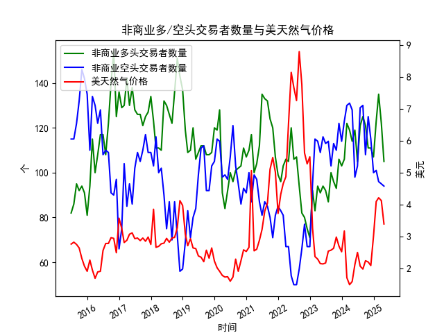

|            |   非商业多头交易者数量 |   非商业空头交易者数量 |   美天然气价格 |
|:-----------|-----------------------:|-----------------------:|---------------:|
| 2023-09-30 |                     96 |                    113 |           2.64 |
| 2023-10-31 |                     93 |                    110 |           2.99 |
| 2023-11-30 |                    106 |                    122 |           2.71 |
| 2023-12-31 |                    103 |                    114 |           2.53 |
| 2024-01-31 |                    106 |                    123 |           3.18 |
| 2024-02-29 |                    122 |                    130 |           1.72 |
| 2024-03-31 |                    119 |                    131 |           1.5  |
| 2024-04-30 |                    114 |                    128 |           1.6  |
| 2024-05-31 |                    119 |                     98 |           2.13 |
| 2024-06-30 |                    105 |                    103 |           2.51 |
| 2024-07-31 |                    121 |                    129 |           2.08 |
| 2024-08-31 |                    125 |                    130 |           1.99 |
| 2024-09-30 |                    121 |                    108 |           2.25 |
| 2024-10-31 |                    111 |                    125 |           2.21 |
| 2024-11-30 |                    111 |                    115 |           2.1  |
| 2024-12-31 |                    107 |                    100 |           3.02 |
| 2025-01-31 |                    123 |                    101 |           4.1  |
| 2025-02-28 |                    135 |                     96 |           4.22 |
| 2025-03-31 |                    122 |                     95 |           4.13 |
| 2025-04-30 |                    105 |                     94 |           3.4  |

### 近期美天然气投资机会分析

#### 介绍
基于提供的月度数据，我对近10年NYMEX交易所美天然气非商业多头交易者数量、非商业空头交易者数量以及价格进行了分析。重点关注最近三个月（2025-02-28、2025-03-31和2025-04-30）的变化，尤其是2025-04-30（本月）相对于2025-03-31（上月）的变动。投资机会的判断主要考虑交易者情绪（多头和空头变化）与价格趋势的互动，这些因素可能预示市场波动或潜在机会。以下分析基于历史数据模式，但需提醒，投资涉及风险，实际决策应结合实时市场和外部因素（如天气、地缘政治）。

#### 最近三个月数据摘要
以下是最近三个月的关键数据，突出多头交易者数量、空头交易者数量和价格的数值变化：

| 日期        | 多头交易者数量（单位：个） | 空头交易者数量（单位：个） | 价格（单位：美元/百万英热单位） |
|-------------|-----------------------------|-----------------------------|--------------------------------|
| 2025-02-28 | 135.0                      | 96.0                       | 4.22                          |
| 2025-03-31 | 122.0                      | 95.0                       | 4.13                          |
| 2025-04-30 | 105.0                      | 94.0                       | 3.40                          |

- **本月（2025-04-30）相对于上月（2025-03-31）的关键变化**：
  - 多头交易者数量：从122.0下降至105.0，下降幅度约13.9%。这表明投资者对价格上涨的信心显著减弱，可能反映市场看跌情绪。
  - 空头交易者数量：从95.0微降至94.0，下降幅度约1.1%。空头持仓保持稳定，显示空头力量未明显增强。
  - 价格：从4.13下降至3.40，下降幅度约17.7%。价格急剧下跌，可能受多头减少和整体市场疲软影响。

#### 关键变化分析
- **多头交易者趋势**：最近三个月，多头数量从135.0（2025-02-28）持续下降至105.0（2025-04-30）。这种下降可能表示投资者正在退出多头头寸，转向观望或看跌，特别是在价格从高点回落的情况下。这与历史数据（如2015-2020年间多头波动）类似，过去多头减少往往伴随价格回调。
  
- **空头交易者趋势**：空头数量在最近几个月保持相对稳定（从96.0降至94.0），未出现显著增加。这表明空头投资者未大规模建仓，尽管价格下跌，但整体空头兴趣有限。这可能暗示市场尚未形成强烈的看跌共识。

- **价格趋势**：价格从4.22（2025-02-28）的高点逐步回落至3.40（2025-04-30），显示短期下行压力。相比历史（如2015年的价格在2.32-2.83波动），当前价格处于中等水平，但急剧下降可能预示进一步波动。如果多头继续减少，价格可能测试更低支撑位（如3.00以下）。

整体来看，最近三个月的变化显示市场从相对乐观（多头较高、价格较高）转向谨慎（多头下降、价格下跌）。这可能受季节性因素（如冬季结束后的需求减弱）或全球能源动态影响。

#### 投资机会判断
基于上述数据，以下是近期可能存在的投资机会。重点聚焦于价格和交易者情绪的互动，强调潜在风险和时机：

- **做空机会（短期看跌）**：
  - **理由**：多头数量显著下降（本月较上月下降13.9%），结合价格急剧下跌（17.7%），暗示短期内市场可能进一步下行。如果价格跌破3.40的支撑位（参考历史低点如2015年的2.32），这将是一个潜在的做空机会。空头稳定表明市场未过度拥挤，留有下行空间。
  - **建议时机**：在价格继续测试3.00-3.40区间时入场，但需监控外部事件（如夏季需求回升）。目标收益可能在价格降至3.00以下。
  - **风险**：如果多头情绪反转（如地缘政治事件推动需求），价格可能反弹，导致损失。

- **潜在买入机会（中期反弹）**：
  - **理由**：空头数量未显著增加，表明市场并未形成强烈共识，这可能预示价格已接近底部。历史数据显示，价格在低位（如2025-04-30的3.40）后曾出现反弹（例如2015-2016年的小幅回升）。如果本月价格稳定或出现技术支撑，这可能是中期买入的机会，尤其在多头重新入场时。
  - **建议时机**：等待价格企稳（如若5月数据显示多头回升），然后在3.40以下买入。目标可能瞄准4.00以上的反弹。
  - **风险**：如果多头继续下降，价格可能进一步下跌，延长持有期。

- **其他机会**：
  - **波动率交易**：最近三个月的价格波动较大（从4.22到3.40），适合期权或衍生品策略（如卖出波动率）。如果交易者情绪分化（多头减少、空头稳定），这可提供套利机会。
  - **组合策略**：考虑多头/空头比率（当前约为1.12，较上月的1.28下降），如果比率进一步缩小，可能适合中性策略（如价差交易）。

总体上，近期投资机会偏向短期看跌，但需谨慎。2025-04-30的数据显示市场弱势，但历史显示天然气价格易受季节和事件影响，因此持续跟踪下月数据至关重要。

#### 结论
近期美天然气市场显示出短期下行趋势，多头减少和价格下跌可能带来做空机会，但空头稳定也留有反弹潜力。投资者应密切关注本月与上月的变化（如多头进一步下滑），并结合实时数据决策。建议在实际投资前咨询专业顾问，并设置止损以管理风险。