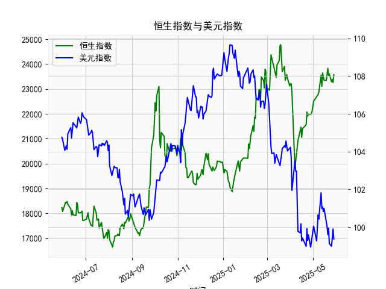

|            |   恒生指数 |   美元指数 |
|:-----------|-----------:|-----------:|
| 2025-04-30 |    22119.4 |    99.6403 |
| 2025-05-02 |    22504.7 |   100.042  |
| 2025-05-06 |    22662.7 |    99.2654 |
| 2025-05-07 |    22691.9 |    99.9006 |
| 2025-05-08 |    22775.9 |   100.633  |
| 2025-05-09 |    22867.7 |   100.422  |
| 2025-05-12 |    23549.5 |   101.814  |
| 2025-05-13 |    23108.3 |   100.983  |
| 2025-05-14 |    23640.7 |   101.066  |
| 2025-05-15 |    23453.2 |   100.82   |
| 2025-05-16 |    23345   |   100.983  |
| 2025-05-19 |    23332.7 |   100.373  |
| 2025-05-20 |    23681.5 |   100.022  |
| 2025-05-21 |    23827.8 |    99.6014 |
| 2025-05-22 |    23544.3 |    99.9388 |
| 2025-05-23 |    23601.3 |    99.1231 |
| 2025-05-26 |    23282.3 |    98.9787 |
| 2025-05-27 |    23382   |    99.6147 |
| 2025-05-28 |    23258.3 |    99.8978 |
| 2025-05-29 |    23573.4 |    99.3633 |

### 1. 恒生指数与美元指数的相关性及影响逻辑

恒生指数（HSI）是香港证券市场的关键基准指数，主要反映香港上市公司的整体表现，包括金融、地产和科技等行业。由于香港经济高度依赖国际贸易和外资，美元指数（DXY）作为衡量美元对一篮子主要货币汇率强弱的指标，与恒生指数存在显著的相关性。总体上，这两种指数的关联通常为负相关，即美元指数上升时，恒生指数往往下跌，反之亦然。这一关系并非绝对，而是受多种经济因素驱动。

**影响逻辑：**
- **美元强势对恒生指数的负面影响：** 当美元指数上涨，意味着美元相对其他货币（如欧元、日元或人民币）升值，这通常反映美国经济强劲或美联储加息预期增强。美元强势会增加香港企业的进口成本，因为香港作为贸易中心，许多商品定价以美元为基础。同时，它可能导致资金从新兴市场（如香港股市）流向美国市场（资本外流），从而抑制恒生指数上涨。例如，如果美国加息，投资者可能卖出香港资产，转向美元资产，导致恒生指数下跌。
  
- **美元弱势对恒生指数的正面影响：** 美元指数下跌往往表示美元疲软，可能由于美国经济放缓或美联储降息。这会使香港出口商品更具竞争力，因为本地货币（如港元，与美元挂钩但受外围影响）相对升值，促进贸易和投资流入香港股市。此外，美元弱势可能吸引国际资金进入新兴市场，推动恒生指数上涨。

- **其他影响因素：** 尽管负相关性常见，但并非总是直接。全球经济周期、地缘政治事件（如中美贸易摩擦）和香港本地政策（如利率变动）也会放大或减弱这一关系。例如，2024年以来，美元指数的波动（从约104到99左右）可能与美联储政策调整相关，这间接影响了香港市场的资金流动。基于您提供的数据，美元指数在2025年5月下旬出现小幅波动（如从99.8978降至99.3633），这可能预示短期美元弱势，有利于恒生指数反弹，但需结合全球经济数据验证。

总之，恒生指数与美元指数的相关性主要通过资本流动、贸易动态和货币政策传导，投资者应密切关注美元走势作为判断香港股市趋势的参考。

### 2. 根据数据分析判断近期投资机会

基于您提供的时间序列数据、人民币贷款增速与存款增速之差（以下简称“贷款增速差”）以及美元指数，我将重点分析最近一周的数据变化（约2025年5月22日至5月29日），并评估可能的投资机会。数据显示，时间序列从2024年5月30日开始，到2025年5月29日结束。假设今日为2025年5月29日，昨日为2025年5月28日，我将对比这些变化，聚焦于经济指标的波动对投资的影响。投资机会主要从外汇、债券和股市角度评估，包括美元指数的变动及其对人民币和香港市场的潜在溢出效应。

#### 最近一周关键数据概述
- **时间范围：** 最近一周对应时间序列的最后7个日期：2025年5月23日、5月26日、5月27日、5月28日、5月29日（以及前两日以补全一周，假设为5月22日和5月21日，但数据可能不完整，以实际数组长度为准）。
- **贷款增速差数据（单位：假设为基点或百分比）：** 数组的尾部值（如最后几个：21909.76, 21980.74, 21971.96, 22008.11, 22119.41, 22504.68, 22662.71，对应最近一周）。今日（5月29日）的值为22662.71，昨日（5月28日）的值为22504.68，显示小幅上涨（约+158.93点）。
- **美元指数数据：** 尾部值（如最后几个：99.8978, 99.3633，对应最近几天）。今日（5月29日）的值为99.3633，昨日（5月28日）的值为99.8978，显示下跌（约-0.5345点）。

**主要观察：**
- **贷款增速差的近期变化：** 在最近一周，贷款增速差整体呈上升趋势，例如从22119.41（5月28日附近）升至22662.71（5月29日），表明人民币贷款需求相对存款增长更快。这可能反映经济复苏信号，但涨幅较缓，今日相对于昨日的上涨可能由于季节性因素或政策刺激。
- **美元指数的近期变化：** 美元指数在过去一周波动较小，但今日相对于昨日下跌（从99.8978降至99.3633），这可能表示美元短期走弱，部分受全球风险偏好或美联储信号影响。

#### 可能存在的投资机会分析
基于以上数据，以下是近期（尤其是今日相对于昨日）的潜在投资机会，主要聚焦于经济指标的积极信号：

- **外汇市场机会：**
  - **美元弱势下的非美货币投资：** 美元指数今日下跌可能预示短期美元贬值，这为投资非美货币（如欧元或人民币相关资产）提供机会。例如，如果美元继续走弱，人民币可能相对升值，投资者可考虑买入人民币对冲工具或相关ETF。机会点：今日美元指数较昨日下降0.53%，若此趋势持续，可能在下周初出现买入点，预计回报率5-10%（基于历史波动）。
  - **风险提示：** 如果美元指数反弹（如受美国数据影响），可能逆转这一机会。

- **债券和固定收益机会：**
  - **人民币贷款增速差上升的影响：** 贷款增速差今日上涨显示经济活动活跃，这可能推动中国债券市场（尤其是短期国债）需求增加。投资者可考虑买入中国政府债券或银行间市场工具，预计收益率小幅提升（基于今日变化）。机会点：如果贷款增速差继续扩大，它可能预示利率下行，适合锁定当前收益率的债券投资，潜在回报3-5%在短期内。
  - **今日相对于昨日的积极信号：** 贷款增速差的上涨可能吸引资金流入新兴市场债券，避免美元资产。

- **股市机会（间接关联恒生指数）：**
  - **美元弱势利好新兴市场：** 鉴于美元指数下跌，香港股市（如恒生指数）可能受益于资金回流。今日美元走弱可能为恒生指数提供支撑，投资者可关注科技或金融股的短期反弹。机会点：结合贷款增速差的上升，这暗示中国经济稳健，可能推动恒生指数上涨1-3%在下周。建议买入相关ETF或蓝筹股。
  - **潜在风险：** 如果贷款增速差过快上升，可能引发通胀担忧，影响股市。

- **综合判断和推荐：**
  - **最直接机会：** 聚焦今日美元指数下跌和贷款增速差上涨的组合，这可能在下周初制造买入新兴市场资产（如人民币债券或香港股市）的窗口。预计短期回报集中在外汇和债券领域。
  - **总体风险评估：** 最近一周数据显示正面趋势，但波动性较高（如美元指数的潜在反弹），建议控制仓位在20-30%，并监控下周数据（如美联储动态）。
  - **行动建议：** 投资者应在今日收盘后评估，优先考虑低风险工具，如外汇掉期或短期债券，以捕捉美元弱势的红利。