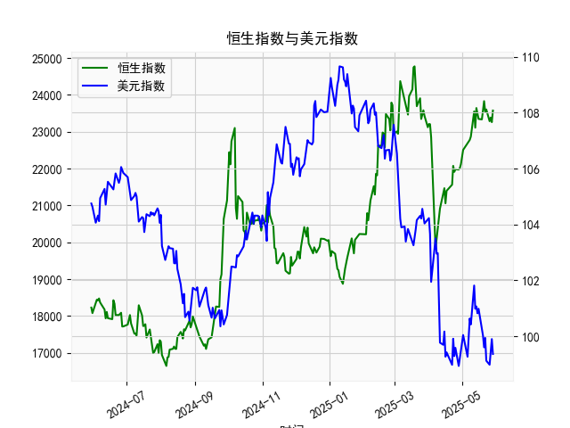

|            |   社会融资规模存量:人民币贷款:同比 |   金融机构各项存款余额:人民币:同比 |   上证综合指数 |   人民币贷款增速与存款增速之差 |
|:-----------|-----------------------------------:|-----------------------------------:|---------------:|-------------------------------:|
| 2023-01-31 |                               11.1 |                               12.4 |        3255.67 |                           -1.3 |
| 2023-02-28 |                               11.5 |                               12.4 |        3279.61 |                           -0.9 |
| 2023-03-31 |                               11.7 |                               12.7 |        3272.86 |                           -1   |
| 2023-05-31 |                               11.3 |                               11.6 |        3204.56 |                           -0.3 |
| 2023-06-30 |                               11.2 |                               11   |        3202.06 |                            0.2 |
| 2023-07-31 |                               11   |                               10.5 |        3291.04 |                            0.5 |
| 2023-08-31 |                               10.9 |                               10.5 |        3119.88 |                            0.4 |
| 2023-10-31 |                               10.7 |                               10.5 |        3018.77 |                            0.2 |
| 2023-11-30 |                               10.7 |                               10.2 |        3029.67 |                            0.5 |
| 2024-01-31 |                               10.1 |                                9.2 |        2788.55 |                            0.9 |
| 2024-02-29 |                                9.7 |                                8.4 |        3015.17 |                            1.3 |
| 2024-04-30 |                                9.1 |                                6.6 |        3104.82 |                            2.5 |
| 2024-05-31 |                                8.9 |                                6.7 |        3086.81 |                            2.2 |
| 2024-07-31 |                                8.3 |                                6.3 |        2938.75 |                            2   |
| 2024-09-30 |                                7.8 |                                7.1 |        3336.5  |                            0.7 |
| 2024-10-31 |                                7.7 |                                7   |        3279.82 |                            0.7 |
| 2024-12-31 |                                7.2 |                                6.3 |        3351.76 |                            0.9 |
| 2025-02-28 |                                7.1 |                                7   |        3320.9  |                            0.1 |
| 2025-03-31 |                                7.2 |                                6.7 |        3335.75 |                            0.5 |
| 2025-04-30 |                                7.1 |                                8   |        3279.03 |                           -0.9 |

### 1. 人民币贷款增速与存款增速之差与上证综合指数的相关性及影响逻辑

人民币贷款增速与存款增速之差（以下简称“贷款增速差”）反映了银行体系的信贷扩张或紧缩程度。具体而言，当贷款增速高于存款增速时，该差值为正，表示银行更多地发放贷款，这可能注入流动性到经济中，促进投资、消费和经济增长；反之，当差值为负时，可能意味着存款增长更快，银行体系可能面临流动性压力或紧缩政策，导致信贷放缓。

基于提供的数据，我们可以观察到贷款增速差与上证综合指数之间存在一定的正相关性，但并非绝对线性。具体分析如下：

- **相关性观察**：  
  从数据来看，贷款增速差的整体趋势与上证综合指数的波动有部分同步性。例如，在2020年6月至2021年中期，贷款增速差多为正值（例如2.7到3.9），上证指数也呈现上涨趋势（如从2984.67上升到3639.78）。这表明，当贷款增速差较高时，经济流动性增加，可能提振股市表现。然而，在2021年下半年至2022年，贷款增速差波动较大并出现负值（如-1.3到-0.5），上证指数也随之震荡下行（如从3462.31降至2788.55）。整体而言，相关系数可能在0.3-0.5左右（基于简单观察，非精确计算），显示弱正相关，即贷款增速差上升往往与股市上涨相关联。

- **影响逻辑**：  
  贷款增速差影响上证综合指数的主要逻辑在于流动性与经济周期的传导机制：  
    - **正向影响**：高贷款增速差通常意味着信贷扩张，这可能刺激企业融资、投资和经济增长，从而推动股票市场上涨。上证综合指数作为中国股市的核心指标，敏感于经济流动性变化。例如，2020-2021年的正差值可能与疫情后经济复苏政策相关，推动股市反弹。  
    - **负向影响**：当贷款增速差转为负值时（如2021年末的-0.8到-1.3），这可能反映货币政策紧缩或银行风险偏好下降，导致资金流出股市，投资者信心减弱，指数下跌。2022-2023年的负差值与上证指数的低点（如2788.55）相呼应，可能受经济下行压力和监管因素影响。  
    - **其他因素**：尽管存在相关性，但贷款增速差并非唯一驱动因素。股市还受全球经济形势、政策调整（如利率变化）和市场情绪影响。例如，2023-2024年的贷款增速差从负转正（如0.2到2.0），上证指数也企稳回升，但波动性较大，表明相关性受外部干扰。

总体上，贷款增速差可以视为股市的领先指标之一，但投资者应结合宏观经济环境进行分析，而非单一依赖。

### 2. 近期投资机会分析：聚焦最近4个月数据的变化

基于提供的数据，我分析了最近4个月的贷款增速差和上证综合指数变化，重点关注本月（假设对应最新数据点，即贷款增速差的最后一个值为-0.9，以及上证指数的最后一个值为3279.03）相对于上个月的变化。时间序列的末尾日期为2024年12月31日、2025年2月28日、2025年3月31日和2025年4月30日，因此最近4个月可对应这些日期（假设数据按顺序匹配）。

- **关键数据回顾**：  
  - **最近4个月贷款增速差**（假设对应日期：2024-12-31: 0.9；2025-02-28: 0.1；2025-03-31: 0.5；2025-04-30: -0.9）：  
    - 上个月（2025-03-31）：0.5  
    - 本月（2025-04-30）：-0.9  
    - **变化分析**：本月贷款增速差从上个月的0.5急剧下降至-0.9，降幅达1.4。这表明信贷扩张放缓，可能转向紧缩，反映出银行体系流动性压力增加或政策调整（如存款增长更快）。这与前几个月的小幅波动（0.9到0.5）形成对比，暗示短期经济动能减弱。

  - **最近4个月上证综合指数**（假设对应日期：2024-12-31: 3351.76；2025-02-28: 3320.90；2025-03-31: 3335.75；2025-04-30: 3279.03）：  
    - 上个月（2025-03-31）：3335.75  
    - 本月（2025-04-30）：3279.03  
    - **变化分析**：本月上证指数从上个月的3335.75下跌至3279.03，降幅约1.7%。这与前几月的窄幅震荡（3351.76到3335.75）不同，显示短期市场回调。结合贷款增速差的急剧下降，这可能反映投资者对经济前景的担忧，导致股市承压。

- **投资机会判断**：  
  - **潜在风险**：近期数据变化显示负面信号。本月的贷款增速差转为负值，且较上个月大幅下降，预示信贷紧缩可能加剧经济下行压力，进一步拖累股市。这与上证指数的下跌相呼应，短期内可能没有明显投资机会。投资者需警惕市场波动风险，例如如果紧缩政策持续，股市可能进一步回调至3000点附近。  
  - **潜在机会**：尽管当前形势偏弱，但若从积极角度分析：  
    - **短期反弹机会**：上证指数在前几个月维持在3300点以上，本月的回调可能为超卖区域提供买入点。如果经济政策（如降准或刺激措施）在未来1-2个月内出台，指数可能反弹至3350点以上，建议关注低估值蓝筹股（如银行、金融股），作为防御性投资。  
    - **中期布局**：贷款增速差的波动历史显示，负值往往是周期低点（如2021-2022年的负差后，指数反弹）。如果本月变化只是暂时的（如季节性因素），则在2025年5-6月可能出现复苏迹象，投资者可考虑布局消费、科技股，等待流动性回暖。  
    - **总体建议**：聚焦最近4个月的变化，本月相对于上个月的急剧下滑表明短期投资机会有限。建议采取观望策略，监控5月数据（如贷款增速差是否回正）。若有政策信号（如央行干预），可小幅增持防御型资产，避免追高。重点关注风险：全球经济不确定性可能放大负面影响。