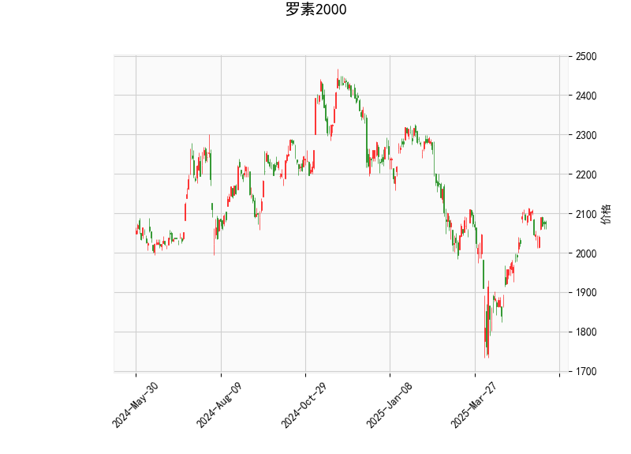

# 分析罗素2000指数的技术分析结果

## 技术指标概述
罗素2000指数（Russell 2000）当前价格为2074.78，显示出混合的技术信号，结合RSI、MACD、Bollinger Bands以及K线形态，我们可以对其进行详细解读，以评估市场趋势和潜在风险。

### 1. RSI（相对强弱指数）
- **当前值**：56.84  
  RSI处于中性区域（高于50但低于70的超买阈值），表明市场整体动能适中，略微偏向多头。该水平暗示短期内价格可能维持稳定，但如果RSI继续上升至70以上，将面临超买风险；反之，若跌至30以下，则可能出现超卖反弹。目前的RSI值显示投资者情绪较为平衡，没有明显的过度买入或卖出迹象。

### 2. MACD（移动平均收敛散度）
- **MACD线**：23.42  
- **信号线**：25.12  
- **柱状图（MACD Hist）**：-1.70（负值）  
  MACD线低于信号线，形成看跌信号，这通常表示短期动能可能转向负面，潜在的卖压增加。柱状图的负值进一步强化了这一观点，暗示动量正在减弱。如果MACD线与信号线发生死叉（进一步下行），可能预示价格回调。但整体MACD值仍处于正值区域，表明长期趋势可能未完全逆转，投资者需密切关注交叉点以判断转折。

### 3. Bollinger Bands（布林带）
- **上轨**：2179.65  
- **中轨**：1999.91  
- **下轨**：1820.17  
  当前价格2074.78位于中轨与上轨之间，表明价格处于相对中性的波动区间。Bollinger Bands的宽度显示市场波动性适中，没有明显扩张（高波动）或收缩（低波动）。如果价格向上突破上轨（2179.65），可能触发多头趋势；反之，若跌破中轨（1999.91），则可能进入空头区间。目前位置暗示潜在支撑位在中轨附近，适合观望或设置止损。

### 4. K线形态
- **形态**：CDLMATCHINGLOW（匹配低点）和CDLSPINNINGTOP（纺锤顶）  
  CDLMATCHINGLOW 通常表示潜在底部反转信号，暗示市场可能从低点反弹，尤其在连续下跌后出现。CDLSPINNINGTOP 则显示市场犹豫不决，可能预示反转或盘整期。这两个形态结合，表明短期内存在不确定性，但整体偏向底部筑底。如果后续K线确认向上突破，这些形态将增强多头信心；否则，可能延续盘整。

## 投资机会和策略判断
基于上述技术分析，罗素2000指数短期内可能存在修正或反转机会。RSI的中性与K线形态的潜在支撑信号提供了一些乐观点，但MACD的看跌和Bollinger Bands的位置提醒需防范回调。以下是对近期投资或套利机会的分析和策略建议，重点关注风险管理。

### 1. 潜在投资机会
- **多头机会**：当前价格接近中轨，且K线形态显示底部信号（如CDLMATCHINGLOW），如果RSI继续上行或MACD线向上交叉信号线，短期反弹的可能性较高。罗素2000作为小型股指数，易受经济复苏影响，若宏观环境向好（如通胀缓解或利率下调），可能驱动指数向上。  
- **空头机会**：MACD柱状图的负值和价格未突破上轨，暗示短期回调风险。如果价格跌破中轨（1999.91），空头趋势可能加强，尤其在市场避险情绪升温时。  
- **套利机会**：罗素2000与大盘指数（如S&P 500）相关性较高，可通过统计套利策略（如配对交易）捕捉价差。例如，如果罗素2000相对S&P 500被低估（基于历史相关性），可在低点买入罗素2000相关ETF（如IWM）并卖出S&P 500相关资产，实现无风险或低风险收益。

### 2. 推荐策略
- **多头策略**：  
  - **买入并持有**：在当前价位（2074.78）附近买入罗素2000相关ETF，设置止盈于上轨（2179.65）附近，并止损于中轨以下（1990左右）。结合RSI和K线形态，等待确认信号后入场。预期收益：5-10%短期反弹。  
  - **期权策略**：购买看涨期权（如ITM或ATM期权），以低成本放大潜在上涨。如果K线形态确认反转，此策略可提供杠杆效应。  

- **空头策略**：  
  - **卖出或做空**：若MACD继续负向，考虑做空ETF或买入看跌期权。止损设在中轨以上，目标下轨（1820.17）。这适合短期市场疲软期。  
  - **风险控制**：结合Bollinger Bands，采用网格交易在下轨附近加仓空头。  

- **中性或套利策略**：  
  - **波动率套利**：利用Bollinger Bands的窄幅波动，通过卖出 straddles 或 strangles 期权获利（例如，卖出同时买入看涨和看跌期权）。若市场维持盘整（如CDLSPINNINGTOP所示），这可捕捉时间价值衰减。  
  - **指数套利**：监控罗素2000与期货或相关指数的价差，进行程序化套利。如果价差扩大，可在现货市场买入并期货市场卖出，实现无套利收益。预期年化回报：视市场效率而定，约2-5%。  

### 风险提示与总体建议
- **总体判断**：短期内，罗素2000可能处于盘整或轻微反弹阶段，多头信号（如K线形态）与空头警告（如MACD）并存，建议采用**结合基本面分析的技术交易**。宏观因素（如美联储政策或经济数据）将影响成败。  
- **风险**：高波动性可能导致快速逆转，RSI若跌破50将加剧空头压力。  
- **建议**：优先使用小额资金测试，设定严格的止损（如2-5%的价格变动），并结合实时数据监控。投资者应根据个人风险承受力调整策略，避免过度杠杆。