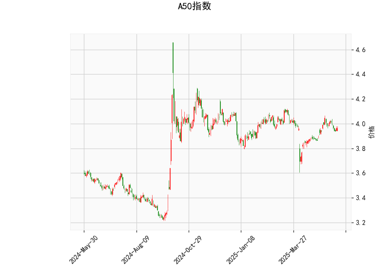

### 1. A50指数技术分析结果的解读

基于提供的A50指数技术指标数据，以下是对各指标的详细分析。总体而言，当前市场呈现出中性偏弱的信号，价格处于相对稳定的区间，但需警惕潜在的下行风险。

- **当前价格（Current Price）**: 3.966。这表示A50指数当前的交易价格，位于中轨附近（详见Bollinger Bands分析），表明短期内价格波动较为温和，没有明显极端偏离。

- **RSI（Relative Strength Index）**: 51.79。RSI是一个衡量价格动量强度的震荡指标，范围在0-100。当前值为51.79，略高于中性线50，显示市场处于轻微看涨状态，但远未达到过度买入区域（通常RSI>70为超买）。这暗示短期内买方力量与卖方力量大致平衡，缺乏强烈趋势。

- **MACD（Moving Average Convergence Divergence）**: 
  - MACD线：0.0114（正值，但较小）。
  - 信号线：0.0163（高于MACD线）。
  - 直方图（MACD Hist）：-0.0049（负值）。
  MACD指标用于识别趋势变化。这里，MACD线低于信号线，且直方图为负，表明短期动量偏向下行，存在潜在卖出信号。这可能是价格近期回调的迹象，但由于数值较小，信号强度不高，市场可能正处于犹豫期。如果MACD线向上交叉信号线，将可能转为看涨。

- **Bollinger Bands（布林带）**:
  - 上轨（Upper Band）：4.132。
  - 中轨（Middle Band）：3.951。
  - 下轨（Lower Band）：3.769。
  当前价格3.966位于中轨附近，显示价格在标准差范围内波动，市场波动性中等（未触及上轨或下轨）。这通常表示一个盘整期，如果价格向上突破上轨（如超过4.132），可能预示上行趋势；反之，如果跌破下轨（如低于3.769），则可能出现下行风险。

- **K线形态**: 为空列表（[]），表示当前未观察到明显的K线模式（如吞没形态、锤头线等）。这意味着短期内缺乏强烈的价格反转信号，市场可能继续维持横盘。

**总体技术分析总结**: A50指数当前处于中性偏弱态势。RSI显示无明显超买超卖，MACD暗示轻微下行压力，而Bollinger Bands反映价格稳定在中轨附近。投资者应密切关注MACD的交叉情况和Bollinger Bands的突破，以判断潜在趋势变化。

### 2. 近期可能存在的投资或套利机会和策略

基于上述技术分析，A50指数短期内机会有限，但存在潜在的交易点位。以下分析聚焦于可能的投资机会、风险以及相应的策略建议。需注意，市场环境复杂，建议结合基本面和风险管理进行决策。

#### 可能存在的投资机会
- **短期看涨机会**: 当前RSI接近中性（51.79），且价格在中Bollinger Bands，如果MACD直方图由负转正（即MACD线向上交叉信号线），可能触发反弹。潜在机会包括价格向上测试上轨（4.132），若突破可获利。
- **短期看跌机会**: MACD直方图为负，表明动量弱化。如果价格跌破中轨（3.951）并接近下轨（3.769），可能出现回调或做空机会，尤其在全球市场不确定性加剧时。
- **套利机会**: A50指数作为衍生品（如期货或期权）的基准，如果其价格与相关资产（如中国A50期货或全球指数ETF）出现暂时的价格偏差，可通过套利操作获利。例如，如果A50现货价格相对期货折价，投资者可考虑现货多头+期货空头策略。但需依赖实时数据验证，当前指标未显示明显套利空间。
- **风险因素**: 机会较小，因为RSI和MACD均无强烈信号，市场可能继续盘整。外部事件（如经济数据发布或地缘政治风险）可能放大波动。

#### 投资或套利策略建议
- **看涨策略**:
  - **买入点**: 等待MACD线向上交叉信号线（目标在RSI升至60以上）。例如，当价格接近中轨（3.951）时，可小仓位买入A50相关ETF或期货。
  - **止损设置**: 若价格跌破下轨（3.769），立即止损。
  - **目标**: 价格向上测试上轨（4.132），潜在收益5-10%。
  - **适合人群**: 短期交易者，风险偏好中等。

- **看跌策略**:
  - **卖出或做空点**: 当前MACD负值已现，可在价格跌破中轨（3.951）时做空A50指数期货或期权。
  - **止盈设置**: 目标下轨（3.769），若触及则获利了结。
  - **风险管理**: 若RSI跌破50，增加卖出力度，但设好止损（如价格反弹至4.000以上）。
  - **适合人群**: 保守型投资者，避免在强势反弹时操作。

- **中性或套利策略**:
  - **横盘交易**: 价格在中Bollinger Bands时，采用区间交易策略（如在3.800-4.100间高卖低买）。结合RSI，当其在40-60区间波动时，可进行小额套利。
  - **跨市场套利**: 如果A50指数与类似指数（如恒生指数或上证指数）价格相关性高，但短期偏差（如A50相对低估），可通过多头/空头配对交易获利。例如，买入A50 ETF并卖出相关指数期货。
  - **总体建议**: 风险控制为主，仓位不超过总资金的20%。监控MACD和Bollinger Bands的动态变化，每日复盘以调整策略。

**最终提醒**: 以上分析基于技术指标，仅供参考。投资涉及风险，实际操作应结合宏观经济、资金流动和个人风险承受能力。建议使用模拟交易验证策略，并在专业平台获取实时数据。