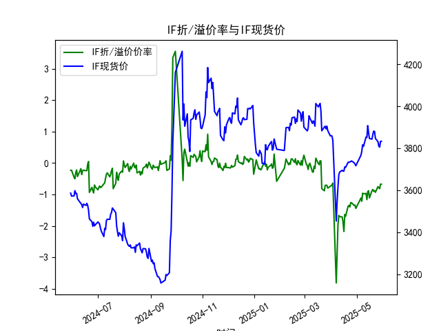
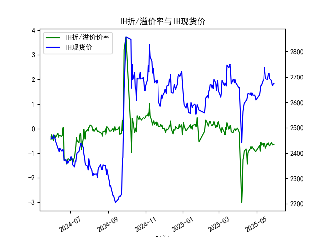
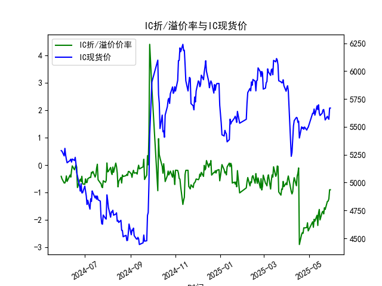
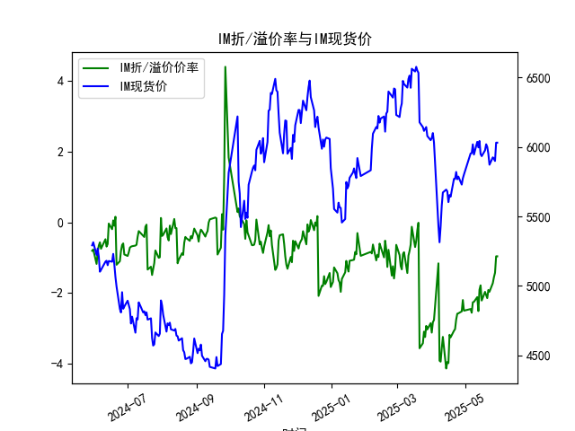

|            |   IF折/溢价率 |   IF现货价 |   IH折/溢价率 |   IH现货价 |   IC折/溢价率 |   IC现货价 |   IM折/溢价率 |   IM现货价 |
|:-----------|--------------:|-----------:|--------------:|-----------:|--------------:|-----------:|--------------:|-----------:|
| 2025-04-30 |     -1.44197  |     3716.2 |     -0.909945 |     2609.2 |     -2.39398  |     5497   |     -2.49939  |     5801.4 |
| 2025-05-06 |     -1.11177  |     3766.2 |     -0.684235 |     2629.6 |     -2.06144  |     5622   |     -2.45329  |     5953.2 |
| 2025-05-07 |     -1.2169   |     3785   |     -0.909959 |     2646.4 |     -2.26234  |     5620.2 |     -2.55739  |     5955.2 |
| 2025-05-08 |     -0.957625 |     3816   |     -0.548944 |     2664.8 |     -1.97107  |     5660   |     -2.2617   |     6018.8 |
| 2025-05-09 |     -0.976471 |     3808.6 |     -0.663397 |     2666.2 |     -2.04348  |     5604.8 |     -2.25057  |     5945.2 |
| 2025-05-12 |     -0.966676 |     3853   |     -0.592655 |     2686.6 |     -1.82396  |     5688   |     -2.1153   |     6037   |
| 2025-05-13 |     -1.16158  |     3851   |     -0.733322 |     2688.2 |     -2.19778  |     5654.6 |     -2.51032  |     5996.6 |
| 2025-05-14 |     -0.908163 |     3907.4 |     -0.587737 |     2737.6 |     -1.74715  |     5697.8 |     -1.90524  |     6043   |
| 2025-05-15 |     -0.880406 |     3872.8 |     -0.631231 |     2723   |     -1.6149   |     5623   |     -1.78364  |     5949   |
| 2025-05-16 |     -1.10785  |     3846   |     -0.790006 |     2695.2 |     -1.99531  |     5601.8 |     -2.21348  |     5933.8 |
| 2025-05-19 |     -0.875523 |     3843.2 |     -0.602139 |     2688.8 |     -1.70946  |     5623   |     -1.96768  |     5975.4 |
| 2025-05-20 |     -0.840664 |     3865.4 |     -0.63422  |     2699.4 |     -1.6802   |     5650.8 |     -2.06014  |     6019.4 |
| 2025-05-21 |     -0.898296 |     3881.2 |     -0.580049 |     2712.6 |     -1.77707  |     5655.6 |     -2.14574  |     6000.6 |
| 2025-05-22 |     -0.87548  |     3879.6 |     -0.666962 |     2715.4 |     -1.55138  |     5614.8 |     -1.91397  |     5950   |
| 2025-05-23 |     -0.9292   |     3846.2 |     -0.695185 |     2693   |     -1.61406  |     5561.8 |     -1.96463  |     5872   |
| 2025-05-26 |     -0.748858 |     3831.2 |     -0.556508 |     2684.4 |     -1.32042  |     5594.6 |     -1.72151  |     5925   |
| 2025-05-27 |     -0.786501 |     3809.2 |     -0.621209 |     2668.6 |     -1.31181  |     5578   |     -1.55547  |     5915   |
| 2025-05-28 |     -0.814251 |     3805   |     -0.658307 |     2665.4 |     -1.22822  |     5568   |     -1.42796  |     5899   |
| 2025-05-29 |     -0.671205 |     3832.8 |     -0.642634 |     2673.6 |     -0.897044 |     5668.6 |     -0.961935 |     6031   |
| 2025-05-30 |     -0.671205 |     3832.8 |     -0.642634 |     2673.6 |     -0.897044 |     5668.6 |     -0.961935 |     6031   |

### 1. 股指期货折/溢价率与现货价的相关性及影响逻辑

股指期货的折/溢价率（通常指期货价格相对于现货指数价格的百分比差）与现货价之间存在密切的相关性，主要因为股指期货是现货指数的衍生品，旨在反映现货市场的未来预期。以下是其相关性和影响逻辑的详细解释：

- **相关性分析**：
  - **正相关性**：股指期货价格通常与现货价高度正相关，因为期货合约基于现货指数（如沪深300、沪深300等）设计。折/溢价率（ANAL_BASISPERCENT）本质上是期货价格与现货价的相对偏差。如果现货价上涨，期货价格往往也会跟随上涨，导致溢价率缩小；反之，如果现货价下跌，期货可能出现更大折价。
  - **动态变化**：短期内，折/溢价率可能因市场情绪、交易量和流动性而波动，但长期来看，它会趋向于与现货价的变动保持一致。例如，在数据中，我们看到IF、IH、IC和IM的折/溢价率与现货价（CLOSE）在同一日期内共同变化，表明两者受相同宏观因素（如经济数据、政策预期）影响。

- **影响逻辑**：
  - **折价的逻辑**：折价率（负值，如-0.671205）表示期货价格低于现货价，这通常反映市场对未来现货价下跌的预期，或者由于持有成本（如融资利率、交易费用）导致。影响因素包括：
    - **持有成本**：期货合约涉及保证金交易和到期交割，如果现货持有成本较高（如股息率低、利率上升），期货可能折价。
    - **市场预期**：如果投资者预期经济下行或市场风险增加（如股市波动），他们可能更倾向于卖出期货，导致折价扩大。
    - **套利机会**：当折价率过大时，可能存在买入期货、卖出现货的套利机会，以捕捉价格回归。
  - **溢价的逻辑**：溢价率（正值）表示期货价格高于现货价，常因市场对未来现货价上涨的乐观预期（如经济复苏）或短期需求（如资金流入）所致。影响因素包括：
    - **短期流动性**：如果资金涌入期货市场（如避险或投机需求），会导致溢价。
    - **成本调整**：期货价格需考虑未来持有收益（如股息），如果现货指数有高股息预期，期货可能溢价。
    - **套利机会**：溢价过大时，可能存在买入现货、卖出期货的套利，以待价格收敛。
  - **整体影响**：现货价是基础资产，折/溢价率则反映了时间价值和风险溢价的调整。外部因素如政策变化、全球经济事件（如美联储加息）或国内数据（如GDP增长）会同时影响两者，导致相关性加强或弱化。例如，在数据中，IF的折价率从2024年5月稳定在-0.2左右，到2025年5月加深至-0.8左右，可能与现货价的波动（如从3586.0降至3805.0）相关，显示市场预期转向谨慎。

总之，折/溢价率是现货价的领先指标，能揭示市场情绪和潜在风险，但其影响需结合具体市场环境评估。

### 2. 基于数据分析判断近期投资机会

根据提供的数据，我分析了IF、IH、IC和IM的近1年数据（从2024-05-30到2025-05-30），重点聚焦最近一周（2025-05-23到2025-05-30）的变化，尤其是今日（2025-05-30）相对于昨日（2025-05-29）的差异。数据显示，近期折/溢价率整体呈现负值（折价），且现货价小幅波动。以下是关键分析和投资机会判断：

- **整体数据趋势**：
  - **最近一周概述**：在过去一周，四个股指期货的折/溢价率均保持在负值区间（折价），现货价则呈现小幅震荡。折价率整体加深，表明市场对未来现货价持谨慎预期，可能受经济不确定性影响。现货价在周中有所回升，但今日与昨日基本持平，显示短期稳定。
  - **今日 vs 昨日变化**：
    - **IF**：今日折/溢价率-0.671205，现货价3832.8；昨日相同（-0.671205，3832.8）。无明显变化，折价率较周初（2025-05-26的-0.748858）有所缩小，暗示折价可能在收敛，可能预示现货价潜在上行。
    - **IH**：今日-0.642634，现货价2673.6；昨日相同（-0.642634，2673.6）。折价率较周初（2025-05-26的-0.556508）加深，但今日持稳，显示短期无剧变。
    - **IC**：今日-0.897044，现货价5668.6；昨日相同（-0.897044，5668.6）。折价率较周初（2025-05-26的-1.320424）显著缩小（从-1.32到-0.90），现货价回升，可能是积极信号。
    - **IM**：今日-0.961935，现货价6031.0；昨日相同（-0.961935，6031.0）。折价率较周初（2025-05-26的-1.721509）大幅缩小，现货价稳定，显示潜在恢复。

- **可能投资机会判断**：
  - **套利机会**：
    - **IF和IC的潜在机会**：这两者折价率在最近一周内缩小（IF从-0.75到-0.67，IC从-1.32到-0.90），且今日与昨日持平，表明折价可能正向均值回归。建议关注买入期货、卖出现货的套利策略，尤其是IF，因为其现货价从3805.0（2025-05-28）回升到3832.8，折价缩小可能预示短期反弹。如果市场情绪转好，此机会在下周初可能放大。
    - **IH和IM的谨慎机会**：IH的折价率加深（从-0.56到-0.64），IM虽缩小但仍深（从-1.72到-0.96），今日无变化，短期套利风险较高。IM的折价缩小幅度最大，可能在下周提供买入机会，但需监控全球经济数据。
  - **趋势投资机会**：
    - **现货价回升信号**：IC和IM的现货价在周中回升（IC从5568.0到5668.6，IM从5899.0到6031.0），结合折价缩小，这可能表示市场底部企稳，适合趋势投资者在下周初布局多头头寸（如买入现货或相关ETF）。
    - **风险警示**：今日数据与昨日相同，可能意味着市场暂无新催化剂。如果下周折价继续加深（如IH），则可能出现卖出信号，避免持仓。
  - **总体建议**：近期投资机会主要集中在IF和IC的套利上，基于折价收敛的迹象。但由于今日无显著变化，机会仍需等待确认（如下周数据）。风险因素包括经济数据波动和政策不确定性，建议结合止损策略，聚焦于流动性强的合约。

通过以上分析，投资机会以短期套利为主，但需密切跟踪后续数据变化。

