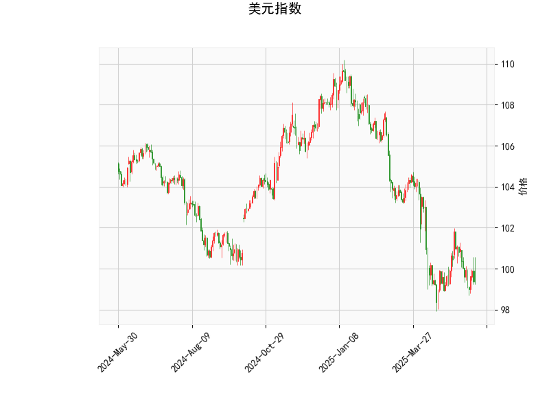

### 1. 美元指数的技术分析结果解读

美元指数当前价位为99.3633，基于提供的指标，我们可以从多个维度进行分析，以评估其短期趋势和潜在风险。

- **RSI（相对强弱指数）分析**：RSI值为42.97，处于中性偏弱区域（一般RSI低于30为超卖，高于70为超买）。这个水平表明美元指数近期可能处于超卖状态，卖方力量较强，但也暗示有潜在反弹机会。如果RSI继续下降，可能进一步确认弱势；反之，如果回升至50以上，则可能信号反转。

- **MACD（移动平均收敛散度）分析**：MACD线为-0.42，信号线为-0.42，柱状图（Histogram）为-0.001（微弱负值）。MACD线低于信号线，显示短期看跌趋势，但两者非常接近，且柱状图值很小，表明看跌动能已减弱，可能即将出现金叉（MACD线向上穿越信号线），这往往是买入信号。整体上，MACD显示美元指数的下跌势头可能放缓，潜在反弹风险增加。

- **Bollinger Bands（布林带）分析**：当前价99.36位于中轨（101.31）和下轨（97.32）之间，接近下轨。这表明美元指数处于相对低位，可能已进入超卖区域。布林带通常用于识别波动率：价格靠近下轨时，往往预示短期反弹机会；如果价格突破上轨（105.30），则可能转为强势。但当前位置显示市场波动性较低，潜在支撑在97.32附近。

- **K线形态分析**：K线形态显示为“CDLMATCHINGLOW”（匹配低点），这是一个看跌形态，通常表示价格可能已触及短期底部，并有反弹迹象。该形态常见于市场见底后，可能预示美元指数短期内企稳或小幅回升。但需结合其他指标验证，如果后续K线出现阳线，则反弹概率增大。

总体判断：美元指数当前处于弱势态势，RSI和Bollinger Bands显示超卖信号，MACD接近零轴，K线形态暗示潜在见底。短期内，美元指数可能小幅反弹或维持震荡，但如果外部因素（如美联储政策或全球经济数据）进一步施压，弱势可能延续。投资者需密切关注99-101区间作为关键支撑位。

### 2. 基于美元指数分析，对近期A股和港股的投资或套利机会及策略判断

美元指数的弱势通常对新兴市场股票有利，尤其是中国市场（A股和港股），因为美元走软可能带动资金从美元资产流入新兴市场，提振风险资产需求。同时，人民币相对走强可能吸引外资流入A股和港股。结合上述技术分析，美元指数可能短期反弹或继续弱势，这为A股和港股提供了潜在机会。以下是具体分析和策略建议：

- **投资机会分析**：
  - **A股机会**：如果美元指数继续弱势，将利好A股，尤其是受益于经济复苏的板块，如消费、科技和新能源。当前A股整体估值相对合理（沪深300指数PE约12-15倍），加上政策支持（如稳增长措施），短期内可能出现反弹。重点关注大盘蓝筹股（如银行、消费股）和科技龙头（如半导体、电动车相关）。如果美元指数反弹至100以上，A股可能面临压力，但当前弱势环境下，买入机会大于卖出。
  - **港股机会**：港股对美元指数更敏感，常作为外资流入的首选。弱势美元可能推动港股反弹，特别是恒生科技指数（受益于中概股回流）。当前港股估值较低（恒生指数PE约10倍），存在估值修复空间。建议关注中概股（如互联网巨头）和内需驱动股（如消费零售），这些板块可能在资金回流下率先上涨。

- **套利机会分析**：
  - **跨境套利**：A股和港股之间存在AH股价差机会。例如，许多AH股（A股和H股）目前H股折价（如腾讯控股H股较A股折价10-20%），如果美元弱势吸引外资，H股可能率先上涨，形成套利空间。策略包括：买入H股（港股）并卖出A股（或反之），待价差收窄后获利。近期AH股溢价率波动较大，美元指数见底信号（如MACD金叉）出现时，是入场时机。
  - **其他套利形式**：利用ETF套利，例如买入A股ETF（如华夏沪深300 ETF）和卖出港股通ETF（如南方恒生ETF），如果美元弱势导致港股相对A股强势。这种策略适合短期操作，风险在于市场波动。

- **投资策略建议**：
  - **短期策略**：在美元指数RSI回升或K线形态确认反弹前，建议轻仓布局A股和港股。优先选择低估值股，避免高波动板块。使用止损位（如A股大盘跌破3200点时减仓），控制风险。
  - **中长期策略**：如果美元指数弱势持续，考虑增持中国资产。组合配置可包括50%A股蓝筹、30%港股科技股、20%现金或债券。关注宏观事件（如美联储会议），若美元进一步走弱，则加仓新兴市场。
  - **风险提示**：美元指数潜在反弹可能导致A股港股回调（如资金回流美国），因此需结合基本面（如中国经济数据）验证。总体上，当前环境提供中性偏好的机会，建议以价值投资为主，控制仓位在50-70%。