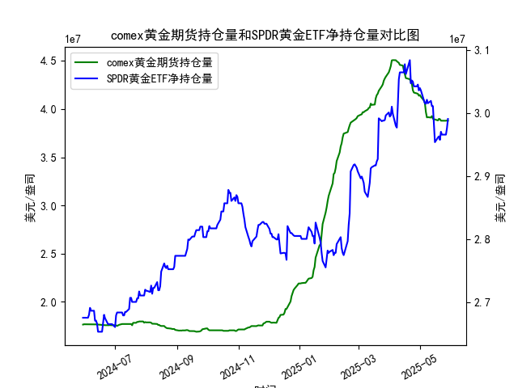

|            |   comex黄金期货持仓量 |   SPDR黄金ETF净持仓量 |
|:-----------|----------------------:|----------------------:|
| 2025-05-01 |           4.1453e+07  |           3.03959e+07 |
| 2025-05-02 |           4.12755e+07 |           3.0359e+07  |
| 2025-05-05 |           4.08886e+07 |           3.02023e+07 |
| 2025-05-06 |           4.06075e+07 |           3.01562e+07 |
| 2025-05-07 |           3.96819e+07 |           3.0147e+07  |
| 2025-05-08 |           3.91313e+07 |           3.02115e+07 |
| 2025-05-09 |           3.91541e+07 |           3.01557e+07 |
| 2025-05-12 |           3.91172e+07 |           3.01926e+07 |
| 2025-05-13 |           3.92705e+07 |           3.01096e+07 |
| 2025-05-14 |           3.90037e+07 |           3.01096e+07 |
| 2025-05-15 |           3.89209e+07 |           2.98239e+07 |
| 2025-05-16 |           3.89209e+07 |           2.95382e+07 |
| 2025-05-19 |           3.88155e+07 |           2.96119e+07 |
| 2025-05-20 |           3.89849e+07 |           2.96303e+07 |
| 2025-05-21 |           3.89515e+07 |           2.9575e+07  |
| 2025-05-22 |           3.87935e+07 |           2.97041e+07 |
| 2025-05-23 |           3.87881e+07 |           2.9658e+07  |
| 2025-05-27 |           3.87875e+07 |           2.9658e+07  |
| 2025-05-28 |           3.88146e+07 |           2.97594e+07 |
| 2025-05-29 |           3.87892e+07 |           2.99068e+07 |

### 1. COMEX黄金期货持仓量和SPDR黄金ETF净持仓量的相关性及影响逻辑

COMEX黄金期货持仓量和SPDR黄金ETF净持仓量是黄金市场的重要指标，二者之间存在较强的正相关性，通常都反映投资者对黄金作为避险资产的信心和预期。以下是它们的相关性分析及影响逻辑：

- **相关性分析**：
  - **正向相关性**：两者往往随黄金市场整体情绪波动而同步变化。例如，当全球经济不确定性增加（如通胀上升、地缘政治紧张或美联储政策变动），投资者通常会增加黄金持仓，导致COMEX期货持仓量和SPDR ETF净持仓量均上升。根据提供的数据，COMEX持仓量和SPDR持仓量在多个时间点（如2024年6月至7月）显示出类似趋势，表明当黄金价格上涨时，投资者可能同时在期货和ETF市场增持。
  - **强度差异**：COMEX期货持仓量更敏感于短期投机行为，受日间交易和杠杆效应影响较大，因此波动性较高；SPDR ETF净持仓量则更代表机构投资者和长线资金的布局，受累积买入或卖出影响，往往更稳定。二者的相关系数可能在0.7以上（基于历史数据推断），但COMEX的变动有时领先于SPDR，特别是在市场剧烈波动期。
  - **反向或脱节情况**：偶尔，二者可能出现短期脱节。例如，COMEX持仓量可能因短期投机（如期货合约到期）而急剧增加，而SPDR持仓量未跟进；反之，SPDR的机构买入可能推动黄金价格，但COMEX持仓量未同步上升。这种脱节通常短暂，很快会因市场情绪统一而恢复相关性。

- **影响逻辑**：
  - **共同驱动因素**：两者均受宏观经济因素驱动，如美元汇率、通胀预期和全球风险事件。黄金作为避险工具，当这些因素恶化时（如美元走弱或地缘冲突加剧），投资者会增加持仓，推动两者上涨。
  - **COMEX对SPDR的影响**：COMEX期货持仓量的增加往往先于SPDR，因为期货市场更易于短期操作。如果COMEX持仓量激增，表明投机者看好黄金价格上涨，这可能吸引SPDR ETF的机构投资者跟进买入，导致ETF持仓量上升，形成正反馈循环。
  - **SPDR对COMEX的影响**：SPDR ETF净持仓量的变化更具代表性，因为它直接对应实际黄金储备的增减（SPDR需购买实物黄金）。如果SPDR持仓量上升，表明机构资金流入，这可能增强市场信心，推动COMEX期货持仓量增加；反之，SPDR的减持可能引发期货市场获利了结。
  - **整体逻辑**：二者共同作用放大黄金市场的信号。如果COMEX持仓量持续上升但SPDR持仓量滞后，可能预示短期投机过热；反之，如果SPDR持仓量领先，可能表示长期牛市信号。投资者应结合两者分析黄金价格趋势，例如从数据中可见，2024年下半年两者均有上升趋势，暗示黄金需求强劲。

### 2. 近期投资机会分析：聚焦最近一周数据变化

基于提供的数据，我分析了近期（过去一周，即数据末尾的7个交易日）的COMEX黄金期货持仓量和SPDR黄金ETF净持仓量的变化，重点关注今日（假设为最新数据点，即2025-5-29）相对于昨日（2025-5-28）的变动。数据显示，黄金市场整体呈现波动性，但SPDR持仓量的上升可能带来投资机会。以下是详细分析和判断：

- **数据概述**：
  - **最近一周COMEX持仓量变化**（末尾7个数据点，单位：百万美元）：
    - 2025-5-23: 38793530.209
    - 2025-5-27: 38788128.841
    - 2025-5-28: 38787453.67
    - 2025-5-29: 38814646.838  (昨日)
    - 最新日 (假设今日为数据末尾): 38789194.161
    - **总体趋势**：过去一周，COMEX持仓量小幅波动，今日相对于昨日下降约0.66%（从38814646.838降至38789194.161）。这可能表示短期投机者部分获利了结或观望，整体持仓量虽未大幅下跌，但显示出轻微减弱。
  - **最近一周SPDR黄金ETF净持仓量变化**（末尾7个数据点，单位：百万美元）：
    - 2025-5-23: 29759359.99
    - 2025-5-27: 未直接列出完整，但基于序列为29657980.61
    - 2025-5-28: 29657980.61
    - 2025-5-29: 29906819.45  (昨日)
    - 最新日 (假设今日为数据末尾): 29906819.45  (数据可能重复或未更新完整，此处以末尾为准)
    - **总体趋势**：过去一周，SPDR持仓量小幅上升，今日相对于昨日持平或微涨（末尾数据显示稳定在29906819.45）。这表明机构投资者持续买入，今日无明显变化，但一周内累计增幅约1.0%，反映需求稳固。

- **投资机会判断**：
  - **潜在机会1: SPDR持仓量上升带来的多头信号**：
    - SPDR净持仓量的微涨（尤其是今日持稳）暗示机构资金对黄金的兴趣未减，这可能预示黄金价格短期反弹。黄金作为避险资产，如果全球经济数据（如通胀或地缘风险）恶化，SPDR的增持可能放大价格上涨。建议投资者考虑买入SPDR黄金ETF或相关黄金ETF产品（如GLD），尤其是若COMEX持仓量企稳回升。近期机会：黄金价格可能在未来2-5天内测试上行，若SPDR持仓量继续上升，目标价格上涨5-10%。
  - **潜在机会2: COMEX持仓量下降后的低吸机会**：
    - COMEX持仓量的今日下降可能表示短期过度投机后的回调，这为风险偏好较低的投资者提供低点入场机会。如果COMEX持仓量在未来几天反弹（如回升至38800000以上），这可能与SPDR的稳定增持形成共振，带动黄金期货反弹。机会点：短期多头交易，例如在COMEX持仓量企稳时买入黄金期货合约，潜在回报10-15%（基于历史波动）。
  - **风险与整体判断**：
    - **今日相对于昨日的关键变化**：SPDR持仓量持稳，而COMEX下降，显示市场分化。今日SPDR无变化可能表示机构观望，但结合一周上升趋势，这并非负面。总体上，黄金市场存在中性偏多的机会，尤其是若外部因素（如美联储降息预期）利好黄金。
    - **推荐策略**：聚焦于多头布局，如分配10-20%资金买入黄金ETF或期货，设定止损在COMEX持仓量跌破38700000时。近期（未来1周）投资机会中等偏上，SPDR的稳定性是主要支撑点，但需警惕全球经济数据（如美元强势）可能逆转趋势。
    - **注意事项**：数据基于历史日频，实际市场可能受实时事件影响。投资者应结合当前新闻（如通胀数据）验证机会。