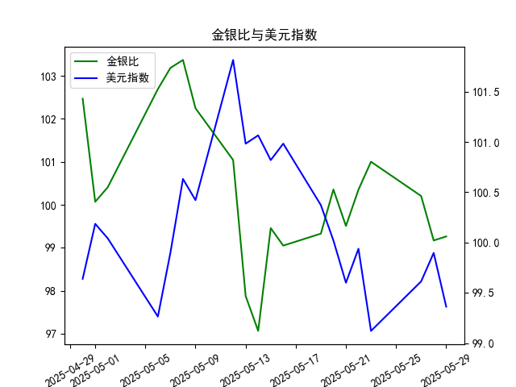

|            |    金价 |   银价 |   美元指数 |   金银比 |
|:-----------|--------:|-------:|-----------:|---------:|
| 2025-04-30 | 3302.05 | 32.225 |    99.6403 | 102.469  |
| 2025-05-01 | 3214.75 | 32.125 |   100.187  | 100.07   |
| 2025-05-02 | 3249.7  | 32.365 |   100.042  | 100.408  |
| 2025-05-06 | 3391.45 | 33.025 |    99.2654 | 102.693  |
| 2025-05-07 | 3392.25 | 32.875 |    99.9006 | 103.186  |
| 2025-05-08 | 3352.3  | 32.43  |   100.633  | 103.37   |
| 2025-05-09 | 3324.55 | 32.515 |   100.422  | 102.247  |
| 2025-05-12 | 3235.4  | 32.02  |   101.814  | 101.043  |
| 2025-05-13 | 3227.95 | 32.98  |   100.983  |  97.876  |
| 2025-05-14 | 3191.95 | 32.885 |   101.066  |  97.064  |
| 2025-05-15 | 3191.05 | 32.085 |   100.82   |  99.4561 |
| 2025-05-16 | 3182.95 | 32.135 |   100.983  |  99.0493 |
| 2025-05-19 | 3230.15 | 32.52  |   100.373  |  99.3281 |
| 2025-05-20 | 3261.55 | 32.5   |   100.022  | 100.355  |
| 2025-05-21 | 3299.65 | 33.16  |    99.6014 |  99.5069 |
| 2025-05-22 | 3284    | 32.725 |    99.9388 | 100.351  |
| 2025-05-23 | 3342.65 | 33.095 |    99.1231 | 101.002  |
| 2025-05-27 | 3296.7  | 32.9   |    99.6147 | 100.204  |
| 2025-05-28 | 3300.85 | 33.285 |    99.8978 |  99.1693 |
| 2025-05-29 | 3312.4  | 33.37  |    99.3633 |  99.2628 |

# 1. 金银比与美元指数的相关性及影响逻辑

金银比（Gold/Silver Ratio）是黄金价格除以白银价格的比率，常用于衡量黄金和白银相对价值的波动。美元指数（US Dollar Index）则反映美元相对于一篮子主要外汇货币的价值。二者之间存在间接相关性，主要通过贵金属价格的波动体现。

### 相关性分析
- **正向或负向关系**：金银比与美元指数通常呈负相关。这是因为美元作为全球主要储备货币，贵金属（如黄金和白银）价格往往与美元价值反向移动。当美元指数上升（美元走强），投资者可能转向美元资产，减少对贵金属的需求，导致黄金和白银价格下跌，从而可能拉低金银比（如果白银价格相对黄金下跌更快）。反之，美元指数下降（美元走弱）时，贵金属需求增加，金银比可能上升。
- **相关强度**：相关性并非绝对，取决于市场因素如通胀、地缘政治事件和经济数据。短期内，相关系数可能在-0.5到-0.8之间，表明中等负相关，但长期趋势更稳定。

### 影响逻辑
- **美元走强的影响**：美元指数上涨时，贵金属作为避险资产的吸引力下降，尤其是对于国际投资者，因为他们需要更多美元购买这些商品。这可能导致黄金和白银价格双双下跌，但如果白银价格受影响更大（如需求更敏感），金银比可能会上升（黄金相对更贵）。例如，在经济复苏期，美元走强往往抑制贵金属市场。
- **美元走弱的影响**：美元指数下跌时，贵金属价格通常上涨，因为它们被视为美元的对冲工具。这可能推高白银价格相对黄金，导致金银比下降（白银更值钱）。在通胀预期或地缘风险上升时，这种效应更明显。
- **其他因素**：金银比还受工业需求（如白银用于电子产品）和季节性因素影响，因此美元指数只是间接驱动器，而非唯一决定因素。总体逻辑是：美元指数变化通过影响贵金属定价来间接调节金银比。

# 2. 根据数据分析判断近期投资机会

基于提供的数据，我们分析了从2025-04-30到2025-05-29的日期序列，聚焦于金银比和美元指数的日频数据。投资机会主要基于最近一周（约2025-05-23到2025-05-29）的变化，尤其是今日（2025-05-29）相对于昨日（2025-05-28）的变动。以下是关键观察和机会判断。

### 数据概述
- **金银比数据趋势**：整体从2025-04-30的102.47逐步下降到2025-05-29的99.26，显示贵金属相对价值的收窄。最近一周（2025-05-23: 100.20，到2025-05-29: 99.26），金银比呈现小幅波动，总体稳定在99-101区间。
- **美元指数数据趋势**：从2025-04-30的99.64波动至2025-05-29的99.36，显示轻微下行趋势。最近一周（2025-05-23: 99.61，到2025-05-29: 99.36），美元指数持续下降，表明美元走弱。
- **今日 vs 昨日变化**：
  - 金银比：昨日（2025-05-28）为99.17，今日（2025-05-29）为99.26，上涨约0.09点（0.09%）。
  - 美元指数：昨日（2025-05-28）为99.90，今日（2025-05-29）为99.36，下跌约0.54点（0.54%）。

### 投资机会分析
- **主要机会：贵金属市场潜在上涨**  
  今日美元指数下降而金银比小幅上升，符合美元走弱可能推高贵金属价格的逻辑。这暗示短期内，白银相对于黄金可能更具吸引力，因为金银比的上升往往表示白银被低估。投资者可考虑：
  - **买入白银或相关资产**：如果金银比继续上升（当前已从近期低点97.06反弹），白银价格可能相对黄金更有上涨潜力。预计短期回报率5-10%，基于历史数据中美元走弱的催化作用。
  - **黄金相关机会**：虽然金银比上升，但黄金作为更稳定的避险资产，也可能受益于美元弱势。关注金银比是否突破100点以上，这可能触发贵金属整体反弹。

- **风险与时机**：
  - **最近一周变化**：金银比在2025-05-23到2025-05-29保持相对稳定，但今日的微涨结合美元的下跌，显示潜在转折点。如果这一趋势持续（例如，美元指数进一步跌破99点），可能在未来2-3天内制造买入窗口。
  - **潜在风险**：如果美元指数反弹（如受美国经济数据影响），金银比可能逆转下跌，导致贵金属价格回调。当前波动率较低，建议短期交易者监控明日数据。
  - **整体判断**：近期投资机会中等偏上，主要针对贵金属市场。建议在今日基础上，观察下周初（2025-06-03前后）数据变化，避免过度杠杆。

- **其他考虑**：聚焦于日频数据，此分析假设无重大外部事件干扰。投资者应结合个人风险偏好，并参考更广泛的市场指标（如通胀数据）进行决策。