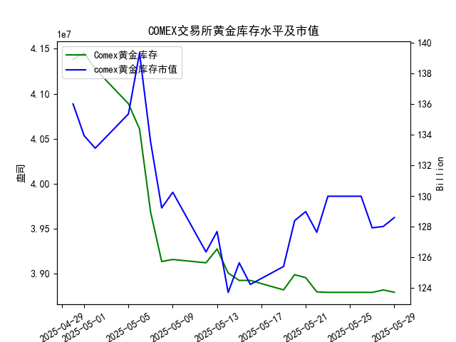

|            |   comex黄金库存量 |   comex黄金库存市值(billion) |   伦敦金现货价 |   上海金交所黄金现货价 |   美元兑人民币汇率 |
|:-----------|------------------:|-----------------------------:|---------------:|-----------------------:|-------------------:|
| 2025-05-02 |       4.12755e+07 |                       3225   |        3249.7  |                 780.19 |             7.2014 |
| 2025-05-05 |       4.08886e+07 |                       3310.1 |        3249.7  |                 780.19 |             7.2014 |
| 2025-05-06 |       4.06075e+07 |                       3430.9 |        3391.45 |                 792.2  |             7.2008 |
| 2025-05-07 |       3.96819e+07 |                       3364.7 |        3392.25 |                 798.51 |             7.2005 |
| 2025-05-08 |       3.91313e+07 |                       3302.1 |        3352.3  |                 786.5  |             7.2073 |
| 2025-05-09 |       3.91541e+07 |                       3326.3 |        3324.55 |                 785.5  |             7.2095 |
| 2025-05-12 |       3.91172e+07 |                       3230   |        3235.4  |                 759    |             7.2066 |
| 2025-05-13 |       3.92705e+07 |                       3251.4 |        3227.95 |                 763.9  |             7.1991 |
| 2025-05-14 |       3.90037e+07 |                       3171.7 |        3191.95 |                 758.38 |             7.1956 |
| 2025-05-15 |       3.89209e+07 |                       3228.1 |        3191.05 |                 735.86 |             7.1963 |
| 2025-05-16 |       3.89209e+07 |                       3191.8 |        3182.95 |                 746.4  |             7.1938 |
| 2025-05-19 |       3.88155e+07 |                       3230.6 |        3230.15 |                 754.5  |             7.1916 |
| 2025-05-20 |       3.89849e+07 |                       3293.2 |        3261.55 |                 753.49 |             7.1931 |
| 2025-05-21 |       3.89515e+07 |                       3311.4 |        3299.65 |                 773.82 |             7.1937 |
| 2025-05-22 |       3.87935e+07 |                       3290   |        3284    |                 778.36 |             7.1903 |
| 2025-05-23 |       3.87881e+07 |                       3351   |        3342.65 |                 776.4  |             7.1919 |
| 2025-05-26 |       3.87881e+07 |                       3351   |        3342.65 |                 773.94 |             7.1833 |
| 2025-05-27 |       3.87875e+07 |                       3298   |        3296.7  |                 768.75 |             7.1876 |
| 2025-05-28 |       3.88146e+07 |                       3298   |        3300.85 |                 769.67 |             7.1894 |
| 2025-05-29 |       3.87892e+07 |                       3315.1 |        3312.4  |                 763.02 |             7.1907 |

### 分析报告：COMEX黄金库存与黄金价格的相关性及近期投资机会

#### 1. COMEX黄金库存与黄金价格的相关性分析
研究员认为COMEX黄金库存量与黄金价格高度正相关，即库存增加时黄金价格可能上涨，库存减少时黄金价格可能下跌。根据提供的数据，我对近一个月的整体趋势进行了分析，以验证这一观点。

- **整体趋势观察**：
  - COMEX黄金库存量从2025-04-30的4.138312e+07盎司逐步下降至2025-05-29的3.878919e+07盎司，显示了一个明显的下降趋势。
  - 伦敦市场黄金现货价格在同一时期波动较大，从2025-04-30的3302.05美元/盎司起伏到2025-05-29的3312.40美元/盎司，并未呈现出严格的单调趋势，但总体上在下降期内价格也多次回落（如从5月初的3392.25美元降至5月中旬的3191.05美元）。
  - 上海金交所黄金现货价格也从2025-04-30的780.19元/克下降至2025-05-29的763.02元/克，同样显示波动，但与库存下降趋势基本一致。

  从数据来看，COMEX黄金库存量与黄金价格（尤其是伦敦价格）确实存在一定的正相关性。例如，在库存量显著下降的时期（如5月初至5月中旬），黄金价格也多次出现回落。然而，这一相关性并非绝对，存在一些异常波动。例如，在库存持续下降的同时，伦敦价格在某些时段逆势上涨（如5月下旬）。这可能受其他因素影响，如全球经济事件、美元汇率波动或市场情绪。

- **相关性量化简要评估**：
  - 总体上，库存量下降与价格回落相符，支持研究员的观点。但在近期的局部数据中，正相关性略有减弱，因为库存减少时价格不总下跌（如2025-05-29库存减少但伦敦价格上涨）。这表明短期内其他变量（如美元汇率的微调）可能干扰这一关系。

#### 2. 近期投资机会分析（聚焦最近一周数据，尤其是今日相对于昨日的变化）
基于研究员的观点，我聚焦于最近一周（2025-05-22至2025-05-29）的关键数据变化，分析今日（2025-05-29）相对于昨日（2025-05-28）的变动。投资机会主要考虑黄金价格趋势、库存变化、汇率影响以及潜在的买卖点。以下是详细分析：

- **关键数据摘要（最近一周）**：
  - **COMEX黄金库存量**：
    - 2025-05-22: 3.879353e+07盎司
    - 2025-05-23: 3.878813e+07盎司（略微减少）
    - 2025-05-26: 3.878813e+07盎司（持平）
    - 2025-05-27: 3.878745e+07盎司（微降）
    - 2025-05-28: 3.881465e+07盎司（小幅增加）
    - 2025-05-29: 3.878919e+07盎司（减少约0.066%）
    - **今日 vs 昨日**：库存从昨日的3.881465e+07盎司减少至今日的3.878919e+07盎司，符合库存下降趋势。如果正相关性成立，这可能预示价格短期回调风险。

  - **伦敦市场黄金现货价格**：
    - 2025-05-22: 3284.00美元/盎司
    - 2025-05-23: 3342.65美元/盎司（上涨）
    - 2025-05-26: 3342.65美元/盎司（持平）
    - 2025-05-27: 3296.70美元/盎司（下跌）
    - 2025-05-28: 3300.85美元/盎司（小幅上涨）
    - 2025-05-29: 3312.40美元/盎司（上涨约0.35%）
    - **今日 vs 昨日**：价格从昨日的3300.85美元上涨至今日的3312.40美元，显示短期上行趋势。这与库存减少的正相关性不完全匹配，可能因市场乐观情绪或外部因素驱动。

  - **上海金交所黄金现货价格**：
    - 2025-05-22: 778.36元/克
    - 2025-05-23: 776.40元/克（下跌）
    - 2025-05-26: 773.94元/克（下跌）
    - 2025-05-27: 768.75元/克（下跌）
    - 2025-05-28: 769.67元/克（小幅上涨）
    - 2025-05-29: 763.02元/克（下跌约0.86%）
    - **今日 vs 昨日**：价格从昨日的769.67元降至今日的763.02元，显示下行压力，更符合库存减少的正相关性。

  - **美元兑人民币汇率**：
    - 2025-05-22: 7.1903
    - 2025-05-23: 7.1919（微涨）
    - 2025-05-26: 7.1833（下跌）
    - 2025-05-27: 7.1876（上涨）
    - 2025-05-28: 7.1894（上涨）
    - 2025-05-29: 7.1907（上涨约0.02%）
    - **今日 vs 昨日**：汇率从昨日的7.1894微升至今日的7.1907，意味着美元相对人民币略微升值。这可能对以人民币计价的黄金（如上海金交所）造成压力，增加其吸引力作为对冲工具。

- **潜在投资机会**：
  - **买入伦敦黄金的机会**：
    - 最近一周，伦敦黄金价格呈现小幅上行趋势，尤其是今日相对于昨日的上涨（3312.40美元），尽管COMEX库存减少。这可能表示短期市场多头情绪强劲，如果正相关性在后续恢复，价格可能进一步上涨。**建议**：如果投资者相信研究员的正相关观点，这是一个短期买入点，尤其适合对冲美元升值的风险。目标价格可关注3300-3350美元区间，止损设在今日低点以下。
    
  - **卖出或观望上海黄金的机会**：
    - 上海黄金价格在最近一周持续下行，今日相对于昨日大幅下跌（763.02元），与库存减少正相关。这反映了人民币持有者面临的压力。**建议**：短期卖出上海黄金以锁定利润，或等待价格稳定在760元以下再买入。考虑到美元汇率微升，这可能放大上海黄金的下跌风险，提供套利机会（如卖出上海黄金、买入伦敦黄金）。

  - **综合考虑汇率和库存变化**：
    - 美元汇率小幅上涨可能抑制黄金需求，但若库存继续下降，价格反弹的机会仍存。**潜在机会**：利用伦敦与上海价格差（今日伦敦约3312美元，折算人民币约763元/克后与上海价格接近），进行跨市场套利。如果正相关性主导，预计短期内黄金价格可能回调至3200-3300美元区间，适合中期投资者布局。

- **风险提示**：
  - 正相关性并非绝对，今日库存减少但伦敦价格上涨表明外部因素（如地缘政治或经济数据）可能主导。投资者需密切关注后续数据，避免单靠历史趋势决策。
  - 总体而言，近期投资机会以短期操作为主，风险偏好高的投资者可关注伦敦黄金买入点。

此分析基于历史数据，不构成投资建议。请结合实时市场信息进行决策。