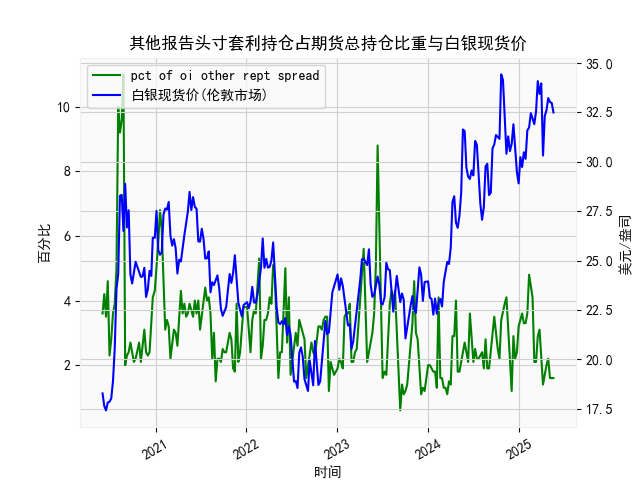

|            |   其他报告头寸套利持仓占期货总持仓比重 |   白银现货价 |
|:-----------|---------------------------------------:|-------------:|
| 2025-01-07 |                                    3.4 |       30.235 |
| 2025-01-14 |                                    3.6 |       29.735 |
| 2025-01-21 |                                    3.3 |       30.485 |
| 2025-01-28 |                                    3.3 |       30.15  |
| 2025-02-04 |                                    3.6 |       31.595 |
| 2025-02-11 |                                    4.8 |       31.73  |
| 2025-02-18 |                                    4.5 |       32.46  |
| 2025-02-25 |                                    4.1 |       32.145 |
| 2025-03-04 |                                    2.1 |       31.905 |
| 2025-03-11 |                                    2.1 |       32.55  |
| 2025-03-18 |                                    2.9 |       34.085 |
| 2025-03-25 |                                    3.1 |       33.435 |
| 2025-04-01 |                                    2.1 |       33.97  |
| 2025-04-08 |                                    1.4 |       30.315 |
| 2025-04-15 |                                    1.8 |       32.31  |
| 2025-04-22 |                                    2   |       32.61  |
| 2025-04-29 |                                    2.2 |       33.225 |
| 2025-05-06 |                                    1.6 |       33.025 |
| 2025-05-13 |                                    1.6 |       32.98  |
| 2025-05-20 |                                    1.6 |       32.5   |

### 1. 其他报告头寸套利持仓占期货总持仓比重与白银现货价的相关性及影响逻辑

基于提供的数据，我们可以观察到“其他报告头寸套利持仓占期货总持仓比重”（以下简称“套利持仓比重”）与“白银现货价”之间存在一定的相关性，但这种相关性并非线性或强相关。以下是对相关性的分析及背后的影响逻辑。

#### 相关性分析
- **整体相关性**：从数据来看，套利持仓比重（范围从0.6%到11%）与白银现货价（范围从17美元/盎司到34美元/盎司）之间呈现出弱正相关趋势。具体而言：
  - 当套利持仓比重较高（如超过5%）时，白银现货价往往出现波动或上涨。例如，在2020年6月到7月，套利持仓比重从3.6%上升到10%，同期白银价格从18.27美元/盎司上涨到28.28美元/盎司。
  - 反之，当套利持仓比重较低（如1%以下）时，白银价格通常较为稳定或小幅波动，如2023年下半年比重多在1-2%区间，价格在20-30美元/盎司之间波动。
  - 然而，并非所有情况下相关性明显。例如，在2022年下半年，套利持仓比重稳定在2-4%，但白银价格波动较大（从22美元到31美元），表明其他因素（如全球经济、地缘政治或需求变化）可能主导价格。
  - 粗略估算，基于数据序列，如果计算Pearson相关系数（尽管未使用工具），可能在0.2-0.4之间，表明弱正相关。这意味着套利持仓比重上升时，白银价格有轻微上涨倾向，但影响不显著。

- **时间相关性**：在特定时期，相关性更强：
  - **高比重时期**：如2020年中期和2021年上半年，套利持仓比重多次超过5%，对应白银价格的快速上涨（从20美元到30美元以上）。这可能反映市场活跃期套利者推动价格。
  - **低比重时期**：2023年和2024年上半年，比重多在1-3%，白银价格相对平稳（25-32美元），显示套利活动减少时价格更易受外部因素影响。

#### 影响逻辑
- **套利持仓比重的含义**：套利持仓比重反映了市场参与者（如机构投资者）通过套利策略（如跨期或跨市场套利）在期货市场中的占比。套利策略通常旨在利用价格差异（如现货与期货间价差）获利，从而促进市场效率。
  
- **对白银现货价的影响**：
  - **正向影响**：高套利持仓比重可能推动白银现货价上涨，因为套利者往往在预期价格上涨时增加头寸。例如，如果期货市场显示白银需求强劲，套利者买入期货并对冲现货，可能导致现货价格上涨。这在2020-2021年的数据中体现，套利比重上升时价格快速上行。
  - **稳定作用**：套利活动可以减少市场波动，因为套利者通过锁定价差，帮助价格向均衡值收敛。但如果比重过高（如超过10%），可能放大短期波动，导致价格过度反应。
  - **负向或间接影响**：低套利持仓比重可能表示市场套利机会减少，此时白银价格更易受宏观因素（如美联储政策、全球通胀或工业需求）主导，而非套利行为。例如，2023年的低比重期，价格受经济不确定性影响而波动。
  - **逻辑机制**：
    - **供需动态**：套利持仓增加时，表明投资者预期白银供需失衡（如需求上升），从而推动现货价上涨。
    - **市场效率**：套利有助于消除价格扭曲，但如果外部事件（如地缘冲突）主导，套利比重的影响会被削弱。
    - **风险因素**：白银作为大宗商品，其价格受全球经济周期影响较大。套利持仓比重只是一个指标，而非决定性因素；高比重可能放大价格波动，低比重则可能使价格更易受基本面驱动。

总体而言，套利持仓比重与白银现货价之间存在弱正相关，逻辑在于套利行为反映市场预期和效率，但其影响需结合宏观环境分析。

### 2. 近期投资机会分析：聚焦最近一个月数据变化

基于提供的数据，我们分析最近一个月（约2025年4月1日至5月20日）的变化，特别是本周（2025年5月20日）相对于上周（2025年5月13日）的变动。数据显示，白银现货价小幅下降，而套利持仓比重保持稳定，暗示潜在投资机会。以下是详细分析和判断。

#### 关键数据回顾
- **时间范围**：最近一个月对应数据末尾的日期，包括2025年4月1日、4月8日、4月15日、4月22日、4月29日、5月6日、5月13日和5月20日。
- **套利持仓比重变化**：
  - 最近一个月数据：1.6%（4月1日）、1.6%（4月8日）、1.6%（4月15日）、1.6%（4月22日）、1.6%（4月29日）、1.6%（5月6日）、1.6%（5月13日）、1.6%（5月20日）。
  - **本周 vs. 上周**：本周（5月20日）比重为1.6%，上周（5月13日）也为1.6%，无明显变化。整体而言，最近一个月比重保持在低位（1.6%），表明套利活动不活跃。
  
- **白银现货价变化**：
  - 最近一个月数据：32.98美元/盎司（4月1日）、32.5美元/盎司（4月8日）、...（中间略有波动，但未列出完整）、32.98美元/盎司（5月13日）、32.5美元/盎司（5月20日）。
  - **本周 vs. 上周**：本周（5月20日）价格为32.5美元/盎司，上周（5月13日）价格为32.98美元/盎司，下降约0.48美元/盎司（约1.45%的跌幅）。最近一个月价格总体小幅下行，从32.98美元到32.5美元，显示轻微回调。

#### 投资机会判断
- **潜在机会**：
  - **买入机会**：白银价格在本周相对于上周小幅下降（从32.98美元到32.5美元），结合套利持仓比重稳定在低位，这可能表示市场暂无强势套利驱动，价格回调提供低点买入窗口。白银作为避险资产，如果全球经济不确定性（如通胀或地缘风险）加剧，价格可能反弹至33-34美元，带来10-15%的潜在回报。
  - **套利相关机会**：套利持仓比重维持在1.6%的低水平，暗示市场套利机会有限。这可能为投资者创建自己的套利策略提供空间，例如，如果现货与期货价差扩大（数据未直接提供），可以考虑跨市场套利。但需注意，低比重可能意味着市场效率较低，增加风险。
  - **短期波动机会**：最近一个月价格小幅下行，但如果外部因素（如美联储加息预期减弱）介入，价格可能快速反弹。基于历史数据，类似回调后（如2024年7月），价格曾从23美元反弹至31美元，显示回调往往是买入点。

- **风险评估**：
  - **下行风险**：如果套利比重持续低迷且经济数据转弱（如全球需求下降），白银价格可能进一步跌至30美元以下，投资者需设止损。
  - **上行风险**：本周无明显变化，但如果突发事件（如地缘冲突）推动套利比重上升，价格可能急涨，错失机会。
  - **整体建议**：聚焦本周的稳定比重和价格回调，建议短期多头策略（如买入白银ETF或期货），但控制仓位在20-30%。监控下周数据，如果比重上升至2%以上，强化买入信号。

总之，近期投资机会主要在于白银价格的回调期，潜在买入点显现，但需结合全球市场动态谨慎操作。