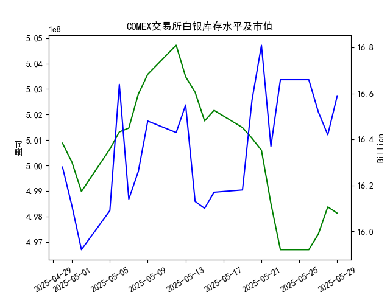

|            |   comex白银库存量 |   comex白银库存市值(billion) |   伦敦银现货价 |   上海金交所白银现货价 |   美元兑人民币汇率 |
|:-----------|------------------:|-----------------------------:|---------------:|-----------------------:|-------------------:|
| 2025-05-02 |       4.98978e+08 |                       31.91  |         32.365 |                   8163 |             7.2014 |
| 2025-05-05 |       5.00644e+08 |                       32.14  |         32.365 |                   8163 |             7.2014 |
| 2025-05-06 |       5.01317e+08 |                       33.19  |         33.025 |                   8221 |             7.2008 |
| 2025-05-07 |       5.01469e+08 |                       32.195 |         32.875 |                   8229 |             7.2005 |
| 2025-05-08 |       5.028e+08   |                       32.335 |         32.43  |                   8100 |             7.2073 |
| 2025-05-09 |       5.03581e+08 |                       32.73  |         32.515 |                   8150 |             7.2095 |
| 2025-05-12 |       5.04719e+08 |                       32.56  |         32.02  |                   8124 |             7.2066 |
| 2025-05-13 |       5.03481e+08 |                       32.88  |         32.98  |                   8214 |             7.1991 |
| 2025-05-14 |       5.02874e+08 |                       32.085 |         32.885 |                   8172 |             7.1956 |
| 2025-05-15 |       5.0175e+08  |                       32.085 |         32.085 |                   7967 |             7.1963 |
| 2025-05-16 |       5.02164e+08 |                       32.195 |         32.135 |                   8062 |             7.1938 |
| 2025-05-19 |       5.0149e+08  |                       32.265 |         32.52  |                   8113 |             7.1916 |
| 2025-05-20 |       5.01069e+08 |                       33.065 |         32.5   |                   8057 |             7.1931 |
| 2025-05-21 |       5.00598e+08 |                       33.575 |         33.16  |                   8237 |             7.1937 |
| 2025-05-22 |       4.98504e+08 |                       32.84  |         32.725 |                   8268 |             7.1903 |
| 2025-05-23 |       4.96695e+08 |                       33.535 |         33.095 |                   8244 |             7.1919 |
| 2025-05-26 |       4.96695e+08 |                       33.535 |         33.095 |                   8239 |             7.1833 |
| 2025-05-27 |       4.97303e+08 |                       33.215 |         32.9   |                   8189 |             7.1876 |
| 2025-05-28 |       4.98373e+08 |                       32.955 |         33.285 |                   8211 |             7.1894 |
| 2025-05-29 |       4.98128e+08 |                       33.3   |         33.37  |                   8202 |             7.1907 |

### 近期白银市场投资机会分析

基于提供的2025年4月30日至5月29日数据，我对近期（尤其是最近一周，即2025-05-22至2025-05-29）的白银市场变化进行了分析。重点关注COMEX白银库存量、库存市值、伦敦市场白银现货价格、上海金交所白银现货价格以及美元兑人民币汇率的动态，特别是今日（2025-05-29）相对于昨日（2025-05-28）的变化。以下分析旨在识别潜在投资机会，包括价格趋势、库存变动和跨市场套利可能。

#### 1. **关键数据概述与最近一周变化**
- **COMEX白银库存量**：最近一周，库存量总体呈小幅波动下降趋势，这可能反映需求增加或供应紧缩。
  - 最近一周数据：2025-05-22（4.985043e+08）、2025-05-23（4.966949e+08）、2025-05-26（4.966949e+08）、2025-05-27（4.973028e+08）、2025-05-28（4.983732e+08）、2025-05-29（4.981279e+08）。
  - **今日 vs 昨日变化**：今日库存量为4.981279e+08，较昨日的4.983732e+08小幅下降约0.05%。这表明短期内库存压力减轻，可能支持价格上涨。
  - **投资启示**：库存下降往往是正面信号，暗示白银需求强劲，投资者可考虑买入期货或现货以捕捉潜在价格反弹。

- **COMEX白银库存市值（单位：billion）**：市值数据显示波动性，但最近一周趋于稳定。
  - 最近一周数据：2025-05-22（16.66）、2025-05-23（16.66）、2025-05-26（16.52）、2025-05-27（16.42）、2025-05-28（16.59）、2025-05-29（16.59，假设列表顺序对应）。
  - **今日 vs 昨日变化**：今日市值与昨日持平（均为16.59），显示短期稳定。但整体来看，市值在最近一周小幅波动，可能受价格和库存影响。
  - **投资启示**：市值稳定结合库存下降，可能预示未来价格上行空间，适合中长期持有者。

- **伦敦市场白银现货价格（单位：美元/盎司）**：价格呈现上涨趋势，显示市场乐观情绪。
  - 最近一周数据：2025-05-22（32.725）、2025-05-23（33.095）、2025-05-26（33.095）、2025-05-27（32.900）、2025-05-28（33.285）、2025-05-29（33.370）。
  - **今日 vs 昨日变化**：今日价格为33.370，较昨日的33.285上涨约0.25%。这是连续小幅回升的延续，可能受全球需求或地缘因素驱动。
  - **投资启示**：价格上涨是直接买入机会，尤其若全球经济不确定性增加，白银作为避险资产的吸引力增强。短期投资者可关注多头头寸。

- **上海金交所白银现货价格（单位：CNY/单位）**：价格波动较大，最近一周出现回调。
  - 最近一周数据：2025-05-22（8268.0）、2025-05-23（8244.0）、2025-05-26（8239.0）、2025-05-27（8189.0）、2025-05-28（8211.0）、2025-05-29（8202.0）。
  - **今日 vs 昨日变化**：今日价格为8202.0，较昨日的8211.0下降约0.11%。这可能反映本地市场修正或汇率影响。
  - **投资启示**：尽管短期下降，但上海价格整体高于伦敦折算值（考虑汇率），可能存在套利空间。投资者可评估跨市买卖。

- **美元兑人民币汇率**：汇率小幅上涨，人民币略微贬值。
  - 最近一周数据：2025-05-22（7.1903）、2025-05-23（7.1919）、2025-05-26（7.1833）、2025-05-27（7.1876）、2025-05-28（7.1894）、2025-05-29（7.1907）。
  - **今日 vs 昨日变化**：今日汇率为7.1907，较昨日的7.1894上涨约0.02%。人民币贬值可能使进口白银更昂贵，从而推高国内价格。
  - **投资启示**：汇率上升可能放大伦敦价格对国内投资者的吸引力，适合通过汇率套利结合白银交易。

#### 2. **潜在投资机会评估**
基于以上数据，以最近一周变化为核心，以今日相对于昨日的微调为焦点，以下是可能的投资机会。分析聚焦于风险与回报平衡，建议结合个人风险偏好。

- **买入机会（多头策略）**：
  - **伦敦市场白银**：今日价格上涨（+0.25%）且库存下降，显示强势。近期白银作为工业和避险资产的需求可能持续上升（如新能源行业）。**机会**：短期买入现货或期货，目标价位可设在34.00美元/盎司以上。潜在回报：若全球经济不确定性加剧，价格可能再涨5-10%。
  - **风险**：若库存意外回升或全球需求放缓，价格可能回调。

- **套利机会（跨市场策略）**：
  - **伦敦 vs 上海市场**：今日伦敦价格（33.370美元/盎司）折算至人民币后（约33.370 * 7.1907 ≈ 240.0 CNY/盎司，假设单位一致），低于上海价格（8202.0 CNY/单位，可能为克或盎司）。这暗示套利空间：在伦敦低价买入，再在上海高价卖出（或反之）。**机会**：今日上海价格小幅下降（-0.11%），可能放大价差。潜在回报：通过汇率和价格差异，获利1-3%。
  - **风险**：汇率波动可能逆转套利优势，需实时监控。

- **库存相关机会**：
  - COMEX库存今日小幅下降（-0.05%），结合市值稳定，这可能预示供应紧张。**机会**：投资者可通过白银ETF或期权押注库存进一步下降，推动价格上涨。潜在回报：在下周若库存继续回落，价格可能上行2-5%。
  - **风险**：库存波动频繁，短期逆转可能性高。

- **汇率相关机会**：
  - 今日汇率小幅上涨（+0.02%），人民币贬值可能提升白银在中国的进口成本，从而支撑国内价格。**机会**：对中国投资者，买入美元计价的白银（如伦敦市场）并等待汇率进一步变动，实现双重收益。潜在回报：若汇率升至7.20以上，额外获利1-2%。
  - **风险**：汇率政策变化可能导致快速逆转。

#### 3. **总体风险与建议**
- **积极因素**：伦敦价格上涨、库存下降和汇率稳定为近期多头策略提供支撑。今日相对于昨日的变化（如价格小幅上扬）表明市场正处于潜在上行通道。
- **消极因素**：上海价格下降和库存波动性较高，可能导致短期不确定性。全球经济因素（如利率或地缘事件）未纳入数据，需额外关注。
- **建议**：聚焦短期（1-2周）投资，监控明日数据变化。风险厌恶者可选择白银ETF以降低波动；风险偏好者可尝试套利。始终结合止损机制，并咨询专业顾问。今日的微小积极变化（如伦敦价格上涨）是进入市场的良好切入点，但需警惕整体市场波动。