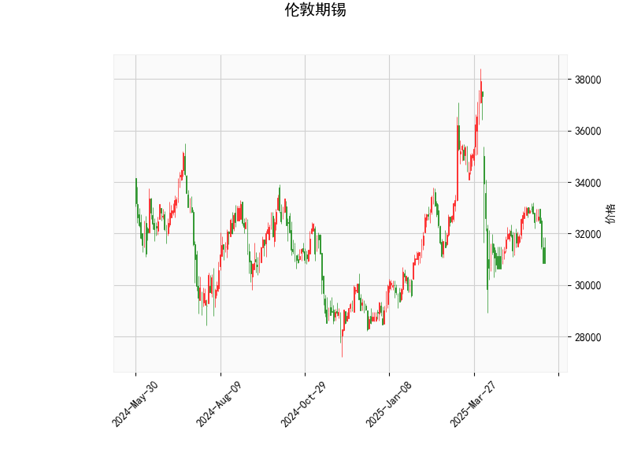

### 伦敦期锡技术分析结果解读

#### 1. 技术指标整体分析
基于提供的伦敦期锡技术分析数据，我们可以从多个角度评估当前市场状况。当前价格为30850.0，处于一个相对低位，结合其他指标，显示出市场可能处于超卖状态，但短期内仍存在下行风险。以下是对各指标的详细分析：

- **RSI（相对强弱指数）**：当前RSI值为34.31，这低于30的阈值，通常被视为超卖信号。这表明锡价可能已被过度抛售，市场参与者情绪偏向悲观。如果RSI开始回升（例如，向上穿越40水平），这可能预示着短期反弹机会。然而，RSI过低也可能意味着进一步下探的风险，如果市场缺乏基本面支撑。

- **MACD（移动平均收敛散度）**：MACD线为-237.09，信号线为-67.27，MACD直方图为-169.82。这些数值均显示MACD线低于信号线，且直方图为负，表明短期趋势偏向看跌。这反映了价格动量疲软，可能源于卖家主导的市场。但MACD处于负值区域的时间过长时，往往会引发技术性反弹，尤其当结合RSI的超卖信号时。

- **布林带（Bollinger Bands）**：上轨为37014.10，中轨为33026.24，下轨为29038.37。当前价格30850.0位于下轨（29038.37）和中轨（33026.24）之间，接近下轨。这暗示价格可能已触及超卖区域，历史上，当价格靠近下布林带时，往往是潜在的支撑位。如果价格反弹并向上穿越中轨，这可能标志着趋势逆转；反之，如果价格进一步跌破下轨，则可能加剧下行压力。

- **K线形态**：检测到的形态包括“CDLCLOSINGMARUBOZU”和“CDLMATCHINGLOW”。  
  - “CDLCLOSINGMARUBOZU”通常表示一根实体较长的K线，暗示市场强势（如果是阳线）或弱势（如果是阴线）收盘，反映出买卖力量的集中。这种形态常预示潜在反转，尤其是当市场超卖时。  
  - “CDLMATCHINGLOW”表明价格在低位形成匹配的低点，这可能是一个支撑信号，暗示卖家力量减弱，潜在反弹机会。但需结合其他指标确认，避免假突破。  
  整体上，这些K线形态显示市场可能在低位筑底，但仍需警惕短期波动。

总结而言，当前技术面显示伦敦期锡处于超卖状态（RSI和布林带支持），但MACD和K线形态暗示看跌趋势尚未完全逆转。市场可能在短期内出现震荡或小幅反弹，但如果缺乏基本面驱动（如全球锡需求恢复），下行风险依然存在。

#### 2. 近期投资或套利机会与策略判断
基于上述分析，伦敦期锡市场短期内可能存在一定的反弹或套利机会，但需谨慎对待高波动性。以下是针对潜在机会的判断和策略建议：

- **潜在投资机会**：
  - **反弹买入机会**：RSI超卖和价格接近布林带下轨暗示可能的技术性反弹。如果K线形态（如CDLMATCHINGLOW）得到确认（例如，伴随阳线出现），投资者可考虑在当前价位附近布局多头头寸。预计反弹目标可能指向中布林带（约33026.24），若成功上破，则进一步看向上轨（37014.10）。  
  - **套利机会**：如果伦敦期锡与相关资产（如LME其他金属期货或锡现货市场）存在价格偏差，可探索跨市场套利。例如，锡价若继续超卖，而全球锡库存数据显示供应紧张，则可进行锡期货与现货的价差套利。当前超卖状态可能放大这种机会，但需监控全球经济因素（如电动汽车需求对锡的影响）。

- **潜在风险与策略**：
  - **多头策略**：建议在RSI回升至40以上或MACD直方图转为正值时入场买入，目标设在中布林带附近。止损位可放置在下布林带下方（如29500左右），以控制风险。结合K线形态，选择在“CDLMATCHINGLOW”确认后操作，以提高胜率。
  - **空头策略**：若MACD继续恶化（直方图进一步下探）或价格跌破下布林带，则可布局空头头寸，目标指向29000以下。但鉴于超卖信号，避免过度看空。
  - **套利策略**：  
    - **跨品种套利**：比较伦敦期锡与其他金属（如铜或锌）的价格相关性。如果锡价相对铜价出现异常低估，可进行多锡空铜的配对交易。  
    - **期现套利**：若期货价格与现货价格间隙扩大（当前价位下，期货可能被低估），可买入期货并卖出现货锁定利润。  
    - **风险管理**：无论多空，都应控制仓位（不超过总资金的20%），并设置动态止盈止损。密切关注外部因素，如中国经济数据或全球供应链事件，这些可能触发锡价波动。
  - **整体判断**：近期机会以短期反弹为主，适合波动率交易者。保守投资者应等待更多确认信号（如RSI向上交叉或K线反转形态），避免在超卖市场贸然入场。潜在回报/风险比中等，但需警惕地缘政治事件（如贸易摩擦）可能加剧下行。

总体上，伦敦期锡的技术面显示短期内可能的小幅机会，但市场仍需基本面支撑。投资者应结合宏观环境（如锡矿供应和需求动态）制定策略，并保持灵活性。