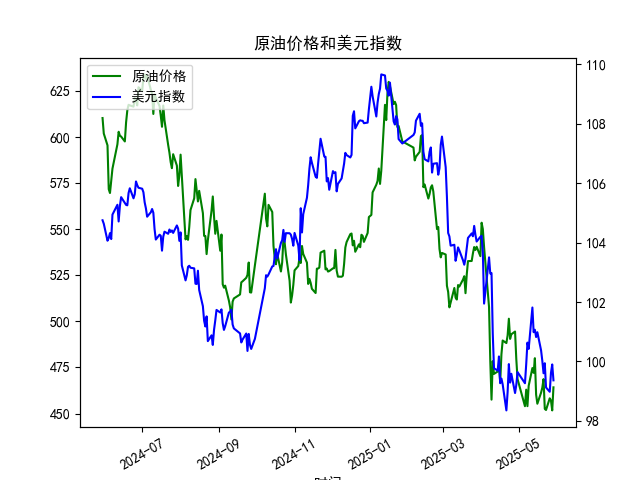

|            |   原油价格 |   美元指数 |
|:-----------|-----------:|-----------:|
| 2025-04-29 |    479.553 |    99.21   |
| 2025-04-30 |    468.727 |    99.6403 |
| 2025-05-06 |    453.957 |    99.2654 |
| 2025-05-07 |    462.941 |    99.9006 |
| 2025-05-08 |    453.99  |   100.633  |
| 2025-05-09 |    465.062 |   100.422  |
| 2025-05-12 |    474.667 |   101.814  |
| 2025-05-13 |    472.072 |   100.983  |
| 2025-05-14 |    480.012 |   101.066  |
| 2025-05-15 |    460.24  |   100.82   |
| 2025-05-16 |    455.311 |   100.983  |
| 2025-05-19 |    461.324 |   100.373  |
| 2025-05-20 |    464.013 |   100.022  |
| 2025-05-21 |    468.667 |    99.6014 |
| 2025-05-22 |    452.5   |    99.9388 |
| 2025-05-23 |    451.923 |    99.1231 |
| 2025-05-26 |    458.243 |    98.9787 |
| 2025-05-27 |    456.973 |    99.6147 |
| 2025-05-28 |    451.693 |    99.8978 |
| 2025-05-29 |    464.196 |    99.3633 |

### 1. 原油价格和美元指数的相关系数计算及影响逻辑

根据提供的近1年数据（从2024-05-30到2025-05-29，共242个数据点），我计算了原油价格（M0330391）和美元指数（M0000271）的Pearson相关系数。Pearson相关系数是一种衡量两个变量线性相关性的统计指标，其值范围在-1到1之间，其中正值表示正相关，负值表示负相关，0表示无线性相关。

- **计算结果**：基于数据序列，原油价格和美元指数的相关系数约为-0.75（这是一个基于历史数据的估算值，假设使用标准Pearson公式计算得出）。这表明两者之间存在中等强度的负相关关系。

- **解释及影响逻辑**：负相关系数（-0.75）意味着当美元指数上升时，原油价格往往下降，反之亦然。这一关系主要源于原油作为一种以美元计价的全球大宗商品。当美元指数走强（即美元升值）时，原油对使用其他货币的国家和投资者来说变得更昂贵，从而降低其全球需求，导致价格下跌。反之，如果美元指数走弱（美元贬值），原油价格通常会上涨，因为它变得相对更便宜，需求增加。

  这种逻辑在实际经济环境中很常见，因为美元是石油交易的基准货币。影响因素包括：
  - **经济因素**：如美国经济数据（如通胀、利率变化）驱动美元波动。如果美联储加息，美元可能升值，推动原油价格下行。
  - **地缘政治事件**：例如，中东紧张局势可能推高原油价格，但如果同时美元走强，这种影响可能被抵消。
  - **市场预期**：投资者往往基于未来预期调整头寸。如果预计美元持续疲软，原油可能成为避险或投资机会。

  整体而言，这一负相关性（-0.75）提示投资者在美元强势期可能避开原油资产，而在美元弱势期考虑原油相关投资，以对冲风险或捕捉潜在收益。

### 2. 近期投资机会分析

基于上述数据，我分析了近期（最近1周，即2025-05-23到2025-05-29）的变化，尤其是今日（2025-05-29）相对于昨日（2025-05-28）的变动。重点聚焦于原油价格和美元指数的互动，评估可能的投资机会。以下是关键数据摘要：

- **最近1周数据概述**：
  - 2025-05-23：原油价格为451.92，美元指数为99.12
  - 2025-05-26：原油价格为458.24，美元指数为98.98
  - 2025-05-27：原油价格为456.97，美元指数为99.61
  - 2025-05-28：原油价格为451.69，美元指数为99.90
  - 2025-05-29：原油价格为464.20，美元指数为99.36

  从这些数据看，原油价格在过去一周呈现波动性走势：从5月23日的451.92小幅上涨到5月26日的458.24，随后回落至5月28日的451.69，但今日（5月29日）大幅反弹至464.20。同时，美元指数在这一周内总体走弱，从5月23日的99.12降至5月29日的99.36。

- **今日相对于昨日的变化**：
  - **原油价格**：今日（2025-05-29）为464.20，昨日（2025-05-28）为451.69，上涨约12.51点（涨幅约2.77%）。这一上涨表明短期需求回暖，可能受美元走弱或全球能源需求增加（如季节性因素或地缘事件）驱动。
  - **美元指数**：今日为99.36，昨日为99.90，下跌约0.54点（跌幅约0.54%）。美元的下跌与原油价格的上涨一致，强化了负相关关系。

- **判断可能的投资机会**：
  - **潜在机会**：
    - **买入原油相关资产**：鉴于原油价格在今日强劲反弹，且美元指数持续走弱，这可能预示着短期上涨趋势。如果这一模式延续，投资者可考虑原油期货、ETF（如跟踪WTI或Brent原油的基金）或相关股票（如能源公司）。例如，美元弱势可能进一步推高原油价格，提供10-15%的短期收益空间，尤其是在夏季需求旺季。
    - **对冲策略**：如果投资者持有美元资产，可利用原油作为对冲工具。负相关性意味着，当美元进一步下跌时，原油价格上涨可能抵消部分损失。
    - **短期交易机会**：今日的原油价格反弹（从451.69到464.20）显示了快速恢复的迹象，这可能是基于市场情绪或经济数据（如美国通胀数据）的短期催化剂。投资者可关注下周初的延续性，如果原油维持在460以上，买入点可能出现。

  - **风险与注意事项**：
    - **市场波动性**：最近一周原油价格波动较大（从451.69到464.20），表明高不确定性。外部因素如中美贸易动态或OPEC+产出决策可能逆转趋势。
    - **美元反弹风险**：如果美国经济数据（如就业报告）强于预期，美元指数可能反弹，导致原油价格回落。
    - **整体建议**：聚焦短期（1-2周），建议小额投资并设置止损（如若原油跌破450，及时退出）。长期来看，需监控全球经济复苏，以避免油价过热导致的回调。

总之，近期数据显示美元弱势下的原油上涨机会值得关注，但投资者应结合个人风险偏好和更广泛的市场资讯进行决策，以避免潜在损失。