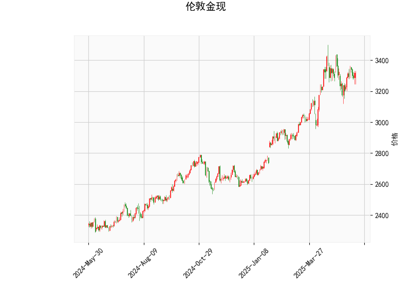

# 伦敦金现技术分析结果详解

## 1. 技术指标分析
基于提供的伦敦金现（XAU/USD）数据，我们对关键技术指标进行逐一分析，以评估当前市场的技术面状况。当前价格为3317.795，整体指标显示市场处于相对中性偏看跌的态势，但尚未出现极端信号。

- **RSI（相对强弱指数）: 54.23**  
  RSI值位于50以上但低于70的区间，这表明黄金价格目前处于中性偏强势状态。RSI没有进入超买（70以上）或超卖（30以下）区域，暗示短期内价格波动可能较为平稳，没有明显的反转信号。然而，如果RSI继续上升，可能预示进一步的上行潜力；反之，如果回落至50以下，则需警惕潜在的下行风险。

- **MACD（移动平均收敛散度）: MACD线23.56, 信号线26.39, 柱状图-2.83**  
  MACD线低于信号线，且柱状图为负值，这是一个典型的看跌信号。MACD指标显示短期移动平均线已从长期移动平均线下方交叉，暗示市场可能进入短期回调阶段。柱状图的负值强度（-2.83）不算强烈，表明下跌动能尚不充分，但投资者应注意进一步的负面交叉可能加剧下行压力。如果MACD线向上穿越信号线，则可能逆转为看涨信号。

- **Bollinger Bands（布林带）: 上轨3481.74, 中轨3196.88, 下轨2912.03**  
  当前价格3317.80位于中轨（3196.88）和上轨（3481.74）之间，这表明价格处于相对较高的位置，但尚未触及上轨，显示市场可能在波动中维持上行趋势。Bollinger Bands的收窄或扩张通常预示波动性变化：如果价格向中轨或下轨回落（2912.03），可能形成买入机会；反之，如果向上突破上轨，则可能触发进一步上涨。然而，当前位置的相对高位增加了回调风险，尤其是结合MACD的看跌信号。

- **K线形态: 无显著形态**  
  K线形态列表为空，意味着近期未出现明显的经典K线模式（如吞没形态、锤子线等）。这可能表示市场缺乏强烈的趋势信号，价格走势较为震荡。投资者应结合其他指标和更长周期的K线图来确认潜在模式。

总体而言，技术指标显示黄金市场当前处于中性偏看跌状态。RSI的中性水平提供了一些支撑，而MACD的看跌信号和Bollinger Bands的位置则提示短期下行风险。价格在Bollinger Bands中轨上方表明上行趋势未完全逆转，但需警惕外部因素（如经济数据或地缘事件）可能放大波动。

## 2. 近期投资或套利机会与策略判断
基于上述分析，我们评估近期可能的投资或套利机会。黄金作为避险资产，其价格受全球经济、地缘政治和利率影响。当前的技术面显示短期机会以防御性策略为主，重点关注回调风险。以下是针对近期市场的判断和建议策略：

### 可能的投资机会
- **短期看跌机会**: MACD的负向交叉和柱状图暗示潜在的下行趋势。如果价格回落至Bollinger Bands中轨（约3196.88）附近，这可能是一个卖出或做空的机会，尤其是在RSI未进入超卖区域的情况下。预计下行空间可能至下轨（2912.03），提供10-15%的潜在收益空间（基于当前价位计算）。
  
- **套利机会**: 黄金市场常与相关资产（如白银、股指或外汇）存在价差套利潜力。例如，如果黄金价格回调，而白银相对强势，则可考虑黄金-白银价差套利（买入白银、卖出黄金）。此外，跨市场套利（如伦敦金现与纽约金期货的价差）可能存在，但需监控实物黄金与纸黄金的溢价差异。目前，由于MACD信号，黄金的短期弱势可能创造与强势资产（如科技股或加密货币）的反向套利机会。

- **长期多头机会**: 如果全球风险事件升温（如地缘冲突或经济衰退），黄金作为避险资产可能反弹。RSI的中性水平暗示修正后仍有上行潜力，尤其是如果价格稳定在中轨以上。

### 推荐策略
- **短期策略: 防御性做空**  
  - **买入点**: 等待价格回落至Bollinger Bands中轨（3196.88）附近，同时MACD柱状图转为正值时考虑反转买入。  
  - **卖出点**: 当前价格附近（3317.80）可小仓位做空，目标下轨（2912.03），止损设在上轨（3481.74）上方以控制风险。  
  - **风险管理**: 使用1:2的风险回报比，确保每笔交易的风险不超过总仓位的1-2%。结合RSI，避免在超卖区域加仓。

- **套利策略: 价差交易**  
  - **黄金与其他资产的套利**: 监控黄金与白银的比价（当前黄金强势但MACD弱势时），买入相对低估资产（例如白银）。若黄金价格回调而大宗商品指数上涨，则可进行跨品种套利。  
  - **执行建议**: 使用杠杆产品（如差价合约CFD）进行短期套利，持有期控制在1-5天。实时追踪经济数据（如美国CPI或美联储会议），以捕捉价差扩大机会。

- **整体风险提示**: 黄金市场受基本面驱动强烈，技术分析仅为参考。近期可能受美国利率决策或全球通胀数据影响而波动。建议结合基本面分析（如COT报告），并采用多元化组合（如黄金与债券搭配）以降低风险。投资者应根据个人风险承受能力调整策略，并咨询专业顾问。

此分析基于当前数据，市场情况可能快速变化。定期复盘指标以调整策略。