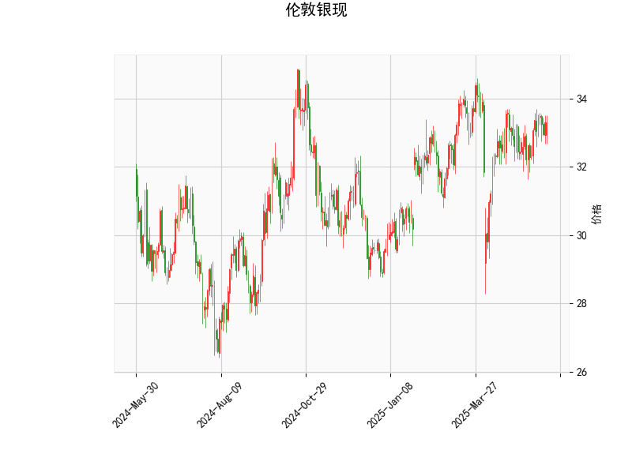

### 1. 伦敦银现的技术分析结果分析

以下是对提供的伦敦银现（现货银价格）技术分析结果的详细解读。当前价格为33.302美元/盎司，我们将从关键指标入手，评估价格趋势、市场波动性和潜在信号。

- **当前价格（33.302）**: 当前价格位于布林带的中轨（32.912）和上轨（34.712）之间，表明银价处于相对稳定的区间。价格未触及上轨，显示短期内没有强烈的上行突破压力，但也未跌破中轨，暗示市场可能维持震荡或轻微上扬。

- **RSI（相对强弱指数，54.54）**: RSI值处于中性区域（50附近），表示市场没有明显的超买（RSI > 70）或超卖（RSI < 30）信号。这反映了银价的近期波动较为平衡，买方和卖方力量大致相当。如果RSI继续上升，可能预示短期上行风险；反之，若回落至40以下，则需警惕下行趋势。

- **MACD指标**:
  - **MACD线（0.165）**: 该值高于信号线（0.119），且MACD直方图（0.046）为正，这是一个看涨信号。MACD线与信号线的正乖离表明短期动量向上，可能有潜在的上行趋势。
  - **信号线（0.119）和直方图（0.046）**: 直方图的正值显示多头力量占优，但幅度较小（小于0.1），意味着上行势头尚不强劲。如果MACD线继续远离信号线，可能会确认牛市信号；反之，若出现交叉向下，则可能转为看跌。

- **布林带（Bollinger Bands）**:
  - **上轨（34.712）**: 当前价格距离上轨较近，但未突破，表明市场波动性适中。如果价格向上突破上轨，可能触发进一步上涨；反之，回落至中轨以下可能表示回调。
  - **中轨（32.912）**: 作为20期简单移动平均线的代表，价格在其上方运行，显示短期趋势偏向中性或轻微乐观。
  - **下轨（31.113）**: 价格远高于下轨，减少了短期下行风险，但如果市场情绪转向负面，价格可能测试此水平。

- **K线形态（空）**: K线形态数组为空，意味着近期未观察到明显的蜡烛图模式（如吞没看涨或锤头）。这可能表示价格走势较为随机或缺乏强烈方向性，投资者需结合其他指标进行判断。

总体而言，技术指标显示银价处于中性偏多状态。RSI和MACD的组合暗示轻微的上行潜力，但布林带的收窄（上轨与下轨间距较小）表明市场波动性较低，短期内可能维持区间震荡。如果外部因素（如地缘政治或经济数据）介入，价格易受影响。

### 2. 近期可能存在的投资或套利机会和策略分析

基于上述技术分析，我们评估近期银现货市场的投资或套利机会。当前指标显示市场较为稳定，但MACD的看涨信号提供了一些积极线索。以下是潜在机会和策略建议，需结合个人风险承受能力和市场动态进行调整。

#### 潜在投资机会
- **看涨机会**: MACD线高于信号线且RSI在中性水平，暗示短期内可能出现小幅上涨。如果银价突破布林带上轨（34.712），这将是一个买入信号，目标可设在35.50附近（基于历史波动）。预计机会窗口为1-2周内，尤其若伴随全球经济复苏或工业需求增加。
  
- **区间震荡机会**: 价格在中轨与上轨之间波动，提供逢低买入、逢高卖出的机会。例如，在33.00附近买入，目标卖出在34.50以下。这种策略适合波动率较低的环境，避免大额风险。

- **风险警示**: 若RSI升至60以上或MACD直方图转为负值，需警惕回调风险。目前无明显超卖信号，因此短期卖空机会较少。

#### 套利机会和策略
- **现货与期货套利**: 伦敦银现货市场可能与期货市场（如COMEX银期货）存在价差。如果现货价格（如33.302）与期货价格偏离（例如，期货溢价过高），投资者可考虑现货买入+期货卖出套利策略。近期，若美联储加息预期推高期货价格，现货相对低估时，这种机会可能出现。预计潜在收益为0.5-1.0美元/盎司，但需监控价差收敛。

- **跨市套利**: 若银价与其他贵金属（如金）相关性增强（当前银价相对稳定），可探索银-金价差套利。例如，如果金价上涨而银价滞后，买入银现货并卖出金期货。但基于当前数据，银市场波动较小，此类机会需等待更明显的价差扩大。

- **推荐策略**:
  - **买入持有策略**: 在当前价位附近（33.00-33.50）小仓位买入，设置止损在布林带中轨下方（32.50），目标盈利在34.50以上。结合MACD金叉确认信号，提升胜率。
  - **波段交易策略**: 利用RSI和布林带进行高抛低吸。例如，当RSI回落至50以下时买入，RSI升至55以上时卖出。适用于短期投资者。
  - **风险管理**: 始终设置止盈止损（如盈利5%止盈，亏损2%止损），并关注宏观因素（如美元指数或通胀数据），以避免突发事件影响。

总体判断，近期投资机会以多头为主，但套利空间有限（需更多数据支持）。建议投资者在执行策略前监控实时数据，并结合基本面分析，以降低风险。行情变化迅速，以上分析基于当前指标，仅供参考。