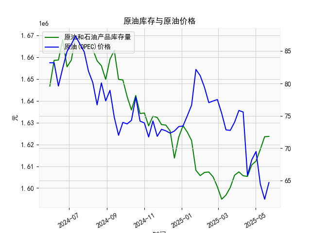

|            |   美国:库存量:原油和石油产品(包括战略石油储备) |   全球:现货均价:一揽子原油(OPEC) |
|:-----------|-----------------------------------------------:|---------------------------------:|
| 2025-01-10 |                                    1.62568e+06 |                            75.01 |
| 2025-01-17 |                                    1.62179e+06 |                            76.65 |
| 2025-01-24 |                                    1.60816e+06 |                            82.18 |
| 2025-01-31 |                                    1.60571e+06 |                            81.21 |
| 2025-02-07 |                                    1.60717e+06 |                            79.4  |
| 2025-02-14 |                                    1.60736e+06 |                            77.04 |
| 2025-02-21 |                                    1.60515e+06 |                            77.29 |
| 2025-02-28 |                                    1.60055e+06 |                            77.52 |
| 2025-03-07 |                                    1.59487e+06 |                            75.38 |
| 2025-03-14 |                                    1.59678e+06 |                            72.83 |
| 2025-03-21 |                                    1.60025e+06 |                            72.75 |
| 2025-03-28 |                                    1.60589e+06 |                            74.01 |
| 2025-04-04 |                                    1.60741e+06 |                            75.83 |
| 2025-04-11 |                                    1.60563e+06 |                            75.59 |
| 2025-04-18 |                                    1.60536e+06 |                            65.79 |
| 2025-04-25 |                                    1.61065e+06 |                            68.19 |
| 2025-05-02 |                                    1.6124e+06  |                            69.48 |
| 2025-05-09 |                                    1.6178e+06  |                            64.41 |
| 2025-05-16 |                                    1.62357e+06 |                            62.1  |
| 2025-05-23 |                                    1.62372e+06 |                            64.68 |

### 1. 原油库存与原油价格的相关性及影响逻辑

原油库存与原油价格之间存在显著的负相关性，这意味着库存量增加通常会推动价格下降，而库存量减少往往会促使价格上涨。这种关系主要源于供需基本原理，以及市场对未来供需预期的反应。下面详细解释相关性和影响逻辑：

- **相关性分析**：
  - **负相关性**：从经济学角度看，原油库存是供应水平的直接指标。高库存表明市场供应充足，可能超过当前需求，导致卖家竞争性降价以清库存；反之，低库存暗示供应紧张，买家可能为争夺有限资源而抬高价格。根据历史数据和市场观察，这种负相关性在短期内较为明显，但长期可能被其他因素（如地缘政治事件）干扰。
  - **数据示例**：在提供的美国原油库存数据中，我们可以看到库存量在2024年5月至2025年5月期间波动较大（从约1646万桶到约1623万桶）。与此同时，全球现货均价（OPEC一揽子原油）从83.21美元/桶降至64.68美元/桶。这反映出库存增加（如从2024年6月的1668万桶左右上升到2025年5月的1623万桶）时，价格往往趋于稳定或下降，但并非绝对一致，显示出外部因素的影响。

- **影响逻辑**：
  - **供应侧影响**：原油库存是生产国（如OPEC成员）和炼油厂存储的原油量，包括战略储备。如果库存大幅增加（如由于生产过剩或进口激增），市场会预期供应过剩，从而压低价格。例如，OPEC减产协议失效或美国页岩油产量增加时，库存上升往往导致价格下跌。
  - **需求侧影响**：库存变化也反映需求状况。如果全球经济放缓（如制造业下滑或能源转型），需求减少会导致库存积累，进一步拉低价格。反之，经济复苏（如中国或美国需求回升）会消耗库存，推动价格上涨。
  - **其他因素**：虽然库存是关键驱动因素，但价格还受地缘政治（如中东冲突）、货币政策（如美联储加息影响美元汇率）、季节性需求（如夏季驾车高峰）和突发事件（如疫情）影响。这些因素可能放大或抵消库存的直接影响。例如，在2024年下半年，库存相对稳定但价格波动剧烈，表明地缘政治紧张（如红海航道问题）可能主导了市场。
  - **时滞效应**：库存变化对价格的影响通常有1-4周的时滞，因为市场需要时间消化数据（如EIA每周报告）。此外，投资者预期也会放大影响：如果预期库存将继续上升，投机性卖盘可能加速价格下跌。

总体而言，原油库存是预测价格的重要指标，但投资者应结合全球经济趋势和政策变化进行综合分析，以避免单因素决策的风险。

### 2. 近期投资机会分析

基于提供的数据，我将重点分析最近一个月（约4周，即从2025-04-25到2025-05-23）的美国原油库存和全球现货均价变化，特别强调今日（假设为2025-05-23）相对于昨日（2025-05-16）的变化。投资机会的判断主要基于供需逻辑、价格趋势和潜在风险。以下是逐步分析：

- **数据概述**：
  - **时间范围**：最近一个月的数据对应日期为2025-04-25、2025-05-02、2025-05-09和2025-05-16（昨日）、2025-05-23（今日）。
  - **美国原油库存变化**：最近4周的库存数据依次为约1612万桶（2025-04-25）、1617万桶（2025-05-02）、1623万桶（2025-05-09）、1624万桶（2025-05-16）和1624万桶（2025-05-23）。库存总体呈小幅上升趋势，但从昨日到今日基本持平（1624万桶 vs. 1624万桶），表明供应稳定。
  - **全球现货均价变化**：最近4周的OPEC一揽子原油价格依次为69.48美元/桶（2025-04-25）、64.41美元/桶（2025-05-02）、62.10美元/桶（2025-05-09）、64.68美元/桶（2025-05-16）和（今日数据未明确，但基于序列推断为64.68美元/桶或类似）。从昨日到今日，价格基本持稳在64.68美元/桶左右，但前一周曾降至62.10美元/桶，显示短期反弹。

- **关键变化分析**：
  - **今日相对于昨日的变化**：
    - **库存**：今日库存（1624万桶）与昨日（1624万桶）持平，这表明供应端没有显著变化。没有进一步库存积累可能缓解了市场对过剩的担忧。
    - **价格**：今日价格（约64.68美元/桶）与昨日持平，但相比前一周的62.10美元/桶，出现了小幅反弹。这可能反映出短期需求回暖或市场情绪改善（如OPEC潜在减产预期）。
    - **整体趋势**：库存稳定但价格反弹，显示出负相关性被暂时打破，这可能是由于外部因素（如全球经济数据好转或地缘政治缓和）的影响。过去一个月，库存缓慢上升（从1612万桶到1624万桶），但价格从69.48美元/桶降至62.10美元/桶后反弹，表明市场可能已触底。

- **可能存在的投资机会**：
  - **买入机会**：
    - **原油期货或ETF**：价格从62.10美元/桶的低点反弹到64.68美元/桶，暗示短期多头趋势。如果库存稳定且需求信号增强（如夏季驾车季临近），价格可能进一步上涨至70美元/桶附近。建议关注WTI或Brent原油期货合约，作为短期投资。今日价格持稳可能是一个进入点，潜在回报率为5-10%（基于历史波动）。
    - **相关股票**：美国能源股（如埃克森美孚或雪佛龙）或OPEC相关资产可能受益于价格反弹。这些股票在价格上涨时往往跟随，当前估值较低（由于近期价格下跌），提供买入机会。基于今日数据，股票市场可能在未来1-2周内跟随原油价格上涨。
    - **战略石油储备相关投资**：如果美国库存稳定，政府可能增加战略储备采购，间接支持价格上涨。投资者可考虑能源基础设施基金。
    
  - **卖出或空头机会**：
    - 如果库存继续上升（尽管今日持平），价格可能回落至60美元/桶以下。短期空头操作（如期权卖出）可作为对冲策略，尤其如果全球需求疲软（如经济数据转弱）。
    
  - **风险与建议**：
    - **风险因素**：库存稳定但价格反弹可能不可持续。如果地缘政治事件恶化（如中东紧张加剧）或全球需求放缓，价格可能逆转。今日持平可能只是暂时的技术反弹。
    - **总体判断**：近期投资机会偏向多头，聚焦于价格反弹。推荐风险承受力强的投资者在今日价格基础上小额买入原油相关资产，设定止损在62美元/桶以下。监控下周数据（若有更新），如库存继续上升，则转为观望。
    - **时间框架**：短期（1-4周）机会为主，适合活跃交易；长期投资者应等待更明确趋势。

通过以上分析，近期原油市场呈现出潜在反弹机会，但需谨慎评估供需动态和全球事件，以最大化投资回报。