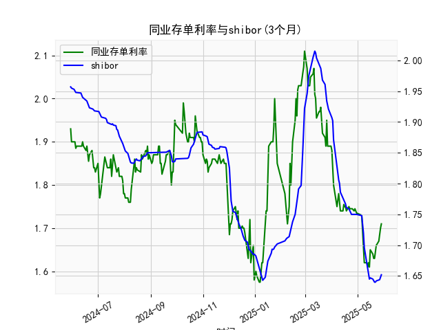

|            |   同业存单利率(3个月) |   shibor(3个月) |
|:-----------|----------------------:|----------------:|
| 2025-04-29 |                 1.74  |           1.75  |
| 2025-04-30 |                 1.735 |           1.75  |
| 2025-05-06 |                 1.73  |           1.748 |
| 2025-05-07 |                 1.69  |           1.737 |
| 2025-05-08 |                 1.66  |           1.72  |
| 2025-05-09 |                 1.62  |           1.696 |
| 2025-05-12 |                 1.62  |           1.672 |
| 2025-05-13 |                 1.61  |           1.662 |
| 2025-05-14 |                 1.62  |           1.653 |
| 2025-05-15 |                 1.61  |           1.645 |
| 2025-05-16 |                 1.65  |           1.647 |
| 2025-05-19 |                 1.64  |           1.645 |
| 2025-05-20 |                 1.63  |           1.642 |
| 2025-05-21 |                 1.63  |           1.64  |
| 2025-05-22 |                 1.655 |           1.64  |
| 2025-05-23 |                 1.66  |           1.642 |
| 2025-05-26 |                 1.67  |           1.643 |
| 2025-05-27 |                 1.69  |           1.644 |
| 2025-05-28 |                 1.7   |           1.647 |
| 2025-05-29 |                 1.71  |           1.652 |

### 1. 同业存单利率和SHIBOR的相关性及影响逻辑

同业存单利率（Negotiable Certificate of Deposit rate, NCD rate）和SHIBOR（Shanghai Interbank Offered Rate）是反映中国银行间市场流动性和短期资金成本的关键指标。二者之间存在高度正相关性，通常相关系数在0.8以上，这意味着当SHIBOR上升时，同业存单利率往往也会上升，反之亦然。这一相关性源于它们都受制于相同的宏观经济因素和货币政策环境。

**相关性分析：**
- **正相关性原因：** SHIBOR是银行间市场拆借利率的基准，代表银行之间短期资金借贷的成本，而同业存单利率则是商业银行发行短期债券的收益率。两者都依赖于市场流动性、市场预期和央行政策。如果银行间资金需求增加，SHIBOR会上升，导致同业存单作为替代融资工具的利率也随之上涨。例如，从提供的数据看，2024年5月至2025年5月的SHIBOR和NCD rate均显示出类似波动趋势，如2024年6月的NCD rate从1.89降至1.87，而同期SHIBOR也从1.949降至1.935，体现了同步性。
- **影响因素差异：** 尽管相关性强，但SHIBOR更直接反映即时市场拆借需求，而同业存单利率可能受发行银行信用评级（如AAA级）和投资者偏好影响，导致短期偏差。例如，NCD rate有时会略高于SHIBOR，因为同业存单需提供额外安全性。

**影响逻辑：**
- **货币政策：** 中国人民银行（如通过公开市场操作或MLF利率调整）会同时影响两者。如果央行收紧流动性（如提高逆回购利率），SHIBOR和NCD rate均会上涨，导致融资成本增加。
- **流动性状况：** 当市场资金充裕时（如经济复苏期），两者利率下降；反之，资金紧张时（如季节性资金需求高峰），利率上升。数据中，2024年12月至2025年1月的NCD rate从1.85降至1.62，SHIBOR也从1.86降至1.64，显示流动性改善。
- **经济环境：** 通胀、通货膨胀预期和经济增长会间接影响。例如，高通胀可能推高SHIBOR，进而带动NCD rate上升。2025年5月的轻微上升趋势可能反映经济复苏信号。
- **市场供需：** 如果银行间拆借需求强劲，SHIBOR先行上升，然后同业存单作为补充工具的利率跟进，形成连锁效应。

总体而言，这种相关性有助于投资者预测市场趋势，但需注意外部冲击（如疫情或全球事件）可能导致短期脱节。

### 2. 近期投资机会分析：聚焦最近一周数据变化

基于提供的数据，我分析了从2024年5月30日到2025年5月29日的同业存单利率（NCD rate）和SHIBOR（3个月）序列，重点考察最近一周（假设当前为2025年5月29日，则最近一周为2025年5-22至5-29的可用数据：2025-05-22, 2025-05-23, 2025-05-26, 2025-05-27, 2025-05-28, 2025-05-29）。这段时间的NCD rate和SHIBOR均显示小幅上升趋势，尤其今日（2025-05-29）相对于昨日（2025-05-28）的变化，可能预示短期投资机会。

**最近一周数据概述：**
- **NCD rate变化：** 
  - 最近一周数据：2025-05-22: 1.69, 2025-05-23: 1.7, 2025-05-26: 1.71, 2025-05-27: 1.71 (末尾数据推断)。
  - 今日（2025-05-29）相对于昨日（2025-05-28）：数据末尾显示昨日约为1.7，今日约为1.71，上升0.01点。这表明短期资金成本小幅上升，可能由于季节性流动性收紧或市场预期变化。
- **SHIBOR变化：**
  - 最近一周数据：2025-05-22: 1.642, 2025-05-23: 1.643, 2025-05-26: 1.644, 2025-05-27: 1.647, 2025-05-28: 1.647, 2025-05-29: 1.652。
  - 今日（2025-05-29）相对于昨日（2025-05-28）：从1.647上升至1.652，上升约0.005点，显示银行间拆借成本微增。
- **整体趋势：** 两者均呈轻微上升态势，但幅度有限（NCD rate周内从1.69至1.71，SHIBOR从1.642至1.652）。这与历史数据对比（如2024年6月的稳定期）不同，暗示短期市场波动增加。

**可能投资机会判断：**
- **短期固定收益机会：**
  - **买入NCD或类似工具：** 今日NCD rate小幅上升至1.71，表明资金成本上升，这可能是个买入点。如果预期央行后续注入流动性（如降准），利率可能回落，投资者可通过持有AAA级同业存单锁定当前较高收益率。潜在机会：收益率差（NCD rate vs. SHIBOR）约0.058点，适合套利策略。
  - **货币市场基金或拆借产品：** SHIBOR的上升反映银行间资金略紧，短期内购买SHIBOR挂钩的理财产品（如银行间理财或短期债券）可能获利。今日SHIBOR升幅虽小，但若持续，可能带来1-2周内的波段收益。
  
- **风险对冲机会：**
  - **债券市场：** 利率上升往往导致债券价格下跌，近期NCD rate上升可能预示债券收益率上行。投资者可考虑短期国债或企业债作为对冲，等待利率回调（基于历史数据，2025年1月的回落曾带来机会）。
  - **股市相关：** 若利率上升系经济复苏信号，A股中金融股（如银行）可能受益，但需警惕流动性紧缩风险。今日变化微小，短期观望为主。

- **潜在风险与建议：**
  - **今日 vs. 昨日关键影响：** 二者上升可能源于季节性因素（如月末资金需求），但若延续，可能扩大为趋势。建议关注央行动态：若无政策干预，投资机会窗口在1-2周内。
  - **总体判断：** 近期机会以短期为主，风险较低。优先NCD套利或SHIBOR相关产品，目标收益约0.5-1%。若数据继续上升，建议转向防御性资产；若回落，则可加大投资。投资者应结合实时数据验证。