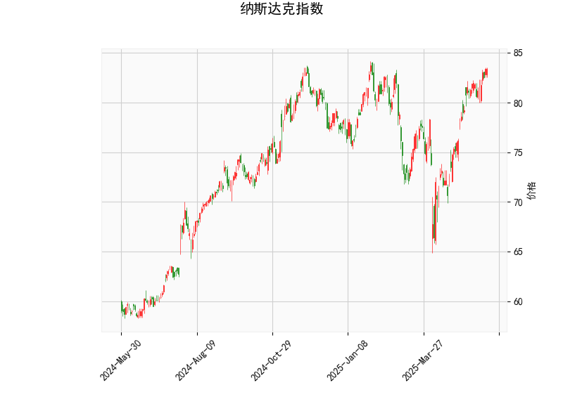

# 纳斯达克指数技术分析结果解读

## 1. 对技术分析结果的详细分析
基于提供的纳斯达克指数数据，我们可以从多个技术指标入手，对当前市场状况进行评估。以下是对关键指标的逐一分析，这些指标反映了价格动量、趋势强度和潜在波动性。

- **当前价格（Current Price）**: 83.38  
  当前价格位于相对较高的水平，接近近期历史高点。这表明指数可能处于强势上涨阶段，但也需要警惕潜在回调风险，因为价格已接近短期阻力位。

- **RSI（Relative Strength Index）: 68.45**  
  RSI值高于70的阈值通常被视为超买信号，而当前68.45已接近这一水平，表明短期内买盘力量强劲，但也可能暗示市场过热。如果RSI继续上升，可能增加回调压力；反之，如果回落至50以下，则可能预示修正或新趋势。

- **MACD（Moving Average Convergence Divergence）指标**:  
  - MACD线: 1.91  
  - MACD信号线: 1.84  
  - MACD直方图: 0.07  
  MACD线高于信号线，且直方图值为正，这是一个看涨信号，显示短期动量向上。MACD的正差值（hist）表明多头力量占优，但如果直方图开始收窄或转为负，可能标志着动量减弱或趋势逆转。

- **布林带（Bollinger Bands）**:  
  - 上轨（Upper Band）: 84.80  
  - 中轨（Middle Band）: 76.45  
  - 下轨（Lower Band）: 68.10  
  当前价格83.38已接近上轨，这往往表示价格处于波动区间的上沿，市场可能面临挤压或回调风险。布林带的宽度显示出一定的波动性，如果价格突破上轨，可能进一步上涨；反之，跌回中轨以下则可能触发卖出压力。

- **K线形态**:  
  该字段为空（[]），表示当前未观察到明显的K线模式（如吞没形态或锤头线）。这可能意味着市场缺乏强烈的短期信号，投资者应依赖其他指标进行判断。

总体而言，纳斯达克指数显示出强势上涨的迹象（MACD看涨），但RSI和布林带的上轨位置警告潜在超买风险。这暗示短期内市场可能继续走高，但回调的可能性也在增加。投资者需密切关注这些指标的动态变化，以评估趋势的可持续性。

## 2. 近期可能存在的投资或套利机会及策略分析
基于上述技术分析，纳斯达克指数当前处于一个相对乐观但需谨慎的阶段。以下是对潜在投资机会和策略的判断，这些建议结合了指标信号，并考虑了市场整体环境（如全球经济数据、科技股表现）。请注意，市场充满不确定性，实际操作应结合个人风险偏好和更多数据。

### 潜在投资机会
- **看涨机会**:  
  MACD的正向信号和价格接近上轨表明，指数可能在短期内继续上行，尤其是如果科技股（如FAANG公司）发布积极财报或美联储政策支持。潜在机会包括指数ETF（如QQQ）或相关个股的买入。  
  - **风险**: RSI超买可能导致修正，如果外部事件（如地缘政治风险）触发卖盘。

- **套利机会**:  
  由于纳斯达克指数常涉及衍生品（如期权、期货），当前的技术指标为跨市场套利提供了基础。例如：  
  - **期权套利**: 如果预期短期回调，可以考虑买入看跌期权（Put Option）或构建牛市价差策略（Bull Spread），利用RSI超买信号获利。  
  - **期货套利**: 通过纳斯达克期货与现货指数的价差进行套利，例如如果现货价格接近布林上轨，而期货显示滞后，则可买入期货并卖出现货以锁定差价。  
  - **统计套利**: 结合RSI和MACD，识别与纳斯达克相关的资产（如科技ETF和个股）之间的相关性偏差，进行多空配对交易。

### 推荐策略
- **多头策略（适合乐观者）**:  
  - **买入并设置止损**: 在当前价格附近买入指数ETF或相关资产，并设置止损位（如跌破布林中轨76.45）。如果MACD直方图保持正值，可加仓。  
  - **目标价位**: 短期目标可设在布林上轨以上（如85.00以上），但需监控RSI是否超过70以避免过度暴露。

- **中性或防御策略（适合谨慎者）**:  
  - **观望或轻仓操作**: 鉴于RSI接近超买，建议短期内保持观望，或仅轻仓参与。等待RSI回落至60以下再入场，以降低风险。  
  - **套利组合**: 构建无风险或低风险套利，如买入纳斯达克看涨期权的同时卖出看跌期权（铁蝶式策略），利用波动率差异获利。预计波动率可能增加，因为价格接近布林带边缘。

- **风险管理建议**:  
  - **止盈止损**: 始终设置止损（如83.00以下退出多头头寸），并根据MACD交叉信号调整仓位。  
  - **结合基本面**: 技术分析应与基本面（如企业财报、利率决策）结合。例如，如果美联储加息，RSI超买可能加速回调。  
  - **时间框架**: 短期（1-5天）策略可聚焦MACD变化；中期（1-3个月）则关注布林带突破。

总之，近期纳斯达克指数的投资机会主要围绕其看涨动量，但超买风险不可忽视。建议投资者采用多元化策略，避免单一指标决策，并实时跟踪市场动态以优化回报。最终，投资决策应基于专业咨询和个人情况。