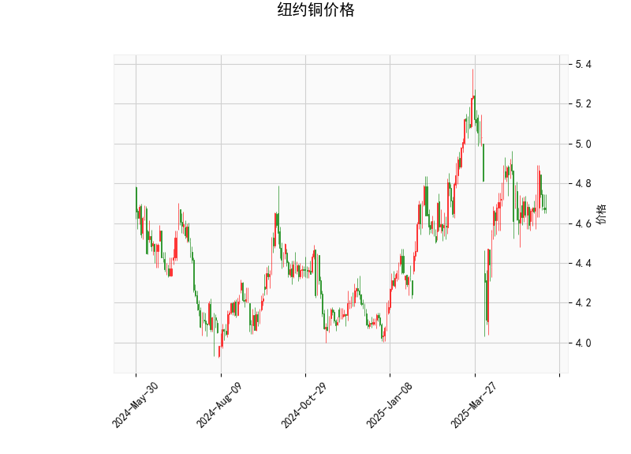

### 纽约铜价格的技术分析结果解读

#### 1. 技术指标分析
以下是对提供的纽约铜价格技术分析结果的详细解读，基于当前价位和各指标的表现。纽约铜当前价格为4.671，整体市场显示出中性偏弱的态势，但存在潜在的反转信号。

- **RSI (相对强弱指数)**: 当前RSI值为47.42，这表明市场处于中性区域（RSI通常在30以下为超卖，70以上为超买）。RSI低于50暗示短期内卖方力量稍占上风，但尚未进入超卖状态。这可能反映出投资者对铜价的观望情绪，没有明显的过度买卖。

- **MACD (移动平均收敛散度)**: MACD线为-0.005，信号线为-0.007，直方图为0.002。MACD线略高于信号线（尽管两者均为负值），这暗示动量可能正在从弱势转向轻微看涨。然而，直方图的正值（0.002）表示短期内买方力量开始显现，这可能是多头信号的早期迹象。如果MACD线继续向上穿越信号线，将加强看涨预期；反之，如果回落，可能加剧下行风险。

- **Bollinger Bands (布林带)**: 上轨为5.233，中轨为4.786，下轨为4.339。当前价格4.671位于中轨（4.786）和下轨（4.339）之间，接近中轨。这表明价格处于相对稳定的中性区间，没有明显突破上轨（可能表示强势）或下轨（可能表示超卖）。如果价格跌破下轨，可能触发进一步下行；反之，向上轨靠拢则可能预示反弹。

- **K线形态**: 提供的K线形态包括CDLDOJI、CDLHIGHWAVE、CDLLONGLEGGEDDOJI、CDLMATCHINGLOW和CDLSPINNINGTOP。这些形态整体显示出市场的高度不确定性和波动性：
  - CDLDOJI和CDLLONGLEGGEDDOJI：这些十字星形态通常表示买卖力量均衡，可能预示反转或盘整期。
  - CDLHIGHWAVE：高波浪形态反映了市场波动性增强，投资者需警惕短期剧烈波动。
  - CDLMATCHINGLOW：匹配低点可能表示潜在支撑位，暗示价格可能企稳。
  - CDLSPINNINGTOP：旋转顶部形态显示多空犹豫，常见于趋势转折点。

总体而言，这些指标显示纽约铜价格短期内处于盘整阶段。RSI和Bollinger Bands提示中性偏弱，而MACD的轻微正直方图和K线形态的犹豫信号，共同暗示可能的反转机会。但市场不确定性较高，需要进一步确认趋势。

#### 2. 近期可能存在的投资或套利机会和策略
基于上述分析，纽约铜市场短期内可能存在有限的投资机会，特别是如果多头信号加强。以下是针对近期（1-3个月）的判断和策略建议，重点关注风险管理和技术确认。

##### 可能的机会
- **投资机会**:
  - **看涨潜力**：MACD直方图转为正值，且K线形态显示潜在支撑（如CDLMATCHINGLOW），这可能预示价格反弹。如果价格向上突破Bollinger Bands中轨（4.786），目标可看向上轨（5.233）。当前RSI在中性水平，留有上行空间，适合短期多头操作。
  - **观望反转**：K线形态的犹豫信号（如CDLDOJI和CDLSPINNINGTOP）表明市场可能从弱势转向，投资者可关注价格企稳后的突破机会。例如，如果价格稳定在4.339（下轨）以上，短期反弹概率增加。
  - **套利机会**：铜作为工业金属，其价格与全球经济周期相关。短期内，可考虑跨市场套利，如纽约铜与上海铜价差（如果数据显示价差扩大）。此外，基于波动率套利：CDLHIGHWAVE形态暗示波动性增强，可通过期权策略（如买入波动率较低的看涨期权）捕捉价格波动。

- **潜在风险**:
  - 如果RSI跌破30或MACD回落，价格可能进一步下探至4.339以下，导致损失。
  - 全球经济因素（如需求疲软或地缘政治事件）可能放大不确定性。

##### 投资策略建议
- **短期策略（1-2周）**:
  - **多头入场**：若MACD线向上穿越信号线（例如直方图扩大），可考虑小额买入，目标价格4.8-5.2（Bollinger Bands上轨附近）。止损设置在4.339以下，以控制风险。
  - **观望策略**：在K线形态未确认反转前，采用中性仓位，避免大额交易。使用RSI作为辅助，等待其回升至50以上再行动。
  - **套利策略**：监控纽约铜与LME铜价差，如果价差异常扩大（例如超过历史平均值），可进行跨交易所套利（如买入低价市场、卖出高价市场）。结合波动率，利用CDLHIGHWAVE形态进行期权跨式策略（straddle），以捕捉剧烈波动。

- **中期策略（1-3个月）**:
  - **趋势跟踪**：如果Bollinger Bands收窄（价格接近中轨），等待突破信号再入场。结合RSI和MACD，构建多头组合，如加仓工业金属ETF或相关期货。
  - **风险控制**：采用仓位管理，每笔交易控制在总资金的5-10%。设置动态止损，例如基于Bollinger Bands下轨。 diversifying with correlated assets (e.g., aluminum or other metals) can hedge against copper-specific risks.
  - **套利扩展**：探索统计套利，如铜与原油或钢铁的关联。如果经济复苏信号增强，铜价可能随工业需求上涨，提供价差收敛机会。

总体策略原则：当前市场不确定性较高，建议以保守为主，优先使用技术指标确认信号（如MACD金叉）。投资者应结合基本面分析（如全球铜需求数据）以增强决策。任何操作需评估个人风险承受能力，并咨询专业顾问。