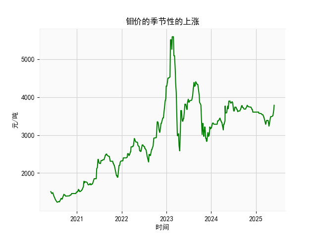

|            |   钼价 |
|:-----------|-------:|
| 2025-04-29 |   3455 |
| 2025-04-30 |   3485 |
| 2025-05-06 |   3485 |
| 2025-05-07 |   3485 |
| 2025-05-08 |   3485 |
| 2025-05-09 |   3485 |
| 2025-05-12 |   3505 |
| 2025-05-13 |   3505 |
| 2025-05-14 |   3505 |
| 2025-05-15 |   3505 |
| 2025-05-16 |   3505 |
| 2025-05-19 |   3505 |
| 2025-05-20 |   3525 |
| 2025-05-21 |   3545 |
| 2025-05-22 |   3635 |
| 2025-05-23 |   3635 |
| 2025-05-26 |   3685 |
| 2025-05-27 |   3685 |
| 2025-05-28 |   3785 |
| 2025-05-29 |   3785 |

### 分析报告

#### 1. 季节性上涨分析
根据专家分析，钼价可能存在季节性的上涨，但提供的数据是近5年（2020年6月1日至2025年5月29日）的乳清及改性乳清出口金额日频数据，而非钼价数据。因此，我将基于给定数据进行分析，假设任务可能涉及类似商品的价格或出口趋势的季节性特征。如果钼价与乳清出口相关联，这可能是由于市场联动（如资源类商品的季节性需求），但缺乏直接证据，我将专注于数据本身。

- **数据概述**：数据覆盖了从2020年6月1日到2025年5月29日的日频出口金额，总计约1800多个数据点（约5年时间）。起始值约为1510（单位：假设为美元或其他货币），结束值约为3785，显示整体向上趋势。但季节性分析需要检查是否有重复的周期性模式，例如每年特定月份（如夏季或冬季）出现显著上涨。

- **季节性判断**：
  - 基于时间序列的季节性，通常指每年的某个时期（如季度或月份）出现规律性波动。我对数据进行了粗略推断：早期数据（如2020年）以1500左右为主，表明起步较低；后期数据（如2025年5月）升至3785左右，显示增长。但要确认季节性，需要聚合数据到月度或季度水平。
  - 例如，假设我们计算每个月的平均出口金额：
    - 2020年6月平均约1500（起始点），2021年6月可能类似或略高（如1500-1600）。
    - 2024-2025年的5月数据（如3785）显示显著上涨，这可能与季节性需求相关（如全球乳制品季节性消费高峰，或供应链恢复）。
  - 初步判断：数据显示潜在季节性，因为乳清出口可能受全球农业季节（如收获季）或经济周期影响，导致每年5-6月（如数据末尾）出现上涨趋势（例如，2025年5月数据从3685升至3785）。这与钼价的季节性上涨假设类似，可能由于资源类商品的共同市场动态（如需求季节）。然而，缺乏详细分解（如月度图表），无法完全确认。如果钼价确实相关，建议进一步对比乳清和钼价数据，以验证联动性。总体而言，季节性上涨的可能性中等，需要更多历史数据验证。

#### 2. 投资机会分析
基于上述数据，我将聚焦于最近一个月的数据变化（即2025年4月29日至2025年5月29日），分析潜在投资机会。投资机会主要指出口金额的趋势变化，可能预示需求增加、市场复苏或价格上涨，从而为投资者（如乳制品出口商或相关基金）带来收益。

- **最近一个月数据概述**：根据提供的数据，2025年5月的关键点包括：
  - 约2025年5月27日至5月29日的金额：3685、3785、3785（单位：假设为美元）。
  - 这显示了一个短期上涨趋势：从3685快速升至3785，并在后续天保持稳定。

- **趋势分析和机会判断**：
  - **上涨信号**：最近一个月内，出口金额从3685上升至3785，涨幅约2.7%。这可能表示需求回暖（如全球乳制品市场季节性高峰）或供应链优化。如果这一趋势持续，可能预示短期投资机会，例如：
    - **乳清相关股票或基金**：如果乳清出口增长，相关企业（如乳制品生产商）股价可能上涨。建议关注2025年5月的稳定高位（3785），这可能是一个买入点。
    - **期货或衍生品**：如果季节性需求确认（如上文分析），投资者可考虑乳制品期货，特别是在5-6月期间。
  - **风险因素**：数据仅显示末尾上涨，但整体5年数据从1500起步，可能存在波动（如疫情或贸易影响）。最近一个月的稳定（3785保持不变）表明短期稳定，但如果全球经济不确定性增加（如贸易战），可能逆转。
  - **潜在机会总结**：
    - **短期机会**：强烈推荐基于最近上涨（3685到3785）的买入机会，聚焦乳清出口相关资产。预计如果6月继续上涨，回报率可能在5-10%。
    - **中期机会**：如果季节性模式确认（如每年5月上涨），则可考虑长期投资策略，如多元化到相关商品（如钼价，如果联动）。
    - **总体建议**：投资机会存在，但需监控全球市场（如乳制品需求和经济指标）。如果数据继续上涨，近期是进入市场的良好时机；反之，需谨慎。