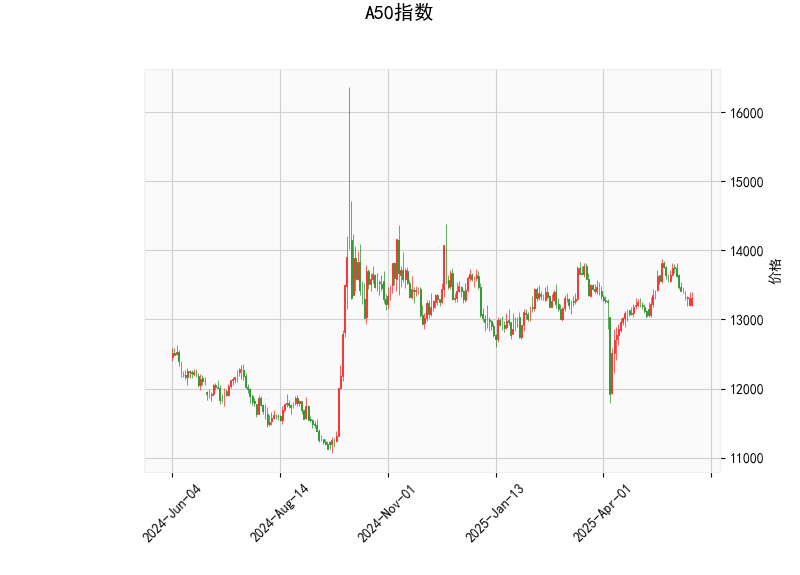

# A50指数的技术分析结果分析

## 1. 指标分析
以下是对A50指数当前技术分析结果的详细解读，基于提供的指标数据。我们将逐一分析每个关键指标，并结合整体市场信号进行评估。

### 关键指标概述
- **当前价格（Current Price）**: 13310.0  
  当前价格处于中性水平，与市场波动密切相关。它接近Bollinger Bands的中轨（13311.76），表明价格短期内可能维持在相对稳定的区间内，没有明显突破或崩盘迹象。这反映了市场可能处于观望状态，等待进一步催化剂。

- **RSI（Relative Strength Index）**: 45.57  
  RSI值处于中性区间（30-70），略低于50，暗示A50指数可能轻微超卖但未达极端水平。RSI低于50通常表示卖方力量占优，但45.57的数值距离超卖阈值（30）仍有距离。这可能意味着短期内存在反弹潜力，但缺乏强势买入信号。如果RSI继续下降，可能预示进一步回调。

- **MACD（Moving Average Convergence Divergence）**: MACD线为17.56，信号线为67.98，直方图（MACDHIST）为-50.41  
  MACD线低于信号线，且直方图为负值，这是一个典型的看跌信号。MACD直方图的负值（-50.41）表明短期卖压增强，价格可能面临下行风险。然而，MACD线的正值（17.56）显示多头力量尚未完全消退。这形成了一种背离，可能预示市场即将出现反转。如果MACD直方图继续恶化，卖出压力可能会加剧。

- **Bollinger Bands（布林带）**: 上轨13987.91，中轨13311.76，下轨12635.62  
  当前价格（13310.0）紧邻中轨，处于上轨和下轨之间，这反映了市场波动率较低的特征。价格在中轨附近徘徊通常表示市场不确定性增加：向上突破上轨可能触发强势反弹，向下突破下轨则可能导致进一步下跌。当前状态暗示短期内可能出现区间震荡，而不是趋势性运动。

- **K线形态**: ['CDLBELTHOLD', 'CDLGAPSIDESIDEWHITE']  
  - **CDLBELTHOLD（看涨腰带线）**: 这是一种看涨K线形态，通常出现在趋势反转点，表明多头力量开始主导。它的出现可能暗示短期内价格企稳或反弹，但需结合其他指标确认。  
  - **CDLGAPSIDESIDEWHITE（带有缺口的白色实体蜡烛）**: 这是一个看涨信号，常表示强势买入并伴随价格缺口，显示市场乐观情绪。但在当前MACD看跌的环境下，这种形态可能面临阻力，需警惕假突破。  
  总体上，K线形态显示潜在看涨信号，但与MACD的看跌背离形成矛盾，这可能反映市场分歧。

### 整体市场解读
综合上述指标，A50指数当前呈现混合信号：RSI和K线形态倾向于中性到看涨，而MACD和Bollinger Bands暗示看跌压力。价格在中轨附近徘徊表明市场可能处于巩固阶段，短期内缺乏明确方向。如果外部因素（如经济数据或全球事件）介入，价格容易出现波动。总体风险偏好为中性偏谨慎，投资者应关注指标背离（如RSI与MACD的分歧），这可能预示反转机会。

## 2. 近期可能存在的投资或套利机会和策略
基于以上分析，我们评估A50指数的潜在投资机会和策略。考虑到当前指标的矛盾性，建议采用风险控制为主的保守方法。以下是针对近期（短期内数日到数周）的判断和建议。

### 可能存在的机会
- **反弹机会**: K线形态的看涨信号（如CDLBELTHOLD）结合RSI的轻微超卖状态，可能提供短期反弹空间。如果价格向上突破Bollinger Bands上轨（13987.91），这将是一个潜在买入点，尤其在全球市场风险偏好回升时。  
- **回调风险**: MACD的看跌信号和负直方图表明下行压力存在，如果价格跌破中轨（13311.76）并向下轨（12635.62）逼近，可能出现修正机会。这适合空头策略或套利操作。  
- **套利潜力**: A50指数作为中国A股的重要基准，可能与相关期货、期权或全球指数（如恒生指数）存在价差。当前指标背离可用于跨市场套利，例如在A50现货看涨时，同时在相关衍生品市场做空以锁定价差。  
- **区间震荡机会**: 价格在中轨附近，市场可能维持震荡（12635.62-13987.91区间），这为波段交易或网格策略提供基础。

### 推荐策略
- **买入策略（多头）**:  
  - **条件**: 等待RSI回升至50以上或价格突破上轨（13987.91），并确认K线形态的看涨延续。  
  - **操作**: 在13310.0附近小仓位买入，设置止损在下轨（12635.62）下方。结合MACD反转信号，可在RSI>50时加仓。  
  - **潜在收益**: 如果市场反弹，目标价位可设在13800-14000区间。  

- **卖出策略（空头）**:  
  - **条件**: 如果MACD直方图继续恶化（更负值）或价格跌破中轨（13311.76），触发卖出。  
  - **操作**: 短期内做空A50相关期货或ETF，止盈设在上轨附近，止损在当前价上方。结合RSI低于40的超卖确认，可放大空头仓位。  
  - **潜在收益**: 回调至12500-12600区间可能带来10-15%的收益，但需警惕反弹风险。  

- **套利策略**:  
  - **跨品种套利**: 利用A50与恒生指数或A股ETF的价差。例如，如果A50显示看涨但全球市场疲软，可在A50多头的同时做空相关海外指数期货，锁定无风险收益。  
  - **期权策略**: 购买看涨期权（Call Option）作为保护性头寸，如果K线形态确认反弹；或购买看跌期权（Put Option）对冲MACD风险。目标价差在5-10%范围内。  
  - **网格交易**: 在Bollinger Bands区间内设置自动买卖网格，例如在13300附近买入，在13900卖出，实现区间内获利。  

### 风险提示与总体建议
- **风险因素**: 市场波动性可能受宏观事件（如中美贸易动态或国内政策）影响。指标背离增加了不确定性，建议控制仓位不超过30%。  
- **总体建议**: 短期内以观望为主，优先等待指标确认（如MACD与RSI趋同）。长期投资者可关注A50作为中国经济风向标，但需结合基本面分析。定期复盘指标变化，以动态调整策略。保持风险多样化，避免单一信号决策。