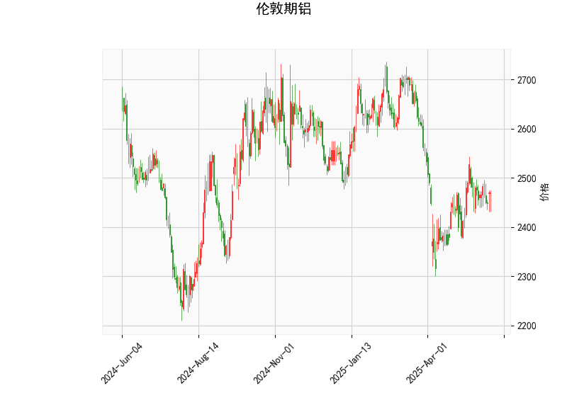

### 伦敦期铝技术分析结果详解

#### 1. 对技术分析结果的整体分析
伦敦期铝的当前价格为2470.5，基于提供的指标，我们可以从多个维度对其进行评估，以了解市场趋势、动量和波动性。

- **RSI（相对强弱指数）分析**：RSI值为51.74，处于中性区域（30-70之间）。这表明铝价目前neither超买也不超卖，市场动力较为平衡。没有明显的超买信号（如RSI>70），短期内可能继续保持稳定或轻微波动。如果RSI在未来几天上升至60以上，将暗示潜在的上行势头；反之，如果跌至40以下，可能预示回调。

- **MACD（移动平均收敛散度）分析**：MACD线（2.20）高于信号线（1.41），直方图（0.79）为正值。这是一个典型的看涨信号，表明短期内多头动力强于空头。MACD线的上升趋势（直方图持续正值）可能预示价格将向上突破。然而，MACD值相对较小，表明上涨动能并不强劲。如果MACD直方图继续扩大，价格可能测试上行阻力位；反之，如果MACD线回落至信号线以下，则可能出现修正。

- **布林带分析**：当前价格2470.5位于中轨（2478.71）附近，这显示价格处于一个相对稳定的波动区间。布林带的上下轨分别为上轨2673.58和下轨2283.83，表明市场波动性适中（带宽不算过宽）。价格接近中轨暗示潜在的均值回归机会：如果价格向上突破上轨，可能触发强势上涨；如果跌破下轨，则可能面临下行风险。目前的定位显示市场不处于极端状态，但如果波动性增加（如带宽扩大），将需要密切关注。

- **K线形态分析**：提供的K线形态包括Doji、Gapsidesidewhite、Highwave、Longlegged Doji和Spinning Top。这些形态多表示市场不确定性和潜在反转信号：
  - Doji和Longlegged Doji通常反映买卖力量均衡，可能预示短期反转或盘整。
  - Highwave和Spinning Top暗示价格波动剧烈，但方向不明，常见于市场犹豫期。
  - Gapsidesidewhite可能表示跳空缺口后的延续或反转，需结合后续K线验证。
  总体上，这些形态显示短期内市场缺乏清晰方向，投资者应警惕假突破。结合MACD的看涨信号，这可能是一个积累多头头寸的机会，但需等待确认。

综合而言，伦敦期铝的技术面显示中性偏看涨的格局。价格在中轨附近、RSI中性以及MACD的正向信号暗示短期内可能有温和的上行潜力，但K线形态的不确定性增加了风险。市场整体波动性不高，适合观望或轻仓操作。

#### 2. 近期可能存在的投资或套利机会和策略
基于上述分析，我们可以从投资和套利角度评估潜在机会。伦敦期铝作为大宗商品，其价格受全球经济、需求（如汽车和建筑业）和库存影响。以下是针对近期（1-3个月内）的判断和策略建议：

- **投资机会**：
  - **看涨机会**：MACD的正向交叉和价格在中轨附近暗示潜在上行空间。如果铝价突破上轨（2673.58），可能触发多头行情，目标可设在2600-2700区间。RSI未超买，提供了一些安全边际。**策略**：考虑在当前价位附近买入多头头寸，或等待RSI升至55以上再入场。止损设在下轨（2283.83）附近，以控制风险。适合中长期投资者，例如通过期货合约或ETF参与。
  - **回调机会**：如果K线形态（如Doji）导致短期盘整，价格可能回落至中轨下方（2400-2450）。这为逢低买入提供机会。**策略**：采用均值回归策略，在价格跌至2350附近时买入，目标反弹至中轨。结合RSI，如果跌至45以下，可视为入场信号。

- **套利机会**：
  - **跨品种套利**：铝价与其它金属（如铜或锌）相关性较高。如果伦敦期铝相对其它金属（如LME铜）出现价格偏离（例如，铝价低于历史均值），可考虑跨市场套利。当前铝价2470.5相对稳定，如果全球需求回升（如电动汽车行业），铝可能相对于铜出现溢价。**策略**：监控LME金属指数，如果铝价与铜价的价差扩大至历史均值以上，可做多铝空铜的配对交易。预计套利窗口在需求季节（如Q3季度）出现。
  - **现货 vs 期货套利**：如果现货铝价（未提供数据）与期货价出现明显价差（例如，现货折扣过大），可进行现金-期货套利。**策略**：在期货市场买入伦敦期铝，同时在现货市场卖出（或锁定库存），待价差收敛获利。当前技术面中性，适合在价格接近下轨时启动此策略，以捕捉短期无风险收益。
  - **波动率套利**：布林带的窄幅暗示低波动性期，但如果K线形态引发突破，波动率可能上升。**策略**：使用期权策略，如买入看涨期权（straddle）以捕捉潜在突破。预计如果经济数据（如PMI指数）提振需求，波动率将增加，提供套利空间。

**风险提示**：大宗商品市场受宏观因素影响较大，包括地缘政治（如贸易战）和经济数据（如中国工业产出）。建议结合基本面分析（如铝库存数据）验证技术信号，并控制仓位（不超过总资金的20%）。总体策略倾向于保守观望，等待MACD和K线形态的进一步确认。投资者可使用MT4/MT5平台实时监控，以优化进出场点。