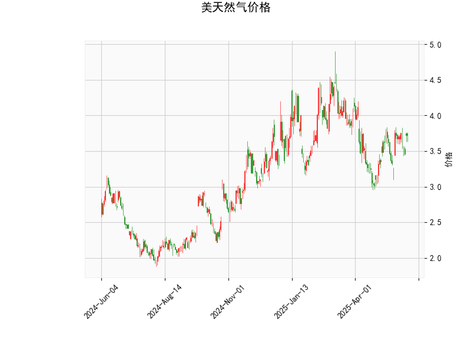

### 美天然气价格的技术分析结果分析

#### 1. 对技术分析结果的详细分析
基于提供的美天然气价格数据，我们可以从多个技术指标入手，评估当前市场的动向。当前价格为3.722美元，这是一个关键的参考点，位于布林带的中间区域，表明价格处于相对稳定的区间，没有出现极端波动。

- **RSI (相对强弱指数)**: 当前RSI值为55.10，这表明市场处于中性偏多头的状态。RSI通常以70作为超买阈值和30作为超卖阈值。55.10的水平显示短期内买盘力量略占上风，但尚未进入超买区域，暗示价格可能有进一步上涨的空间，而非立即回调的风险。

- **MACD (移动平均收敛散度)**: MACD线值为0.035，信号线值为0.019，柱状图（MACD Hist）为0.016。这是一个看涨信号，因为MACD线高于信号线，且柱状图为正值。这表示短期内多头动能正在增强，可能预示着价格的潜在上行趋势。然而，MACD值的整体幅度较小，表明这一信号并非非常强势，投资者需关注后续的柱状图变化以确认趋势。

- **布林带**: 上轨为4.262，中轨为3.624，下轨为2.987。当前价格3.722接近中轨，处于布林带的中间部分，这反映出价格波动较为温和，没有偏离均值过远。如果价格向上突破上轨（4.262），可能触发更强的上涨信号；反之，如果跌破下轨（2.987），则可能出现回调。但目前的位置显示市场保持平衡，适合观察潜在突破。

- **K线形态**: 检测到"CDLMATCHINGLOW"形态，这是一种经典的看涨K线模式，通常表示价格可能触底并反弹。该形态暗示短期内卖方力量减弱，买方可能开始主导，结合其他指标，这进一步支持了轻微的多头倾向。

总体而言，技术指标显示美天然气价格处于一个中性偏涨的阶段。RSI和MACD的信号较为积极，但布林带的稳定位置表明市场尚未形成强烈趋势。这可能反映出当前供需平衡，或外部因素（如季节性需求或地缘政治事件）的影响。

#### 2. 近期可能存在的投资或套利机会和策略判断
基于上述分析，美天然气市场的短期前景显示出潜在的投资机会，特别是多头策略，但风险需谨慎管理。以下是对可能机会和策略的评估：

- **投资机会**:
  - **短期上涨潜力**: MACD的看涨信号和CDLMATCHINGLOW形态暗示价格可能从当前水平反弹或向上测试布林带上轨（4.262）。如果外部因素（如冬季需求增加或原油价格上涨）推动市场，价格有可能在短期内攀升至3.8-4.0美元区间，这为多头投资者提供机会。
  - **风险点**: RSI未进入超买区域，但如果市场突然回调（如由于供应过剩），价格可能回落至中轨以下。当前价格高于下轨（2.987），表明下行风险相对有限，但需警惕全球能源动态。

- **套利机会**:
  - **跨市场套利**: 美天然气价格与原油或其他能源商品相关性较高。如果天然气价格相对原油出现低估（如当前相对稳定的水平），投资者可考虑天然气与原油的价差套利策略。例如，利用期货合约在天然气价格上涨时买入天然气，同时对冲原油风险。
  - **季节性套利**: 天然气市场有明显的季节性波动（如冬季需求高峰）。当前指标显示轻微看涨，可能适合在夏季低点布局冬季多头头寸。如果价格保持在中轨附近，投资者可通过期权套利（如买入看涨期权、卖出看跌期权）来捕捉潜在反弹，而不需全额投入。
  - **其他机会**: 如果MACD柱状图持续扩大，结合K线形态的确认，这可能创造日内交易或短期套利空间，如在价格突破上轨时进场。

- **推荐策略**:
  - **多头策略**: 建议在当前价格附近买入天然气期货或ETF（如UNG），目标设在4.0-4.3美元区间。止损位可放置在3.5美元附近，以控制风险。同时，监控RSI是否接近70，以避免超买回调。
  - **观望与确认策略**: 如果指标未进一步强化（如MACD柱状图缩小），采取观望态度。等待价格突破布林带上轨后入场，以减少假突破风险。
  - **风险管理与套利策略**: 对于套利爱好者，结合技术分析与基本面（如天气预报或库存数据），使用价差交易（如天然气与电力期货的组合）。风险控制方面，建议将仓位控制在总投资的10-20%以内，并设置动态止盈止损（如基于布林带波动）。
  - **总体建议**: 当前市场不宜激进操作，适合中短期投资者。结合宏观因素（如美联储政策或全球供需变化），实时调整策略，以最大化机会并最小化风险。

总之，近期美天然气市场存在轻微的投资机会，但需以数据驱动的谨慎态度应对。投资者应结合实时市场数据和个人风险承受能力制定计划。