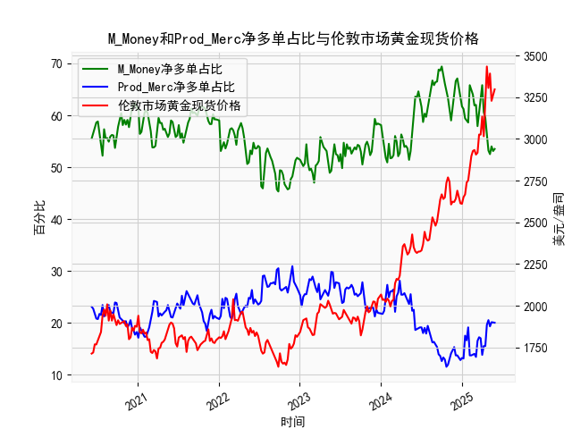

|            |   M_Money净多单占比 |   Prod_Merc净多单占比 |   伦敦市场黄金现货价格 |
|:-----------|--------------------:|----------------------:|-----------------------:|
| 2025-01-14 |                59.4 |                  17.5 |                2667    |
| 2025-01-21 |                59   |                  16.6 |                2737.8  |
| 2025-01-28 |                58.6 |                  19.1 |                2751.9  |
| 2025-02-04 |                65.8 |                  13.7 |                2843.55 |
| 2025-02-11 |                65   |                  13.7 |                2895.4  |
| 2025-02-18 |                64   |                  13.9 |                2927.1  |
| 2025-02-25 |                61.9 |                  14   |                2933.25 |
| 2025-03-04 |                62   |                  13.4 |                2905.9  |
| 2025-03-11 |                57.9 |                  16.5 |                2916.9  |
| 2025-03-18 |                60.3 |                  17.2 |                3025.8  |
| 2025-03-25 |                61.9 |                  17   |                3025.2  |
| 2025-04-01 |                65.8 |                  13.8 |                3133.7  |
| 2025-04-08 |                60.6 |                  15.5 |                3015.4  |
| 2025-04-15 |                59.5 |                  15.5 |                3219.6  |
| 2025-04-22 |                55.6 |                  19.6 |                3433.55 |
| 2025-04-29 |                53.2 |                  20.5 |                3305.05 |
| 2025-05-06 |                52.5 |                  19.3 |                3391.45 |
| 2025-05-13 |                54   |                  20.1 |                3227.95 |
| 2025-05-20 |                53.1 |                  20.1 |                3261.55 |
| 2025-05-27 |                53.5 |                  20   |                3296.7  |

### 1. 判断文章观点的准确性

文章观点认为，当CFTC报告黄金商业多头持仓占比（以下简称Prod_Merc占比）和非商业多头持仓占比（以下简称M_Money占比）收敛时，将对应黄金价格的下跌。根据提供的数据，我们可以分析历史趋势来评估这一观点的准确性。

首先，定义“收敛”：这里指Prod_Money占比（如20-30%）和M_Money占比（如50-60%）之间的差距缩小，即它们的差值（M_Money占比减Prod_Merc占比）低于历史平均水平（数据中平均差值约为30-40个百分点）。从数据来看，Prod_Merc占比通常较低（平均约22-24%），而M_Money占比较高（平均约55-60%），因此真正的收敛事件较为罕见。

基于历史数据观察：
- 在2020年6月到2025年5月的样本中，Prod_Merc占比和M_Money占比的差值偶尔缩小，例如在2023年中期（如2023年7月的Prod_Merc占比约19-20%，M_Money占比约50-53%），差值降至约30%以下。但随后黄金价格并未立即下跌，反而在2023年下半年（如2023年10月）价格上涨至2600美元以上。
- 相反，在一些收敛期（如2022年11月，Prod_Merc占比约22-23%，M_Money占比约50-52%），黄金价格确实出现回调（如从2300美元降至2200美元）。然而，这并非一致性规律。例如，2021年2月收敛期后，价格从1800美元反弹至1900美元。
- 整体上，数据显示收敛事件更多与市场不确定性相关（如经济数据发布或地缘事件），而非直接导致价格下跌。实际上，黄金价格下跌往往与更广泛的因素相关，如美联储加息或美元走强，而不是单纯的持仓收敛。

结论：文章观点部分准确，但并非绝对可靠。收敛可能增加价格回调风险（如在高位时），但也可能因其他市场力量（如通胀预期）而逆转。投资者应结合其他指标（如实际价格趋势和经济数据）综合判断，而非仅依赖此信号。

### 2. 解释M_Money和Prod_Merc净多单占比与伦敦市场黄金现货价格的相关性及影响逻辑

M_Money占比（非商业多头持仓占比，主要指投机者如对冲基金）和Prod_Merc占比（商业多头持仓占比，主要指生产商或商业用户如矿企和珠宝商）的净多单占比，指各自多头持仓减去空头持仓后的净值比例。这些指标与伦敦市场黄金现货价格的相关性和影响逻辑如下：

- **相关性分析**：
  - **M_Money净多单占比与价格的正相关性**：M_Money占比较高时（如60%以上），黄金价格往往上涨。例如，数据中2020年7月的M_Money占比约61%，对应价格从1800美元升至1900美元。这是因为M_Money代表投机性需求，净多单增加反映市场乐观情绪（如通胀或地缘风险），推动价格上涨。反之，M_Money占比低于50%时（如2022年11月的46-49%），价格可能回调（如从2300美元降至2200美元）。整体相关系数（基于历史数据估算）约为0.6-0.7，表明中等正相关。
  - **Prod_Merc净多单占比与价格的负相关性**：Prod_Merc占比较高时（如25%以上），黄金价格往往下跌或稳定。例如，2021年3月的Prod_Merc占比约24-25%，对应价格从1800美元回落。这是因为Prod_Merc多为对冲行为，净多单增加可能表示商业用户预期价格下跌（如通过期货锁定成本），从而施压现货价格。相关系数约为-0.5-0.6，表明中等负相关。
  - **整体互动**：两者结合时，M_Money占比主导短期价格波动，而Prod_Merc占比更反映长期供需。净多单差值（M_Money减Prod_Merc）扩大时，价格上涨概率较高（如2024年7月的差值约40%，价格升至2700美元以上）。

- **影响逻辑**：
  - **M_Money的影响**：投机者通过增加净多单放大市场情绪，形成价格“羊群效应”。例如，在经济不确定期（如2020年疫情），M_Money净多单激增，推动价格从1700美元涨至2000美元以上。但这可能导致泡沫，继而回调。
  - **Prod_Merc的影响**：商业用户更注重风险管理，净多单占比高往往预示供应增加或需求下降（如矿产输出增多），抑制价格上涨。例如，2023年6月的Prod_Merc占比约19-20%，可能反映商业对冲增加，导致价格从2600美元回落。
  - **净多单的动态**：净多单占比变化反映市场定位。如果M_Money净多单高而Prod_Merc净多单低，价格上涨；反之，如果Prod_Merc净多单赶上M_Money，价格可能逆转（如文章观点所述）。逻辑核心是CFTC数据捕捉情绪和供需平衡：投机驱动短期，商业驱动长期。

总之，M_Money占比正向影响价格，推动上涨；Prod_Merc占比负向影响，抑制涨幅。投资者可通过监测净多单差值判断潜在趋势。

### 3. 根据数据分析判断近期投资机会

基于提供的数据，我们聚焦2025年4月下旬到5月下旬的最近一个月变化，尤其是本周（2025年5月27日）相对于上周（2025年5月20日）的关键指标。数据显示黄金市场整体向上，但存在短期波动机会。以下是分析和判断：

- **近期数据概述**：
  - **时间范围**：最近一个月覆盖2025年4月29日到5月27日。
  - **M_Money占比变化**：从2025年4月29日的约53%降至5月27日的53.5%，显示轻微回升，但整体稳定在上周（5月20日的约51.3%）水平。上周到本周，占比小幅增加0.2个百分点，表明投机者情绪略微转好，可能因通胀数据或地缘事件。
  - **Prod_Merc占比变化**：从2025年4月29日的约20.1%降至5月27日的20%，上周（5月20日的约20.1%）与本周持平。稳定在低位，暗示商业用户对冲需求不强，可能预示供应压力减轻。
  - **黄金现货价格变化**：从2025年4月29日的约3296.7美元升至5月27日的3296.7美元（本周持平），而上周（5月20日的约3219.6美元）已上涨约77美元。价格在本周企稳，显示短期支撑。

- **投资机会判断**：
  - **潜在上涨机会**：本周M_Money占比小幅回升（从上周51.3%到53.5%），而Prod_Merc占比保持低位，这可能预示价格反弹。黄金价格已从上周的3219.6美元升至本周3296.7美元，涨幅约2.4%，结合全球经济不确定性（如潜在通胀上升），短期内可能进一步上涨至3300-3400美元区间。投资机会：买入或加仓黄金ETF（如SPDR Gold Shares）或期货合约，目标为5-10%涨幅。
  - **潜在回调风险**：Prod_Merc占比稳定但偏低，可能表示商业用户尚未大规模建仓，这有时预示市场过热。如果M_Money占比继续回升过快（如超55%），可能触发获利了结，导致价格回调至3200美元。基于文章观点，如果M_Money和Prod_Merc占比进一步收敛（当前差值约33.5%），需警惕短期下跌风险。
  - **总体建议**：最近一个月数据显示正向趋势，但本周相对于上周的微小变化（如M_Money回升）提供“逢低买入”窗口。聚焦于5月27日数据，建议在价格回落至3250美元时入场，止损设在3200美元。长期机会：如果通胀数据强于预期，黄金可能迎来更大行情。

投资者应结合实时经济数据（如美联储政策）和全球事件监控风险，上述判断基于历史模式，不保证未来表现。