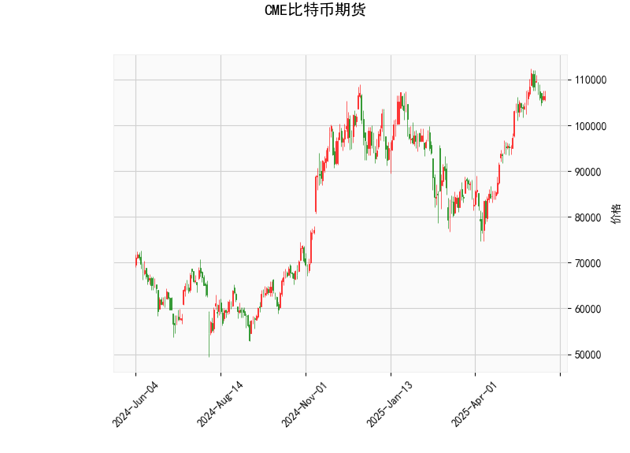

### 1. 对CME比特币期货的技术分析结果进行分析

#### 总体概述
CME比特币期货的当前价格为106,320.0美元，基于提供的指标显示，市场呈现出中性偏看跌的特征。RSI（相对强弱指数）表明市场有轻微过买风险，而MACD（移动平均收敛散度）显示出潜在的负面信号，暗示短期可能出现回调。Bollinger Bands（布林带）显示价格处于中轨以上，但未触及上轨，整体波动性适中。K线形态为空，意味着近期未形成明显的蜡烛图模式，如吞没或锤子线，这可能表示市场缺乏强烈的趋势信号。

#### 关键指标分析
- **当前价格（106,320.0美元）**：  
  当前价格位于Bollinger Bands的中轨（93,491.55美元）和上轨（113,915.73美元）之间，距离下轨（73,067.36美元）较远。这表明比特币价格处于相对稳定的区间，但未显示出强烈的上行势头。如果价格继续在中轨附近徘徊，可能会测试下轨支持位，潜在风险是下行压力。

- **RSI（60.35）**：  
  RSI值高于50，显示市场处于强势区域，但接近70的过买阈值（通常70以上视为过买）。当前RSI为60.35，表明短期内买方主导，但如果持续上升，可能引发获利了结和回调。结合其他指标，这暗示市场可能已积累一定涨幅，需要警惕逆转。

- **MACD指标**：  
  - MACD线（3,442.40）低于信号线（4,230.98），且直方图（-788.58）为负值。这是一个典型的看跌信号，因为MACD线与信号线发生死叉（交叉向下），表示短期动量转向负面。直方图的负值进一步确认卖方力量增强，可能预示价格回调或修正。如果直方图继续扩大负值，市场下行风险将增加。

- **Bollinger Bands**：  
  - 上轨（113,915.73美元）、中轨（93,491.55美元）和下轨（73,067.36美元）。  
  当前价格在中轨上方，但未接近上轨，表明市场波动性较低，没有明显扩张或收缩。Bollinger Bands的窄幅可能表示市场处于盘整期，如果价格跌破中轨，将测试下轨支持位；反之，如果突破上轨，可能触发上行突破。但当前位置显示中性偏弱。

- **K线形态（空）**：  
  无明显K线形态出现，这意味着近期蜡烛图未形成特定模式（如看涨吞没或看跌锤子）。这可能反映市场缺乏清晰的方向性，投资者需结合其他指标决策。

总体而言，这些指标显示比特币期货市场短期内可能面临回调风险。RSI的轻微过买与MACD的负面信号形成矛盾，但后者更具主导性，建议投资者谨慎，关注价格是否跌破中轨。

### 2. 分析判断近期可能存在的投资或套利机会和策略

#### 可能存在的投资机会
基于当前技术分析，以下是近期比特币期货市场的潜在投资机会：
- **回调机会**：MACD直方图为负且RSI接近过买，暗示短期价格可能回落至中轨（93,491.55美元）或下轨（73,067.36美元）附近。这为做空或买入回调提供机会，尤其如果市场情绪转向负面（如全球风险事件影响）。
- **盘整区间交易**：价格在中轨以上，适合区间交易策略。如果价格在93,000-113,000美元区间震荡，投资者可通过买卖差价获利，但需设止损以防范突破。
- **反弹潜力**：若RSI回落至50以下，结合MACD信号反转，可能会出现低点买入机会。目前RSI为60.35，短期回落至55-60区间可能触发多头入场。

#### 套利机会
比特币期货市场常有跨市场或跨产品套利潜力，特别是在波动性较低的时期：
- **跨市场套利**：CME期货价格（106,320.0美元）可能与现货市场（如Coinbase或Binance）或其它期货交易所（如OKEx）存在价差。如果CME价格高于现货，可进行“期货卖出+现货买入”套利；反之，则反向操作。当前中性位置适合监控价差，预计短期内价差在1-5%之间。
- **波动率套利**：Bollinger Bands显示波动性适中，可利用期权或期货合约进行波动率套利。例如，购买看跌期权（针对MACD负面信号）或构建价差策略。如果价格跌向下轨，可套利于波动率扩大。
- **期货与现货套利**：如果比特币现货价格与CME期货价格出现背离（如现货滞后于期货），可通过“现货买入+期货卖出”锁定无风险收益。近期，由于MACD信号，期货可能先于现货调整，提供套利窗口。

#### 推荐投资策略
- **短期策略（1-7天）**：  
  - 观望为主，避免重仓。考虑轻仓做空（目标93,000美元附近），并设置止损在上轨（113,915.73美元）上方。若MACD直方图转为正值，快速转向多头。
  - 风险管理：使用1:2的风险回报比，确保每笔交易的损失不超过总仓位的1-2%。
  
- **中期策略（1-3个月）**：  
  - 等待RSI回落至50以下时买入，目标测试上轨或更高。结合Bollinger Bands，采用“均线支撑买入”策略，例如在中轨附近加仓。
  - 套利焦点：监控CME与现货价差，每日检查1-2次，并在价差超过2%时执行套利交易。

- **整体风险提示**：  
  比特币市场受宏观因素（如美联储政策或地缘政治事件）影响较大。当前指标显示中性偏看跌，建议优先小额测试，结合基本面分析（如机构资金流入）。若无明显信号，采用“空仓观望”策略以规避风险。

通过这些分析，投资者可根据自身风险偏好调整策略，但需持续监控市场动态，以适应快速变化的环境。