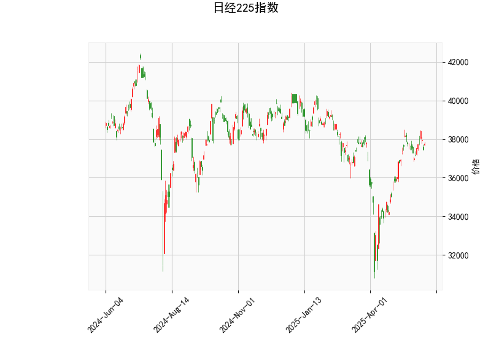

# 日经225指数的技术分析结果分析

## 1. 对技术分析结果的详细分析

以下是对日经225指数当前技术指标的分析，基于提供的指标数据：当前价为37747.45、RSI为56.54、MACD相关值为MACD线442.21、信号线478.69、直方图-36.48、布林带上轨39777.79、中轨36327.87、下轨32877.95，以及K线形态为射击之星。

### RSI（相对强弱指数）分析
- **RSI值：56.54**  
  RSI是一个衡量价格波动速度和变化的指标，通常在30-70之间视为中性。当前RSI为56.54，略高于50的中点，这表明日经225指数处于中性区域，但有轻微的强势倾向。市场尚未进入超买状态（RSI > 70），因此短期内可能没有明显的回调压力，但如果RSI继续上升，可能预示进一步的上涨。然而，结合其他指标，这可能只是暂时的稳定。

### MACD（移动平均收敛散度）分析
- **MACD线：442.21，信号线：478.69，直方图：-36.48**  
  MACD指标用于识别趋势变化和动量。MACD线低于信号线，并且直方图值为负（-36.48），这是一个典型的看跌信号，表明短期动量已转向负面。直方图的负值反映了卖方力量的增强，可能预示价格将回落或进入修正阶段。如果MACD线继续远离信号线，这种看跌势头可能会加剧，投资者需警惕潜在的下行风险。

### 布林带分析
- **上轨：39777.79，中轨：36327.87，下轨：32877.95**  
  布林带帮助识别价格的波动范围和潜在支撑/阻力水平。当前价37747.45位于中轨和上轨之间，接近上轨（39777.79），这表明价格处于相对较高的位置。如果价格持续接近上轨，通常被视为超买信号，可能引发回调。另一方面，如果价格跌破中轨（36327.87），可能会测试下轨（32877.95）的支撑位。目前的定位显示市场在中性到强势区间，但结合其他看跌指标，存在向中轨回落的风险。

### K线形态分析
- **K线形态：射击之星**  
  射击之星是一种经典的看跌反转形态，通常出现在上涨趋势末期，特征是实体较小、上影线较长、下影线较短。这暗示市场可能已形成顶部，卖方力量开始主导。当前形态的出现与MACD的看跌信号相呼应，表明近期可能有价格反转或回调。如果后续K线确认这一形态（如出现下跌实体），则看跌压力将进一步增强。

### 整体技术面解读
综合以上指标，日经225指数的技术面呈现出混合信号：RSI显示中性偏强，而MACD、布林带位置和K线形态均倾向于看跌。这可能表示短期内市场处于一个潜在的顶部区域，上涨势头可能放缓或逆转。投资者应密切关注价格行为，如果出现进一步的看跌确认（如价格跌破中轨），则整体趋势可能转为负面。

## 2. 近期可能存在的投资或套利机会和策略

基于上述分析，日经225指数短期内可能存在看跌机会，但也需考虑市场整体环境（如全球经济数据、日元汇率等外部因素）。以下是对潜在投资或套利机会的判断，以及相应的策略建议。请注意，投资涉及风险，建议结合个人风险承受能力和实时市场数据进行决策。

### 可能存在的投资机会
- **看跌机会**：  
  由于MACD直方图为负、K线出现射击之星形态，以及价格接近布林上轨，短期内可能出现价格回调。这为做空或卖出操作提供机会。例如，如果指数跌破中轨（36327.87），目标可能下探至下轨（32877.95）附近，潜在获利空间约为5-10%。这适合短期交易者或对冲基金。

- **套利机会**：  
  日经225作为日本主要指数，可能与相关衍生品（如期货、期权或ETF）存在价差套利机会。例如：  
  - **跨市场套利**：如果日经225期货价格与现货指数出现偏差（如期货被低估），投资者可以通过买入期货并卖出现货来锁定价差。当前看跌信号可能导致期货价格滞后于现货，形成短期套利空间。  
  - **期权套利**：购买看跌期权（Put Option）以对冲潜在回调风险，或进行看涨/看跌期权价差策略。如果市场波动率上升（如布林带扩大），期权隐含波动率可能增加，提供波动率套利的机会。  
  然而，套利需依赖高效的执行和低交易成本，适合经验丰富的投资者。

- **其他机会**：  
  如果全球风险偏好回升（如美股反弹），日经225可能逆转看跌趋势，提供买入机会。但基于当前指标，这种可能性较低。

### 投资策略建议
- **短期看跌策略**：  
  - **推荐操作**：考虑做空日经225期货或ETF（如EWJ），目标位设在中轨下方（约36000）。设置止损位在上轨附近（约40000），以控制风险。预期持有期为1-2周，待MACD直方图转为正值再平仓。  
  - **风险管理**：使用小仓位操作，并监控RSI是否跌破50（可能加剧回调）。如果RSI回升至70以上，此策略需及时退出。  

- **套利策略**：  
  - **价差套利**：监控日经225指数与期货/期权间的价差。如果现货价格高于期货（基于当前看跌信号），执行反向套利（买入期货、卖出现货）。利用算法工具快速执行，以捕捉短暂机会。  
  - **多空组合**：构建多头日经225期权和空头相关资产（如美元/日元汇率）的组合， hedge汇率风险。如果日元升值（利好日经回调），此策略可放大收益。  

- **中长期策略**：  
  - 如果K线形态未确认（即无持续下跌），等待市场企稳后买入，目标上探上轨（39777.79）。建议结合基本面分析（如日本经济数据），并采用多元化投资（如结合科技股ETF）以降低单一风险。  
  - **总体风险提示**：当前全球市场不确定性高（如地缘政治事件），建议控制仓位不超过总资产的20%，并定期复盘指标。

总之，近期日经225指数的投资机会以看跌为主，套利潜力依赖衍生品市场。但技术分析并非万能，投资者应结合新闻事件和经济数据（如日本央行政策）进行全面评估，以避免潜在损失。