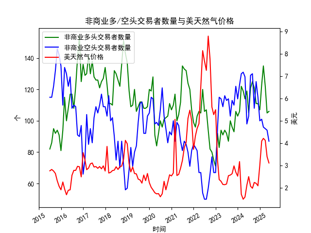

|            |   非商业多头交易者数量 |   非商业空头交易者数量 |   美天然气价格 |
|:-----------|-----------------------:|-----------------------:|---------------:|
| 2023-10-31 |                     93 |                    110 |           2.99 |
| 2023-11-30 |                    106 |                    122 |           2.71 |
| 2023-12-31 |                    103 |                    114 |           2.53 |
| 2024-01-31 |                    106 |                    123 |           3.18 |
| 2024-02-29 |                    122 |                    130 |           1.72 |
| 2024-03-31 |                    119 |                    131 |           1.5  |
| 2024-04-30 |                    114 |                    128 |           1.6  |
| 2024-05-31 |                    119 |                     98 |           2.13 |
| 2024-06-30 |                    105 |                    103 |           2.51 |
| 2024-07-31 |                    121 |                    129 |           2.08 |
| 2024-08-31 |                    125 |                    130 |           1.99 |
| 2024-09-30 |                    121 |                    108 |           2.25 |
| 2024-10-31 |                    111 |                    125 |           2.21 |
| 2024-11-30 |                    111 |                    115 |           2.1  |
| 2024-12-31 |                    107 |                    100 |           3.02 |
| 2025-01-31 |                    123 |                    101 |           4.1  |
| 2025-02-28 |                    135 |                     96 |           4.22 |
| 2025-03-31 |                    122 |                     95 |           4.13 |
| 2025-04-30 |                    105 |                     94 |           3.4  |
| 2025-05-31 |                    106 |                     87 |           3.12 |

### 近期美天然气投资机会分析

#### 概述
基于提供的数据，我们分析了近10年（2015年6月至2025年5月）的NYMEX美天然气非商业多头/空头交易者数量以及价格数据，重点关注最近三个月（2025年3月、4月和5月）的变化，特别是2025年5月相对于2025年4月的变动。这些指标可帮助识别潜在投资机会，如价格波动、交易者情绪逆转或市场底部信号。总体而言，美天然气价格持续下行，但交易者行为显示出一些积极迹象，可能预示短期反弹机会。

#### 关键数据摘要
以下是最近三个月的相关数据提取，单位分别为：多头/空头交易者数量（个）、价格（美元/百万英热单位）。

| 日期       | 非商业多头数量 | 非商业空头数量 | 美天然气价格 |
|------------|----------------|----------------|-------------|
| 2025-03-31 | 122.0         | 95.0          | 4.13       |
| 2025-04-30 | 105.0         | 94.0          | 3.40       |
| 2025-05-31 | 106.0         | 87.0          | 3.12       |

- **多头数量变化**：从2025年3月的122.0降至4月的105.0（下降约13.9%），然后在5月微升至106.0（较4月上升约0.95%）。这表明多头兴趣在短期内有所回暖。
- **空头数量变化**：从2025年3月的95.0微降至4月的94.0（下降约1.05%），然后进一步降至5月的87.0（较4月下降约7.45%）。空头减少可能反映市场看跌情绪减弱。
- **价格变化**：从2025年3月的4.13降至4月的3.40（下降约17.7%），然后进一步降至5月的3.12（较4月下降约8.24%）。价格持续下行，但下降幅度在5月放缓。

#### 分析与洞悉
- **价格趋势**：美天然气价格在最近三个月持续下降，这可能受季节性需求（如冬季取暖季结束）或全球能源供应增加的影响。5月价格较4月的下降（8.24%）虽显著，但较3月到4月的急剧下跌（17.7%）有所缓和，这可能表示价格已接近短期底部。
- **交易者情绪**：多头数量在5月小幅反弹（从105.0增至106.0），结合空头数量的持续减少（从94.0降至87.0），暗示市场可能从过度看跌转向中性或轻微看多。这与价格下行形成对比，可能预示潜在逆转机会，尤其如果外部因素（如地缘政治事件或天气变化）推动需求复苏。
- **整体市场动态**：从长期数据看，非商业多头和空头数量在过去10年中波动较大，但最近几个月多头稳定在100个以上，空头低于100个，显示投资者信心未完全崩盘。价格从2015年的2.32美元左右逐步上升至2025年的3.12美元，但近期回调可能为买入提供机会。

#### 可能存在的投资机会
基于以上变化，以下是近期（尤其是2025年5月）的潜在投资机会，主要聚焦于短期和中期策略。需注意，投资涉及风险，建议结合实时市场数据和风险管理措施。

- **短期买入机会**：
  - **价格潜在反弹**：5月价格虽继续下降，但下降速度放缓（较4月的8.24%低于前月的17.7%），加上多头数量小幅回升，这可能标志着市场底部。多头增加（0.95%）和空头减少（7.45%）的组合暗示投资者情绪逆转。如果未来需求上升（如夏季空调需求或全球供应中断），价格可能反弹至3.50美元以上，适合短期多头操作。
  - **推荐策略**：考虑在当前价位（3.12美元）买入合约或期权，目标设定为3.40-4.00美元区间。潜在回报：若反弹至4.00美元，收益约28%。

- **风险对冲机会**：
  - **空头减少信号**：空头数量从4月的94.0降至5月的87.0，表明部分看跌投资者可能退出。这为多头策略提供支撑，但若价格进一步下跌（例如至2.80美元以下），可通过期权对冲来管理风险。
  - **推荐策略**：使用价差交易（如买入看涨期权、卖出看跌期权）来捕捉波动。近期变化显示，5月相对于4月的空头减少可能降低下行压力，提供低风险入场点。

- **中期布局机会**：
  - **季节性因素**：历史数据显示，美天然气价格往往在夏季（6-8月）受需求影响而反弹（例如，2015-2024年间，6月价格平均上涨约5-10%）。鉴于当前价格已降至3.12美元（低于10年平均约3.50美元），中期买入可能获利。
  - **推荐策略**：持有至2025年夏季，预计价格回升至4.00美元以上。结合多头回暖信号，这可作为多元化能源投资组合的一部分。

- **潜在风险与注意事项**：
  - **下行风险**：如果全球供应过剩或经济放缓持续，价格可能进一步下跌至3.00美元以下，抵消多头信号。
  - **市场不确定性**：数据仅至2025年5月，外部事件（如政策变化或天气）可能影响预测。
  - **建议**：投资者应监控实时数据，并结合其他指标（如库存水平）进行决策，避免仅依赖历史趋势。

#### 结论
近期数据显示，美天然气市场存在潜在买入机会，主要源于5月价格下行放缓、多头小幅回升和空头持续减少。这些变化暗示短期反弹可能，特别是在夏季需求季节。投资者可优先考虑短期多头策略，但需警惕价格波动风险。若当前价格稳定在3.00-3.50美元区间，投资回报潜力较大。建议结合专业咨询和实时监控，以最大化机会。