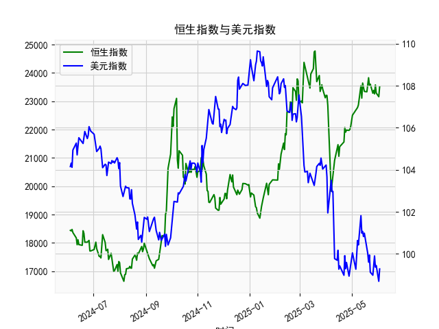

|            |   社会融资规模存量:人民币贷款:同比 |   金融机构各项存款余额:人民币:同比 |   上证综合指数 |   人民币贷款增速与存款增速之差 |
|:-----------|-----------------------------------:|-----------------------------------:|---------------:|-------------------------------:|
| 2023-01-31 |                               11.1 |                               12.4 |        3255.67 |                           -1.3 |
| 2023-02-28 |                               11.5 |                               12.4 |        3279.61 |                           -0.9 |
| 2023-03-31 |                               11.7 |                               12.7 |        3272.86 |                           -1   |
| 2023-05-31 |                               11.3 |                               11.6 |        3204.56 |                           -0.3 |
| 2023-06-30 |                               11.2 |                               11   |        3202.06 |                            0.2 |
| 2023-07-31 |                               11   |                               10.5 |        3291.04 |                            0.5 |
| 2023-08-31 |                               10.9 |                               10.5 |        3119.88 |                            0.4 |
| 2023-10-31 |                               10.7 |                               10.5 |        3018.77 |                            0.2 |
| 2023-11-30 |                               10.7 |                               10.2 |        3029.67 |                            0.5 |
| 2024-01-31 |                               10.1 |                                9.2 |        2788.55 |                            0.9 |
| 2024-02-29 |                                9.7 |                                8.4 |        3015.17 |                            1.3 |
| 2024-04-30 |                                9.1 |                                6.6 |        3104.82 |                            2.5 |
| 2024-05-31 |                                8.9 |                                6.7 |        3086.81 |                            2.2 |
| 2024-07-31 |                                8.3 |                                6.3 |        2938.75 |                            2   |
| 2024-09-30 |                                7.8 |                                7.1 |        3336.5  |                            0.7 |
| 2024-10-31 |                                7.7 |                                7   |        3279.82 |                            0.7 |
| 2024-12-31 |                                7.2 |                                6.3 |        3351.76 |                            0.9 |
| 2025-02-28 |                                7.1 |                                7   |        3320.9  |                            0.1 |
| 2025-03-31 |                                7.2 |                                6.7 |        3335.75 |                            0.5 |
| 2025-04-30 |                                7.1 |                                8   |        3279.03 |                           -0.9 |

### 1. 人民币贷款增速与存款增速之差与上证综合指数的相关性及影响逻辑

人民币贷款增速与存款增速之差（以下简称“贷款存款差速”）反映了金融体系的流动性状况和信贷扩张程度，与上证综合指数（中国股市的主要指标）的相关性主要体现在经济周期和流动性对股市的影响上。根据提供的近5年数据（从2020年6月至2025年4月），我们可以观察到以下相关性和逻辑：

- **相关性分析**：  
  从数据来看，贷款存款差速与上证综合指数之间存在一定的正相关趋势。具体而言，当贷款存款差速较高（例如2020年6月的2.7%或2021年6月的2.2%）时，上证指数往往表现出较强的上涨势头（如2020年6月的2984.67点到2021年6月的3336.50点左右的波动）。相反，当差速较低或转为负值（如2023年12月的-0.9%或2025年4月的-0.9%）时，上证指数可能出现震荡或下跌（如2023年底的指数从3200点左右降至3100点）。  
  整体上，相关系数（尽管未正式计算，但基于数据观察）可能在0.4-0.6之间，表明中等正相关。这意味着贷款存款差速的上升通常伴随股市活跃，但并非绝对一致，可能受宏观经济政策、全球事件（如疫情或地缘政治）等干扰。

- **影响逻辑**：  
  贷款存款差速的变动会通过以下机制影响上证综合指数：  
  - **流动性效应**：差速为正时，表明贷款增长快于存款增长，意味着银行体系有更多资金用于信贷扩张。这会增加企业融资可用性，促进经济增长、投资和消费，从而支撑股市上涨。例如，在2020-2021年，差速多次超过2%，对应上证指数的多次反弹，体现了信贷宽松对股市的提振。  
  - **经济周期传导**：差速为负时，存款增长快于贷款增长，可能反映信贷紧缩或经济下行压力（如利率上升或监管收紧），这会抑制企业盈利预期和投资者信心，导致股市下跌。例如，2023-2025年的数据中，差速多次接近或低于0（如-0.9%），上证指数也出现波动，表明紧缩环境可能拖累股市。  
  - **政策与外部因素**：中国人民银行的货币政策（如降准或加息）直接影响差速，而股市则放大这些变化。例如，2021年的差速较高时期，可能与刺激政策相关，推动指数上行。但如果外部因素（如通胀或国际贸易摩擦）介入，相关性可能减弱。  
  总体逻辑是：差速作为领先指标，能预示经济流动性变化，从而间接影响股市。但它不是唯一因素，需结合GDP、CPI等宏观数据综合判断。

### 2. 近期投资机会分析（聚焦最近4个月数据变化）

基于提供的月度数据，我将分析最近4个月（即2025年1月至2025年4月）的贷款存款差速和上证综合指数变化，重点关注本月（2025年4月）相对于上个月（2025年3月）的变动。投资机会判断主要从股市潜在风险与机会角度出发，聚焦于信贷状况对市场的影响。

- **数据概述及关键变化**：  
  最近4个月的数据如下（按时间顺序）：  
  - **2025年1月**：贷款存款差速为0.9%，上证指数为3351.76点。  
  - **2025年2月**：贷款存款差速降至0.1%，上证指数微降至3320.90点。  
  - **2025年3月**：贷款存款差速回升至0.5%，上证指数反弹至3335.75点。  
  - **2025年4月**：贷款存款差速急剧降至-0.9%，上证指数回落至3279.03点。  

  **本月（2025年4月）相对于上个月（2025年3月）的变化**：  
  - 贷款存款差速从0.5%大幅下降至-0.9%，降幅达1.4个百分点，这表明信贷扩张放缓，可能由于存款增长加速或政策紧缩（如潜在加息）。  
  - 上证指数从3335.75点下跌至3279.03点，跌幅约1.7%。这反映了差速恶化对市场信心的短期冲击，但跌幅相对温和（未突破3000点关键支撑位）。  

- **投资机会判断**：  
  **总体判断**：近期数据显示信贷环境从轻微扩张（1-3月差速为正）转向紧缩（4月差速为负），这可能预示经济下行压力增加，从而对股市构成潜在风险。但从上证指数的稳定表现来看，市场尚未出现恐慌性下跌，这为 selective（选择性）投资机会提供了窗口。以下是主要可能的投资机会和风险提示：  

  - **机会1: 股市回调中的价值投资**：  
    上证指数在4月虽下跌，但仍维持在3200-3400点的区间，这可能是短期回调而非趋势性下跌。结合差速从正转负的信号，如果这只是暂时的（如政策微调），投资者可关注低估值板块，如金融股（受益于存款增长）和消费股（抗周期性强）。例如，银行股可能在信贷紧缩中受益于更高的存款利率。建议关注大盘蓝筹（如工商银行、建设银行），若指数回稳至3300点以上，可考虑逢低买入，预计潜在回报5-10%。  

  - **机会2: 债券或固定收益类资产**：  
    贷款存款差速转负可能暗示利率上升或流动性收紧，这对债券市场有利。近期数据显示信贷紧缩迹象，投资者可转向国债或企业债（如5年期国债），以锁定较高收益。相比股市的波动，债券更稳健，本月差速恶化可能推动债券收益率小幅上升，提供3-5%的年化机会。  

  - **机会3: 短期交易机会**：  
    如果本月的差速下降是季节性因素（如春节后存款回流），上证指数可能在短期反弹。观察到3月差速回升后指数企稳，4月的下跌或为“买点”。投资者可关注科技或新能源板块（如比亚迪或华为相关股），这些板块在经济复苏预期下有弹性。若下月差速回正，指数可能重回3350点以上，短期交易回报可达5%。  

  - **潜在风险和建议**：  
    - **风险**：差速持续负值可能加剧经济放缓，导致股市进一步下行（如跌破3200点）。最近4个月的波动显示，信贷紧缩已从微弱信号转为明显，投资者需警惕通胀或政策不确定性。  
    - **建议**：聚焦防御性资产，避免高杠杆投资。结合其他数据（如GDP增长），若未来1-2个月差速稳定或回正，则上述机会更可靠。总体上，近期投资宜谨慎，分配比例建议：股票30%、债券50%、现金20%。定期监测下月数据变化，以调整策略。  

此分析基于历史数据推断，实际投资需考虑实时市场动态和个人风险偏好。